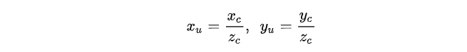
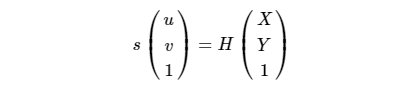
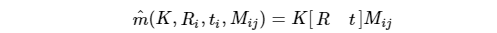

# Camera model

本文参考了[知乎文章](https://zhuanlan.zhihu.com/p/93819559)、[知乎文章](https://zhuanlan.zhihu.com/p/93822726)[CSDN博客](https://blog.csdn.net/CCCrunner/article/details/106766248)[CSDN博客](https://www.cnblogs.com/wangguchangqing/p/8335131.html#autoid-0-0-0)[CSDN博客](https://blog.csdn.net/qq\_16137569/article/details/112398976?utm\_medium=distribute.pc\_relevant.none-task-blog-baidujs\_baidulandingword-0\&spm=1001.2101.3001.4242)

## 针孔相机

### 相机成像原理

相机根据视场角(Field of Vision, FOV)大小的不同分为全向相机(Omni Directional)、广角/鱼眼相机(Fisheye)和普通相机。普通相机FOV一般在90度以下，广角相机FOV通常大于90度，全向相机FOV一般大于180度。&#x20;

相机成像一般过程为：世界坐标系--(刚体变换)-->相机坐标系--(透视投影)-->理想图像坐标系--(畸变矫正)-->真实图像坐标系--(数字化)-->数字化图像坐标系

### 针孔相机成像模型

针孔相机模型为&#x20;

对于3D空间中的一个点，将其投影到像素坐标系的计算过程为：&#x20;

### 畸变模型

如果考虑相机畸变，则成像过程需要增加一步：&#x20;

其中k为径向畸变系数(radial distortion coefficients)，p为切向畸变中离心畸变系数(tangential distortion coefficients)，s为切向畸变中薄透镜畸变系数(thin prism distortion coefficients)。一般opencv中畸变系数的顺序为：$$(k_1,k_2,p_1,p_2,k_3,[k_4,k_5,k_6,s_1,s_2,s_3,s_4])$$&#x20;

注意，因为畸变处理过程是在归一化(normalization)平面中进行的，所以畸变系数与图像分辨率无关。如果将图像分辨率从640x480缩放为320x240，畸变系数不变，但焦距光心需要同比例缩放。

### 图像去畸变

图像去畸变的思路为：对于目标图像（无畸变图像）上的每个像素点，将其转换到归一化平面上，再进行畸变并投影到原图像（有畸变图像），获取原图对应位置的像素点作为目标图像中该点的像素值。（畸变模型太复杂了，很难求逆变换）&#x20;

### 图像尺度缩放与内参的关系

图像分辨率缩放k倍，相机焦距关心等比例缩放k倍，畸变系数不变。证明：&#x20;

## 广角相机模型

### 广角相机成像原理

广角相机成像步骤与普通相机基本一致，主要区别在于镜头聚光的部分，广角相机为了获得更大的FOV，有三种镜头聚光方法:

1. Disptric cameras: 投过透镜来实现，主要是折射；
2. Catadioptric cameras：使用一个标准相机加一个面镜（Shaped mirror)
3. Polydioptric cameras：通过多个相机重叠视野&#x20;

### 相机模型

这里讨论的相机模型只包括透镜/面镜的投影模型。 相机模型指的是相机坐标系到理想图像坐标系（归一化坐标系）的投影模型，设相机坐标系下的点$$(x_c,y_c,z_c)$$，投影到归一化平面上的点$$(x_u,y_u)$$，则相机模型为：&#x20;

#### 针孔相机模型(Pinhole)

针孔相机利用透镜进行聚光成像，如前文所述：&#x20;

#### 全向相机模型(Omnidirectional)

全向相机利用面镜(mirror)反射进行成像，该相机模型带有一个参数$$\xi$$。首先将相机坐标系的点归一化到半径为1的球面上：&#x20;

然后在投影到归一化坐标系上：&#x20;

其逆变换为：&#x20;

当$$\xi$$为0时，全向相机模型就退化为针孔相机模型

### 畸变模型

畸变模型指的是理想图像平面到真实图像平面的变换模型，也就是归一化平面上的畸变模型。 理想的针孔成像模型确定给的坐标变换关系为线性的，而实际上，使用的相机由于镜头中光线通过时产生的不规则的折射，镜头畸变（lens distortion）总是存在的，即根据理想针孔相机成像模型计算出来的像点坐标与实际坐标存在偏差。

#### radtan畸变模型

普通相机畸变包括径向畸变和切向畸变：&#x20;

径向畸变表示沿半径方向的偏移量，形成原因是镜头制造工艺不完美，使得镜头形状存在缺陷，通常分为桶形畸变和枕形畸变，分别代表$$d_r$$往外偏和往里偏。&#x20;

径向畸变的数学变换为：&#x20;

切向畸变分为薄透镜畸变和离心畸变等。薄透镜畸变是因为透镜存在一定的细微倾斜造成的，离心畸变的形成原因是镜头是由多个透镜组合而成的，而各个透镜的光轴不在同一条中心线上。切向畸变的数学表达式为：&#x20;

结合径向和切向畸变，转换关系为：&#x20;

一般只使用$$k_1,k_2,k_3,p_1,p_2$$，其他参数设为0，简化后的模型即为常用的radtan畸变模型：&#x20;

#### 鱼眼畸变模型

针孔相机的透视投影为：$$r=f\cdot tan{\theta}$$，其中$$r=\sqrt{x^2+y^2} ,\theta=atan(r)$$ 鱼眼镜头的畸变模型有很多种：&#x20;

其中，使用最多的是Equidistant模型，即$$r_d=f{\theta}_d$$。对实际的鱼眼镜头来说，它们不可能精确地按照投影模型来设计，所以为了方便鱼眼相机的标定，Kannala提出了一种鱼眼相机的一般多项式近似模型，即：&#x20;

畸变投影模型为：&#x20;

#### FOV畸变模型

FOV畸变模型转换关系为：&#x20;

#### Unified Projection Model

在鱼眼相机中通常会看到Unified Projection Model或者MEI model, 其实就是Omnidirectional相机模型+radtan畸变模型. 前面提到了Omnidirectional模型涵盖了Pinhole模型, 所以MEI model可以表示鱼眼和非鱼眼相机.

## 张正友标定法

### 相机的内参数

设P=(X,Y,Z)为场景中的一点，在针孔相机模型中，经过如下变换就可以投影到二维图像上，像素点p=(u,v):

1. 将P从世界坐标系通过刚体变换（旋转+平移）变换到相机坐标系上，这个过程使用到相机的位姿，即相机的外参数；
2. 从相机坐标系，通过透视投影变换到相机的成像平面（归一化平面）上的点，得到归一化坐标(x,y,1)
3. 将归一化点从成像平面，通过缩放和平移变换到像素坐标系上，得到p=(u,v) 以上变换可写为：&#x20;

将矩阵K称为相机内参数：&#x20;

其中，$$\alpha,\beta$$表示图像上单位距离上像素的个数。为了不失一般性，可以在相机的内参矩阵上添加一个扭曲参数$$\gamma$$，该参数表示像素坐标系两个坐标轴的扭曲：&#x20;

对于大多数标准相机来说，$$\gamma=0$$

### 张氏标定法

在张氏标定法中，用于标定的棋盘格是三维场景中的一个平面A，其在成像平面的像是另一个平面B，知道了两个平面的对应点的坐标，就可以求解得到两个平面的单应矩阵H。其中，标定的棋盘格是特制的，其角点的坐标是已知的；图像中的角点，可以通过角点提取算法得到，这样就可以得到棋盘平面A和图像平面B的单应矩阵H。&#x20;

通过相机模型，有：&#x20;

其中p是像素点坐标，P是标定的棋盘坐标。这样就可以得到：&#x20;

H表示的是成像平面和标定棋盘平面之间的单应矩阵。通过对应点对解出H后，则可以通过上面的等式，得到内参K，外参旋转矩阵R和平移向量t。

#### 棋盘平面和成像平面的单应

将棋盘格所在平面映射到相机的成像平面，则有&#x20;

p为棋盘格成像的像素点坐标(u,v)，P为棋盘格角点在世界坐标系的坐标。&#x20;

设棋盘格所在的平面为世界坐标系中Z=0的平面，则棋盘格任一角点P的世界坐标为(X,Y,0)，根据小孔相机模型：&#x20;

根据平面间的单应性，有&#x20;

将上面两个等式整合，则可以得到单应矩阵H和相机矩阵（包含内参和外参）相等：&#x20;

这样就可以使用棋盘平面和成像平面间的单应矩阵来约束相机的内参和外参。单应矩阵H可以通过棋盘平面和成像平面上对应的点计算出来。

#### 内参的约束条件

根据平面间的单应，有：&#x20;

将旋转矩阵R的各个列向量和平移向量t用H的列向量表示：&#x20;

由于R是旋转矩阵，是正交矩阵，任意两个列向量内积为1，列向量模为1，则：&#x20;

则对于一幅棋盘标定板的图像（一个单应矩阵），可以得到两个对内参的约束等式：&#x20;

#### 求解内参数

通过一幅标定板的图像可以得到关于内参数的两个等式，令&#x20;

矩阵B是一个对称矩阵，未知量只有6个，将这6个未知量写成向量的形式：&#x20;

令$$h_i$$为单应矩阵H的第i个列向量，则有：&#x20;

则有：$${h_i}^TK^{-T}K^{-1}h_j={h_i}^TBh_j={v_{i,j}}^Tb$$&#x20;

从一幅标定板图像得到：&#x20;

则有：&#x20;

假设有n张图像，则有Vb=0，其中V是一个$$2n\times b$$的矩阵，b是一个6维向量，所以需要三张以上的图像。

&#x20;对于方程Vb=0可以使用SVD求得其最小二乘解。对$$V^TV$$进行SVD分解，其最小特征值对应的特征向量就是Vb=0的最小二乘解，从而求得矩阵B。由于这里得到的B的估计值是在相差一个常量因子下得到的，所以有$$B=\lambda K^{-T}K$$，从而可以得到相机的各个内参数：&#x20;

#### 最大似然估计

为了进一步增加标定结果的可靠性，可以使用最大似然估计(Maximum likelihood estimation)来优化上面估计得到的结果。&#x20;

假设同一相机从n个不同的角度的得到了n幅标定板的图像，每幅图像上有m个像点。$$M_{ij}$$表示第i幅图像上第j个像点对应的标定板上的三维点，则&#x20;

$$\hat{m}(K,R_i,t_i,M_{ij})$$表示$$M_{ij}$$的像点，其中$$R_i,t_i$$表示第i幅图像对应相机的旋转矩阵和平移向量，K为相机内参，则像点$$m_{ij}$$的概率密度函数为：&#x20;

可以构造似然函数：&#x20;

为了让L取得最大值，需要最小化以下目标值（**其实就是重投影误差吧**）：&#x20;

这是一个非线性优化问题，可以使用Levenberg-Marquardt方法，利用上面得到的解作为初值，迭代得到最优值。

#### 消除径向畸变

张氏标定法中只关注了影响较大的径向畸变。&#x20;

设(u,v)是理想的无畸变的像素坐标；$$(\hat{u},\hat{v})$$是畸变后的像素坐标；$$(u_0,v_0)$$是相机的主点；(x,y)和$$(\hat{x},\hat{y})$$为理想的无畸变的归一化坐标和畸变后的归一化坐标，使用下面的式子表示径向畸变：&#x20;

$$k_1,k_2$$表示径向畸变系数。径向畸变的中心和相机的主心是相同位置：&#x20;

假设$$\gamma=0$$，则有：&#x20;

改写为矩阵形式：&#x20;

上面的等式是从一幅图像上的一个点取得的，设有n幅图像，每幅图像上有m个点，则将得到的所有等式组合起来，可以得到2mn个等式，将其记为矩阵形式DK=d，则可以得到：&#x20;

利用最大似然估计取得最优解，使用LM的方法估计使得下面式子是最小值的参数值&#x20;

得到畸变参数$$k_1,k_2$$后，可以先将图像进行去畸变处理，然后用去畸变后的图像坐标估计相机的内参数。

## Basalt相机-IMU标定工具

[代码](https://gitlab.com/VladyslavUsenko/basalt) [Github镜像](https://github.com/VladyslavUsenko/basalt-mirror)

### The Double Sphere Camera Model (3DV 2018)

[pdf](https://arxiv.org/pdf/1807.08957.pdf) [project](https://vision.in.tum.de/research/vslam/double-sphere) [code](https://gitlab.com/VladyslavUsenko/basalt) 这篇论文讲述了该工具中使用的相机模型

#### Abstract

这篇论文，作者提供了详细的广角相机模型综述。对于每个模型，作者提供了projection函数和unprojection，以及可以得到有效projection的点的子集。然后，作者提出了Double Sphere camera model，该模型可以很好的适应广角镜头，并且计算高效，有封闭的逆。

#### Introduction

新提出的鱼眼相机投影模型有以下优势：

1. 该模型很适合表示鱼眼相机的畸变；
2. 该模型在projection和unprojection过程中不需要很耗计算资源的三角函数操作；
3. 与基于高阶多项式的投影模型采用迭代法解投影不同，投影函数的逆以封闭形式存在。 在本文汇总，作者将根据与基于视觉的运动估计相关的指标评估所有模型。作者使用几个不同透镜收集了数据集，来评估每个模型的重投影误差。作者还给出了projection和unprojection所需的计算时间，以及相用它们的参数计算雅可比矩阵所需的时间。

#### Related Work

约定像素坐标$$\textbf{u}={[u,v]}^T\in \varTheta \subset \mathbb{R}^2$$，其中$$\varTheta$$表示点投影到的图像域。3D点坐标为$$\textbf{x}={[x,y,z]}^T\in \Omega \subset \mathbb{R}^3$$，其中$$\Omega$$表示可以产生有效投影的3D点集。&#x20;

对于所有的相机模型，我们假设所有的投影都穿过一个点(即中心投影)，这个点定义了相机坐标系的位置。摄像机的方向定义如下。z轴与相机主轴对齐，其他两个正交的方向(x,y)对图像平面的坐标轴对齐。作者定义一个与标定模式紧密相连的坐标系，这样变换$$T_{{ca}_n}\in SE(3)$$，是一个特殊欧式群，可以将图像n的三维坐标从标定模式坐标系转换为相机坐标系。 一般地，一个相机投影函数是一个映射$$\pi: \Omega\rightarrow\varTheta$$。它的逆$${\pi}^{-1}: \varTheta\rightarrow\mathbb{S}^2$$将像素坐标反投影到单位长度的方位向量，该向量定义了一条射线，该条线上所有的点都被投影到这些图像坐标上。

**Pinhole Camera Model**

针孔相机模型有四个内参$$\textbf{i}={[f_x,f_y,c_x,c_y]}^T$$，其投影函数为：&#x20;

可以看到，这一投影只对点$$\Omega=\{\textbf{x}\in\mathbb{R}^3|z>0\}$$有效，这限制了视角小于180°。然而在实践中，即使加入了畸变模型，针孔相机在视角大于120°时表现也会变差。作1619100904683者用下式表示反投影变换：&#x20;

其中反投影被定义在$$\varTheta=\mathbb{R}^2$$

**Unified Camera Model**

统一相机模型（UCM）有五个参数$$\textbf{i}={[\gamma_x,\gamma_y,c_x,c_y,\xi]}^T$$，通常与catadioptric cameras一起使用。先前的研究表明UCM可以表示具有抛物面、双曲、椭圆和面镜的系统。这一模型也可以用于有鱼眼镜头的相机。但是，它无法非常完美的适应大部分鱼眼镜头，因此，经常加入一个额外的畸变模型。&#x20;

在UCM中，投影关系为：&#x20;

在这个模型中，首先将一个点投影到单位球上，然后再投影到针孔摄像机的成像平面上，该平面到单位球中心的距离为$$\xi$$.&#x20;

在实际应用时，上式一般被重写为：&#x20;

这个模型也有五个参数$$\textbf{i}={[f_x,f_y,c_x,c_y,\alpha]}^T$$并与前一个模型在数学意义上等价（$$\xi=\frac{\alpha}{1-\alpha},\gamma_x=\frac{f_x}{1-\alpha},\gamma_y=\frac{f_y}{1-\alpha}$$）。但是这个模型具有更好的数学性质。当$$\alpha=0$$时，这个模型退化到针孔相机模型。&#x20;

可以有效投影的3D点集为：&#x20;

其中，当$$\alpha>0.5$$时，w represents the sine of the angle between the horizontal axis on schematic plot (Figure 2) and the perpendicular to the tangent of the circle from the focal point of the pinhole camera.（**没看懂..**）&#x20;

反投影函数为：&#x20;

其中$$\varTheta$$被定义为：&#x20;

**Extended Unified Camera Model**

拓展统一相机模型有6个参数$$\textbf{i}={[f_x,f_y,c_x,c_y,\alpha,\beta]}^T, \alpha\in[0,1],\beta>0$$并且有如下投影函数：&#x20;

EUCM模型可以看做是UCM模型的拓展，3D点将先被投影到一个绕z轴对称的椭球面上。该研究还表明，当将相机模型视为在二次曲面上的投影然后在图像平面上的正交时，模型在某种意义上是完整的，因为它可以表示所有可能的二次曲面。&#x20;

当使用EUCM时，与UCM相似，定义$$\Omega$$集合，不同点在于需要按照公式17计算d。当$$\beta=1$$时，EUCM退化为UCM模型。&#x20;

如前所述，EUCM在椭球面上投影。因此，不能直接得到反投影的单位长度矢量；因此，必须采用normalization。反投影函数如下：&#x20;

其中，$$\varTheta$$定义为：&#x20;

**Kannala-Brandt Camera Model**

Kannala-Brandt（KB）模型是一个通用的相机模型，很好的适用于普通，广角和鱼眼镜头。KB模型假设 “从图像光学中心到投影点的距离” 与 “点与主轴之间的夹角"的多项式 成正比。作者评估了两个版本的KB模型，一个有6个参数$$\textbf{i}={[f_x,f_y,c_x,c_y,k_1,k_2]}^T$$，一个有8个参数$$\textbf{i}={[f_x,f_y,c_x,c_y,k_1,k_2,k_3,k_4]}^T$$。KB模型的投影函数为：&#x20;

假设多项式$$d(\theta)$$是单调的$$\Omega=\mathbb{R}^3\setminus {[0,0,0]}^T$$。 KB模型的反投影函数要求求一个高阶多项式的根来从$$d(\theta)$$中恢复角$$\theta$$。这可以通过一个迭代优化方法，比如牛顿法，来解决。反投影函数为：&#x20;

其中$$\theta^*是d(\theta)=r_u$$的解，如果$$d(\theta)$$是单调的，$$\varTheta=\mathbb{R}^2$$.&#x20;

KB模型有时会被用作针孔相机的畸变模型，比如[Kalibr](https://github.com/ethz-asl/kalibr)中的等距畸变模型(equidistant distortion model)或[OpenCV](https://github.com/opencv/opencv)中的鱼眼相机模型。模型在数学上是相同的；然而，由于它首先使用针孔相机模型投影点，然后加入畸变，模型在z=0时会出现奇异性，使得该模型不适用于视角接近于180度的鱼眼镜头。 其他几种基于高阶多项式的广角透镜模型也存在。例如，“A flexible technique for accurate omnidirectional camera calibration and structure from motion”与KB模型之间的主要差异为：该模型标定了两个独立的多项式来投影和反投影，以构成封闭的解，并在投影时，它使用图像平面和点之间的夹角而不是光轴与点之间的夹角。

**Field-of-View Camera Model**

视角相机模型（FOV）有5个参数$$\textbf{i}={[f_x,f_y,c_x,c_y,w]}^T$$，并假设像点和主点之间的距离通常近似正比于相应的3D点和光轴之间的角度。作者认为，参数w近似对应于理想鱼眼透镜的视角。投影函数为：&#x20;

其中$$\Omega=\mathbb{R}^3\setminus{[0,0,0]}^T$$. FOV模型对反投影有封闭的解：&#x20;

其中$$\varTheta=\mathbb{R}^2$$. 与KB模型相似，FOV模型可以被用作针孔相机的畸变模型。

#### Double Sphere Camera Model

作者提出了一个双球面相机模型，可以更好的适应有鱼眼镜头的相机，有封闭的逆，并且不需要计算消耗较大的三角函数计算。在提出的DS模型中，一个点被连续地投影到两个中心距离$$\xi$$的单位球面上。然后点用针孔相机模型投影到图像平面上，图像平面距离第二个球中心$$\frac{\alpha}{1-\alpha}$$。该模型有6个参数$$\textbf{i}={[f_x,f_y,c_x,c_y,\xi,\alpha]}^T$$，其投影函数为：&#x20;

可以产生有效投影的3D点集为：&#x20;

反投影函数定义为：&#x20;

其中：&#x20;

#### Calibration

为了估计每个相机模型的参数，作者使用了一个可以在图像中自动检测到的AprilTag标记的网格（**就是棋盘格吧**）。对于标定序列中的每个图像n，检测出角点k在图像平面的投影的2D位置$$\textbf{u}_{nk}$$和对应的3D位置$$\textbf{x}_k$$。初始marker检测后，我们对每个角点进行局部亚像素级别的精调，以获得更好的标定精度。 作者根据状态$$\textbf{s}=[\textbf{i},\textbf{T}_{{ca}_1},...,\textbf{T}_{{ca}_N}]$$定义优化函数：&#x20;

其中$$\textbf{i}$$为内参向量，$$\pi$$是投影函数，$$\textbf{T}_{{ca}_n}\in SE(3)$$是图像n从标定板坐标系到相机坐标系的转换。K是图像n中检测到的角点，$$\rho$$是robust Huber norm。 作者将向量状态的更新参数化$$\varDelta s = {[{\varDelta i},{\varDelta t}_{0},...,{\varDelta t}_{N}]}^T$$:&#x20;

当给定当前状态$$s_l$$，我们可以重写优化函数为：&#x20;

用高斯-牛顿法去计算当前代的更新：&#x20;

其中$$r_l$$是在$$s_l$$状态下评估的参数向量，$$J_l$$是关于$$\varDelta s$$的残差的Jacobian，W是对应着Huber norm的权重矩阵。然后，我们更新状态的当前估计：&#x20;

迭代，直到收敛。&#x20;

由于优化函数的非凸的，因此，内参和相机位姿的好的初始化对优化收敛很重要。作者用“Self-calibration and visual slam with a multi-camera system on a micro aerial vehicle”初始化内参（EUCM中$$\beta=1$$，DS中$$\xi=0$$)并用UPnP算法找到初始位姿。

#### Evaluation

作者在一个具有16个序列的数据集上评测了提出的相机模型，这个数据集包括用五种不同镜头采集的标定序列，和一个EuRoC数据集的标定序列。五种镜头如图所示。&#x20;

为了确保公平的比较，我们首先从所有序列中检测出标定角点，并对所有模型使用相同的数据进行优化。

**Reprojection**

重投影误差显示了一个模型反映真实镜头投影函数的效果，是相机模型最重要的指标之一。表1反映了优化过用不同相机模型在所有数据集上计算的位姿和内参后的平均重投影误差。在大多数序列上，使用8个参数的KB模型表现得最好，所提出模型表现第二好。但是，DS模型只使用了6个参数，并且表现相差不到1%。EUCM表现稍差，UCM和FOV更差。

**Computation time**

计算耗时是相机模型的另一个重要指标，因为在基于视觉的运动估计的每次迭代中，都需要上千次使用投影函数和反投影函数。此外，在算法优化时，必须计算这些函数关于点和内参的Jacobians。因此，需要考虑这些操作的计算耗时。&#x20;

对每个相机模型，作者评测了在Intel Xeon E5-1620 CPU上用[Google Benchmark](https://github.com/google/benchmark)库进行10000次计算的时间。作者用GCC7，O3优化等级，来在单线程执行代码。要注意仅计算函数和使用雅可比矩阵计算函数之间的时间差很小，这可以用现代cpu的超标量结构来解释，它在内部并行执行。 FOV和KB模型计算非常慢，因为KB模型包含了很耗时间的三角函数计算（atan2）。KB模型中的反投影需要迭代优化来求解多项式根，这与三角函数运算一起，使它比UCM、EUCM和DS模型慢几倍。FOV模型是反投影最慢的，这可能是由于它的多重三角运算。

**Qualitative results**

作者对姿态和内参进行优化后，将校准模式的角点投影到BF2M2020S23-3序列中相应的图像上。DS、EUCM 和KB-8模型达到了相似的效果，难以用人眼区分。UCM和KB-6模型很好地拟合了图像中间的角，然而，这些模型在靠近边缘的地方有一个小的偏移。FOV模型效果差的很明显。

**Different formulation of UCM**

