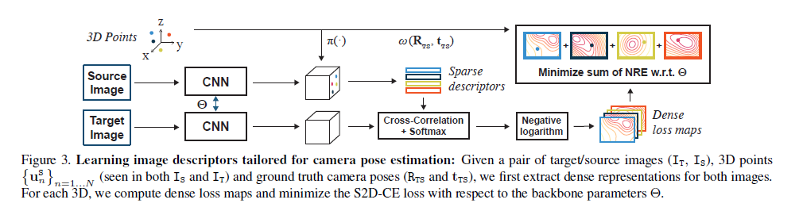

# \[CVPR 2021] NRE





### Abstract

绝对位姿估计一般包括两步：首先通过特征匹配，来获得2D-3D间的correspondences；然后用PnP算法最小化关于相机位姿的重投影误差（RE）。作者认为生成2D-3Dcorrespondence（1）会带来重要的信息损失，需要在RE中通过选择损失和调参来补偿；（2）会导致RE想位姿估计模型传送错误的数据。这篇论文中，作者提出Neural Reprojection Error（NRE）作为RE的代替。NRE将特征匹配与位姿估计融合在一起，可以提供相比2D-3Dcorrespondence更丰富的信息，无需选择损失和调整参数。因此，NRE可以作为训练用于位姿估计的图像描述子的损失函数。作者还提出一种由粗到精的优化方法，来有效地最小化关于相机位姿的NRE项。

### Introduction

一般的相机定位任务分为两步，如图2所示，首先提取特征，进行匹配，来获得图像和3D点云间的2D-3D匹配，然后以此匹配作为输出，用PnP算法来最小化关于相机位姿的重投影误差（RE）。重投影误差是一个以2D-3D匹配和相机位姿为输入的函数，它将3D点用相机位姿重投影到检索图像平面，计算投影点和匹配点之间的欧拉距离，然后用一个鲁棒的损失函数来减少匹配中的外点影响。&#x20;

本文的贡献在于：

1. 提出NRE作为RE的替代品。NRE不需要2D-3Dcorrespondence作为输入，而是依赖于一个稠密的loss map，这包含了更多的信息，可以向位姿估计模块提供更高质量的信息。因此，无需选择鲁棒的损失函数和超参数。计算稠密的loss map本质上涉及到计算神经网络输出的描述子的相互关联；
2. NRE不仅对相机位姿可微，而且对描述子可微。因此，当提供了真值的相机位姿，最小化关于描述子的NRE，是一个适当的用于位姿估计的特征训练任务。NRE将特征学习任务和相机位姿估计任务融合在了一起；
3. 为了更高效的估计相机位姿，作者提出用由粗到精的方法来最小化NRE。因此，作者无需计算或存储任何高分辨率的稠密loss map。作者描述了如何用M-estimator 采样一致方法和一个graduated non-convexity过程来优化。

### Background and Notations

本文中，作者假设一个稀疏3D点云$${\{u^G_n\}}_{n=1...N}$$，其坐标系是在全局坐标系G中，和一个有地理标签的数据集D，其中包含参考图像。作者旨在估计一个用已标注相机采集的检索图像$$I_Q$$的位姿（旋转矩阵$$R_{QG}$$和平移向量$$t_{QG}$$。&#x20;

用参数为$$\Theta$$的卷积神经网络F提取$$T_Q$$的稠密描述子$$H_Q$$：$$H_Q:=F(T_Q;\Theta)$$。相似的，F也被用于为数据集D中的每个3D点$${\{u^G_n\}}_{n=1...N}$$计算一组描述子$${\{h_n\}}_{n=1...N}$$.&#x20;

函数$$\omega(u^G_n,R_{QG},t_{QG}):=K\pi (R_{QG}u^G_n + t_{QG})$$将一个3D点$$u^G_n$$warp到$$I_Q$$图像平面上的2D点$$p^Q_n$$，其中$$p^Q_n=\omega (u^G_n,R_{QG},t_{QG})$$，其中K是相机矫正矩阵，$$\pi(u):={[u_x/u_y,u_y/u_z]}^T$$是投影矩阵。&#x20;

本文中，$$I_Q$$中$$u^G_n$$的correspondence map $$C_{Q,n}$$定义为：$$C_{Q,n}=g(h_n * H_Q)$$，其中g是softmax函数，\*是空间卷积。$$C_{Q,n}(p^Q_n)$$的值描述了$$I_Q$$中点$$p^Q_n$$与$$u^Q_n$$相互匹配的可能性。$$C_{Q,n}$$还有一个额外的分类$$p^Q_n=out$$表示$$I_Q$$中不存在$$u^Q_n$$的情况。根据定义，$$C_{Q,n}(p^Q_n=out):=0$$。因此$$C_{Q,n}$$有$$|\dot{\Omega}_Q|=1+H_Q\times W_Q$$类。其中$$\Omega_Q$$是$$H_Q$$中所有像素位置的集合， $$\dot{\Omega}_Q:=\{\Omega_Q, out\}$$注意，【】表示inverson括号（【True】=1，【False】=0），$$\lfloor \cdot \rfloor$$表示向下取整，$$|| \cdot ||$$表示L2范数。

### Neural Reprojection Error

#### Reprojection Error

被大多数相机位姿估计算法应用的RE定义为：&#x20;

其中$${p^Q_n,u^G_n}$$为2D-3D匹配，$$\psi_{\sigma}(\cdot)$$是参数化的鲁棒损失，比如Geman-McClure或者Tukey的biweight，可以减少较大残差的影响。通过最小化RE的和来估计位姿，得到3D模型与检索图像的匹配，会造成显著的、不可逆的信息损失。这些信息的损失需要通过选择鲁棒的损失和参数调整来尽可能补偿，这一般依赖于视觉信息和外点的分布。除此之外，外点匹配会给位姿估计传递错误的信息。相反的，作者提出的损失，相比RE会利用更丰富的3D模型和检索图像间的信息，并无需选择鲁棒损失和参数。

#### Our Novel Loss

作者提出的损失评估了两个概率质量函数（pmf）间的差异：匹配pmf和重投影pmf。&#x20;

**Matching probability mass function** 这个pmf描述了$$H_Q$$中2D图像位置$$p^Q_n$$的描述子与3D点$$u^G_n$$的描述子$$h_n$$匹配的可能性：&#x20;

其中$$s_n\in \{0,1\}$$在两个组件间选择：预测的correspondence map和外点均匀的pmf。后一个组件提供了由于不共视、遮挡、网络错误等原因，可能出现的不正确correspondence map的鲁棒性。图4（b)展示了一个correspondence map的负对数。&#x20;

**Reprojection probability mass function** 这个pmf描述了根据相机位姿$$R_{QG},t_{QG}$$，2D点$$p^Q_n\in \dot{\Omega_Q}$$对应于3D点$$u^G_n$$重投影点的可能性：&#x20;

其中权重$$w_{i,j}$$是双线性插值系数：&#x20;

公式3对在相机位姿参数$$R_{QG},t_{QG}$$下，3D点$$u^G_n$$投影点周围的四个位置设置权重为非零，对其他位置设置零权重。如果重投影$$\omega (u^G_n,R_{QG},t_{QG})$$在图像边界外，或者3D点的深度为负，即$$R_{QG}u^G_n+t_{QG}\le 0$$:&#x20;

图4(d)给出了reprojection pmf的一个例子。&#x20;

假设可以获得完美的描述子和相机位姿，那么两个pmf应当一样。这一分析是本文的核心思路：(a)给定真值相机位姿，用匹配pmf去拟合重投影pmf，来让描述子适用于相机估计；(b)给定描述子，让重投影pmf拟合匹配pmf，来预测相机位姿。 作者用交叉熵来评估匹配pmf和重投影pmf之间的差异：&#x20;

其中$$\tilde{C}_{Q,n}(p):=-ln(C_{Q,n}(p)),p\in \dot{\Omega}_Q$$被称为稠密损失map。符号$$\tilde{C}_{Q,n}(\omega (u^G_n,R_{QG},t_{QG}))$$对应着在$$\tilde{C}_{Q,n}$$中位置$$\omega (u^G_n,R_{QG},t_{QG})$$使用双线性插值。&#x20;

从3D点$$u^G_n$$的角度看，公式4是基于CNN提取的描述子计算的重投影误差，因此作者将公式4称为neural reprojection error。 从实用角度看，给定稠密的描述子$$H_Q$$和3D点及其描述子$$\{u^G_n,h_n\}$$，可以通过最小化NRE来估计相机位姿。这里NRE直接依赖于稠密损失map，相比RE来说显著减少了信息的损失。因此，不需要挑选鲁棒的损失和超参数，所有信息可以保留下来用于估计相机位姿。&#x20;

NRE不仅对于相机位姿可微，而且对描述子$$H_Q，h_n$$可微。因此，给定真值相机位姿，最小化关于描述子的NRE，可以学习到适用于相机位姿估计的特征。

### Camera Pose Estimation

给定检索图像，提取检索特征描述子$$H_Q$$，并给定3D点及其描述子$${u^G_n,h_n}$$，可以通过最小化NRE来估计相机位姿：&#x20;

其中，loss map $$L_{Q,n}$$定义为：&#x20;

作者没有像在公式5中对$$\tilde{C}_{Q,n}$$使用双线性插值并截断，而是对$$\tilde{C}_{Q,n}$$的每个元素截断一次(公式7)然后采用双线性插值（公式6）。这样近似可以稀疏的保存每个loss map $$L_{Q,n}$$，可以进行有效的平滑。&#x20;

这个损失函数对外点很鲁棒，应为$$\tilde{C}_{Q,n}$$中较大的值被$$ln |\dot{\Omega}_Q|$$截断，图4(c)给出了dense loss map $$L_{Q,n}$$的一个示例。&#x20;

最小化公式6是一个非凸问题，因此作者通过两步进行优化：一个基于采样的初始化，和基于梯度的refinement过程。

#### Initialization Step

为了获得一个初始的位姿估计，作者用Mestimator SAmple Consensus（MSAC）方法。这个方法与RANSAC方法很相近，但是不需要任何人工设置的内点/外点阈值。每次迭代包括：1）随机采样3个loss maps；2）根据这三个loss map估计一个相机位姿；3）用公式6评估这个位姿。其中第二步可以用标准的P3P求解：&#x20;

#### Refinement Step

优化初始位姿是一个很难的优化问题，因为公式6中的每个loss map可能存在停滞区或局部最小值，而初始位姿可能不够准确，来让基于梯度的方法避免局部最小值。因此，作者采用了Graduated Non-Convexity方法（GNC），构建了一系列原始损失函数更平滑的近似（也因此更容易优化）。这个优化策略包含优化损失函数序列，前一个目标的解作为后一个的起始点。但是公式6不是标准的鲁棒优化问题，因此，作者用Gaussian-homotopy-like方法，采用以下平滑的形式代替原始损失函数：&#x20;

其中$$k_\sigma (|r|):=\frac{1}{2\pi \sigma^2}e^{-\frac{{|r|}^2}{2\sigma^2}}$$是一个各向同性的高斯核，标准差为$$\sigma，\Gamma_{Q,n}$$是一组在公式7中，在$$\tilde{C}_{Q,n}$$中的对应值没有被截断的像素。在公式9中，更大的$$\sigma$$值代表着更强的平滑，$$\sigma$$值很小时，该损失函数与公式6接近。因此，在实践中，作者在开始优化时，设置$$\sigma$$足够大，来避免卡在局部最小，然后逐渐减小$$\sigma$$的值。公式9是一个鲁棒的优化问题，作者用Iterated Reweighted Least Squares（IRLS）方法来最小化GNC中的每个优化问题，用\[Lifting or Smoothing: Secrets of Robust Cost Optimization]中的停止优化准则。

#### Coarse-to-fine Strategy

从使用角度分析，相机位姿估计的鲁棒性和准确性直接依赖于loss maps，尤其是它们的分辨率。但是，生成高分辨率的loss map是低效的，大部分计算时间将消耗在非匹配区域的交互作用上。作者提出用由粗到精的方法，先用低分辨率的loss map来估计一个粗糙的位姿，然后用高分辨率的loss map优化。 对于一个$$H \times W \times 3$$的检索图像，1）用一个coarse网络$$F_{coarse}$$提取$$H/16 \times W/16 \times 1280$$的粗略描述子，2）计算$$H/16 \times W/16$$大小的loss map，3）用MSAC+P3P获得初始位姿估计，4）用GNC过程来优化初始位姿，5）用fine网络$$F_{fine}$$提取$$H/2 \times W/2 \times 288$$的稠密描述子，6）用粗略相机位姿，将3D点重投影，在其位置上计算$$64 \times 64$$大小的高分辨率loss maps，7）用GNC过程，获得最终的位姿估计。

### Learning Image Descriptors

作者提供了图像对$$I_T,I_S$$和3D点$${\{u^s_n\}}$$（在两幅图像中都可见）。对每对图像，利用如下损失函数进行梯度下降优化：&#x20;

其中$$H_T=F(I_T;\Theta),H_S=F(I_S;\Theta),h_n=H_S(K\pi (u^S_n))$$.

### Discussion

#### RE is a special case of NRE

在基于RE的位姿估计方法中，提供了2D-3D的匹配$${\{u^G_n,p^Q_n\}}$$。对一对2D-3D匹配来说，假设$$p^Q_n$$有整数像素坐标，则匹配图$$C_{Q,n}$$是独热编码的，即$$C_{Q,n}(p^Q_n)=1$$，其他位置都为0.这种情况下，公式7中，$$L_{Q,n}$$是一个在$$p^Q_n$$处为0，其他位置为$$ln|\dot{\Omega}_Q|$$的稠密损失图，公式9变为了：&#x20;

在公式11中，每一项都对应着用复高斯核为鲁棒损失的公式1，形状类似于截断的二次核。因此，RE是NRE的一种特殊情况。在实验中，作者最小化公式11，来公平地比较RE和NRE。

#### NRE vs. End-to-end feature metric pose refinement

端到端位姿优化方法（FPR）在测试阶段最小化如下损失：&#x20;

在公式12中，每一项将3D点投影到检索图像平面上，取描述子之间的距离。从这一点看，FPR类似于NRE，因为它利用了比2D-3D匹配更多的信息，但是FPR还需要选择或学习鲁棒的损失，调试或学习它的参数。 FPR和NRE之间最大的差别在于，最小化关于描述子的公式12无法很好的训练特征。为了学习适用于位姿估计的描述子，FPR必须用至少两个损失。NRE是第一个将特征学习问题和相机位姿估计问题结合在一起的方法。

### Experiments

用MegaDepth测试，根据视角距离，将测试集分为简单、中等和困难三个等级。在测试时，给出source和target图像对，利用在source图像中可见的3D点，预计target图像的绝对位姿。

