# \[ICCR 2020] Pole Map



### Abstract

作者提出了一种基于紧凑语义地图的由粗到精的定位系统。杆状目标被保存在紧凑地图中，然后被从语义分割图像中提取出来作为观察。利用粒子滤波进行定位，随后利用一个位姿对齐模块来去耦平移和旋转，来获得更好的准确性。

### Introduction

论文的贡献在于：

1. 提出一种基于语义地图的、利用粒子滤波的、由粗到精的定位系统；
2. 提出一种检测杆状目标的观察模型，和一种从语义分割地图中提取它们的方法；
3. 提出一种位姿对齐模块，来去耦平移和旋转，来预测准确的位姿。

### System Framework

#### Overview

定位系统包括三个独立模块：语义分割、粗定位和位姿对齐。如图2所示。&#x20;

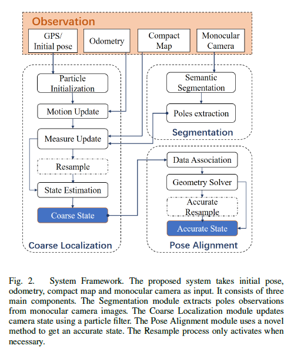

整个系统用GPS或其他粗糙定位系统来初始化。当定位相机的初始位姿后，并行运行语义模块和粗定位模块。语义模块输出由基于CNN的语义分割算法提取的杆。同时，在粗定位模块中的运动更新步骤中，相机位姿通过所提供的里程计来粗略计算。紧凑的地图然后投影到相机，建立语义分割得到的杆与地图中的杆之间的关联。在对测量更新的每个例子都加权后，如果有必要，进行重新采样。然后，利用状态估计计算位姿。位姿对齐模块被用于优化粗定位模块提供的位姿，为了节省时间，可以关闭或者以固定频率运行。这个模块使用一个基于里程计的位姿求解器，去耦平移和旋转，来求解相机的准确平移。然后，固定平移，来优化旋转。如果确定比粗定位更好，在输出最终结果之前，将执行另一个重采样步骤。

#### Pole Representation

这里作者给了一个很强的假设：假设地面是平滑的，且相机始终与地面平行。&#x20;

基于以上假设，作者将地图中的所有语义目标都建模为垂直为地面的无穷长的杆。这样的表征让地图更加紧凑和轻量。因为没有考虑高度，所以可以用二维状态向量来表示landmarks。因此，紧凑地图有M个杆，杆有位置和语义标签，即$$L={<p_i,a_i>}^M_{i=1}$$，其中$$p_i={[x_i,y_i]}^T$$，$$a_i\in \{Pole, Lamp, Tree~Trunk, ...\}$$.&#x20;

给定一个例子位姿m，位姿是$$x_m$$，给定地图中的杆，杆在m的图像平面中的投影的垂直于x轴的无穷长直线，如图1中的红线。记录x坐标u和每个杆的语义标签a为投影$$\hat{l_m}={<\hat{u^k_m}, \hat{a^k_m}>}^M_{k=1}$$。之后，会比较它们与从语义分割图像中提取的杆的观察，来获得数据关联，并计算相机位姿。&#x20;

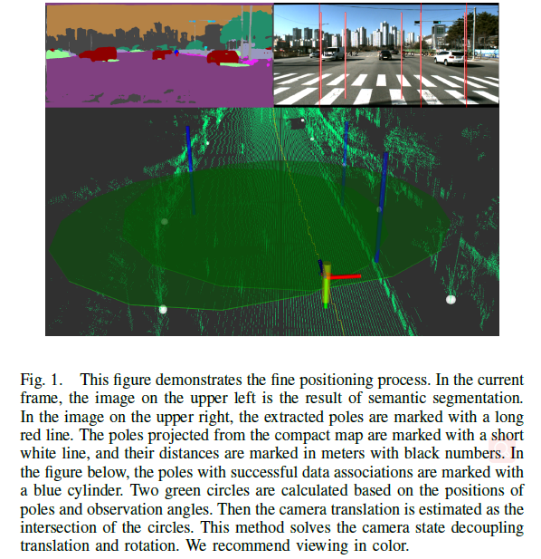

#### Pole Extraction

在语义分割模块中，用BiSeNet进行语义分割，对于每一帧$$F_t$$，过滤网络输出，获得$$n_t$$个杆，保存它们的x坐标和语义标签，即$$\overline{l_t}={<\overline{u^i_t}, \overline{a^i_t}>}^{n_t}_{i=1}$$。过滤算法分为三步：

1. 二值化分割图像，令杆的区域为1，其他区域为0；
2. 计算每列中有多少像素被标记为杆，如果没有达到阈值$$c_1=60$$，则删除这一行。连续的未被剔除的组被聚集为组；
3. 计算每个列组的宽度。如果宽度在$$[c_2=1,c_3=15]$$之间，提取该组的中间作为杆。

### Coarse Localization

粗定位依赖于粒子滤波。作者不断地在各位姿中采样很多粒子，通过融合这些粒子的位姿来更新相机位姿。对于每个采集到的图像，在运动更新、测量更新、重采样和状态估计后，可以估计出相机位姿。

#### Motion Update

作者用UTM（Universal Transverse Mercator）坐标系，以东和北为两个垂直坐标轴，记录位置和旋转，来描述相机位姿。记在第t帧中的第i个粒子的状态为$$p^i_t={[E^i_t,N^i_t,\psi^i_t]}^T$$. 在系统初始化时，读取GPS数据，但是它无法确定性的产生粒子的初始分布。当一个新的帧输入，用来自里程计的线速度$$v_t$$和角速度$$w_t$$来更新每个粒子的状态：&#x20;

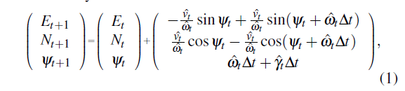

其中&#x20;

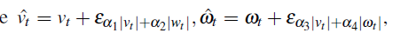

$$\varepsilon_\sigma$$服从均值为0、方差为$$\sigma$$的高斯分布。为了避免退化，作者假设当机器人达到最终位姿时，机器人旋转$$\hat{\gamma_t}=\varepsilon_{\alpha_5 |v_t| + \alpha_6 |w_t|}.\alpha_1, ..., \alpha_6$$由机器人的参数决定。

#### Measurement Update

根据从语义分割模块中和紧凑地图中提取的杆，可以独立更新每个粒子的状态。&#x20;

**Data Association**假设在帧$$F_t$$中，有$$n_t$$个杆的观察，在地图中有M个杆。记在第t帧中的杆的观察为$$\overline{l_t}={<\overline{u^i_t}, \overline{a^i_t}>}^{n_t}_{i=1}$$，将地图中的杆投影到粒子m的状态上为$$\hat{l_m}={<\hat{u^k_m}, \hat{a^k_m}>}^M_{k=1}$$。&#x20;

考虑第t帧的一个粒子m，简化写法，杆的观察为$$\overline{l}={<\overline{u^i}, \overline{a^i}>}^{n_t}_{i=1}$$，杆的投影为$$\hat{l}={<\hat{u^k}, \hat{a^k}>}^M_{k=1}$$。为了估计粒子状态，需要构建$$\overline{l}$$和$$\hat{l}$$的数据关联。这个问题可以建模为最佳映射问题（Optimal Mapping Problem）。假设已经得到了一个映射$$\theta : \{1,...,n\} \rightarrow\{0,1,...,M\}$$，其中$$\theta(i)=0$$说明第i个杆的观察不属于地图中的任何一个杆。定义观察i和杆的投影k之间的距离为损失函数e(i,k):&#x20;

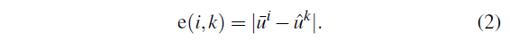

假设杆k在地图中的位姿为$$p_k={[x_k,y_k]}^T$$，它在相机坐标系中的坐标为$$p'_k={[x'_k,y'k]}^T$$，粒子m的位姿为$$x_m={[E_m,N_m,\psi_m]}^T$$，投影矩阵为：&#x20;

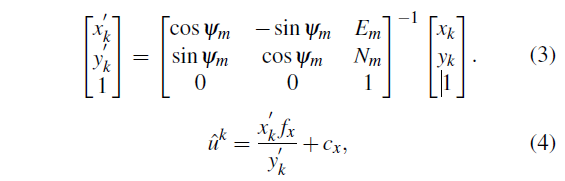

其中$$f_x,c_x$$是相机内参，总损失E由观察$$\overline{u}$$和对应的投影$$\hat{u}$$之间的所有距离的和来定义：$$E=\sum_{1\le i \le n,k=\theta(i)}e(i,k)$$。最小化E，得到真实映射$$\theta$$的最优估计$$\hat{\theta}$$。&#x20;

**Weight Calculation**每个粒子m代表一个可能的相机状态。首先基于杆的观察和投影对它进行权重分配。将每个杆的观察$$\overline{l}_i \in \overline{l}$$分为两类：

1. 观察$$\overline{l}_i$$映射到此图中的一个已确定的杆($$k=\hat{\theta}(i)>0$$)。定义： 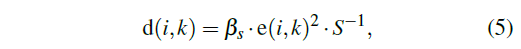其中$$\beta_s$$与三维空间中杆与相机之间的距离呈正相关。假设更靠近的杆对损失具有更高的权重。$$S^{-1}$$被用于建模观察的不确定性，并且由杆提取模块决定。e由公式2定义。然后由$$\overline{l}_i$$决定的权重可以写为： 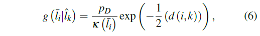其中$$p_D$$是杆的一个特定类别被识别的可能性，由杆提取模块给出。$$k(\overline{l}_k)$$是Possion clutter process的强度。
2. 观察$$\overline{l}_i$$没有被映射到一个存在的杆($$k=\hat{\theta}(i)=0$$)。这种情况下， 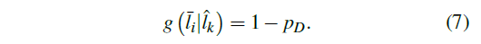第m个粒子的权重用全部观察来计算：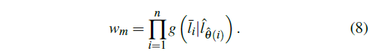&#x20;

#### State Estimation

受GMAPPING启发，作者用有效粒子的数量$$N_{eff}$$来决定是否进行重采样。定义：&#x20;

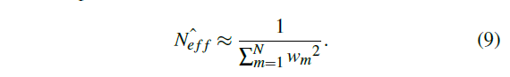

假设N是粒子的数量，当$$\frac{\hat{N_{eff}}}{N} < p_0=0.6$$时进行重采样。相机状态从所有粒子的加权平均来估计。

### Pose Alignment

给定粗定位的结果，位姿对齐将利用几何约束来去耦平移和旋转。如果姿态对齐给出了更好地满足要求的相机状态，算法将利用它进行准确的重采样，来调整粒子分布。&#x20;

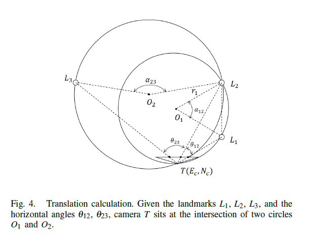

#### Translation Calculation

假设有两个landmarks $$L_1,L_2$$，它们在图像平面上的投影为$$l_1=<u_1,a_1>,l_2=<u_2,a_2>$$，已知相机内参矩阵。可以将单目相机看做一个量角器，计算水平角$$\theta_{12}$$:&#x20;

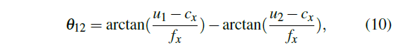

其中，假设$$u_1>u_2$$，$$f_x,c_x$$是相机内参。 如图4所示，$$\theta_{12}$$可以看做一段圆弧的内角，$$L_1$$和$$L_2$$是圆$$O_1$$上的两点，根据圆周角定律，中心角是圆周角的两倍，因此，可以获得该圆的半径：&#x20;

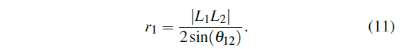

同样，可以根据landmarks $$L_2L_3$$获得圆$$O_2$$和它的半径$$r_2$$和视角$$\theta_{23}$$.$$O_1$$和$$O_2$$相交于两点，分别为$$L_2$$和相机$$T=(E_c,N_c)$$。因为T和$$L_2$$关于$$O_1O_2$$对称，可以获得相机的平移。&#x20;

相机的旋转没有在上述过程中被用到，说明在该模型中，旋转对平移没有影响。因此，可以去耦平移和旋转。

#### Rotation Optimization

为了获得一个完整的位姿候选$$\hat{x}={[\hat{T},\hat{\psi}]}^T$$，作者构建了一个优化函数来求解当平移固定时的相机旋转：&#x20;

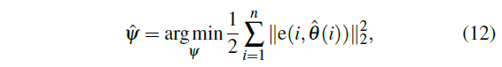

其中e由公式2定义，$$\hat{\theta}$$是测量更新环节解出的数据关联。因此，在这个非线性优化问题中，只有一个参数需要优化，利用高斯-牛顿法来求解问题。

#### Evaluation

在位姿对齐过程中，需要三个landmarks来调节相机位姿。假设有n(>3)个成功关联的landmarks，可以获得$$C^3_n$$个可能的landmarks组合和相同数量的准确位姿候选，在实际应用中，准确的位姿对齐可能失效。例如错误的语义分割造成错误的观察和数据关联，或者图4中两个圆非常相似，造成退化。&#x20;

因此，作者设计了一个评估过程，来保持一个鲁棒的位姿预测。用公式8计算每个位姿候选的权重，然后用权重排序，然后挑选最后最高权重$$w_p$$的位姿候选$$x^*$$，评估过程包含两个准则：

1. $$w_p > w_c$$，其中$$w_c$$是粗糙位姿的权重；
2. $$d_p < d_0=1m$$，其中$$d_p$$是准确位姿$$x^*$$和粗糙位姿之间的距离。 如果满足两个条件，认为位姿对齐是成功的，激活准确的重采样步骤。否则，输出粗定位的结果。如果成功观察的landmarks数量小于3，则输出粗定位的结果。

#### Accurate Resample

如果评估过程输出了一个有效的准确位姿，据此调整所有粒子的概率分布。对平移和旋转分别生成一个新的高斯分布，均值为$$x^*$$，方差分别为$$\sigma_t$$和$$\sigma_\theta$$。然后，从这个分布中采样新的粒子。假设位姿对齐的不确定性与位姿权重负相关，定义&#x20;

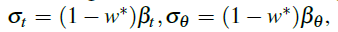

其中$$\beta_t = 1000m,\beta_\theta=200 rad$$反映了位姿对齐模块的可信度。

> Unlike traditional resampling methods that take advantage of existing particles in the Motion Update, the accurate resample step generates distributions from observations and constructed maps. Such approaches are more like a global relocalization technique and reduce the effect of drifts in the long run

### Experiments

对点云进行人工标注，获得杆。由于地图可以只保存杆的信息，所有地图很紧凑。

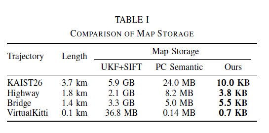

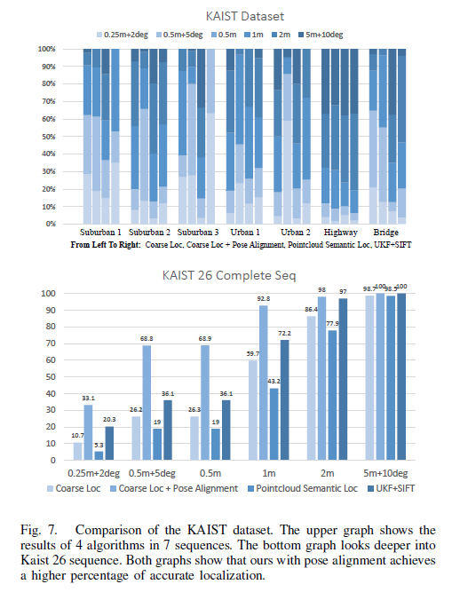

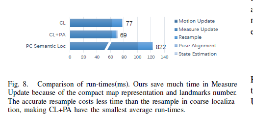

