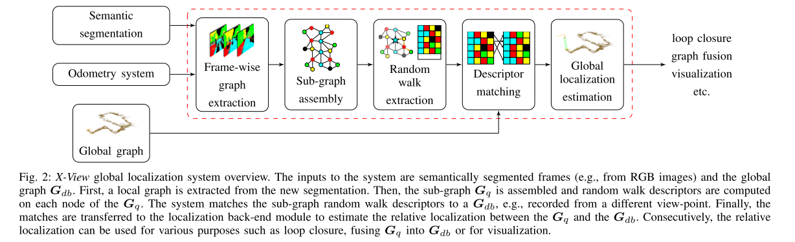
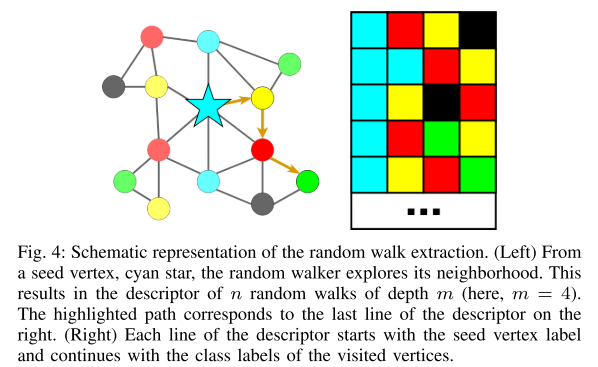
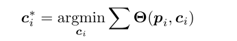
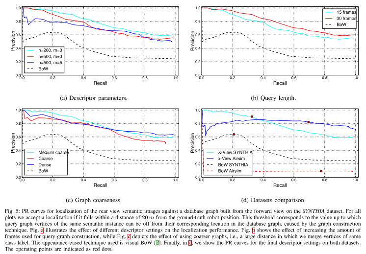
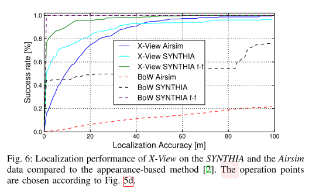
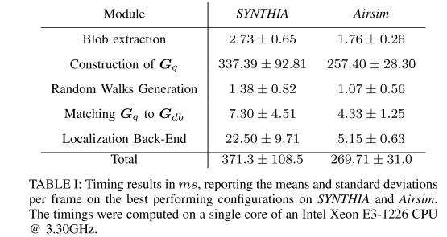

# \[RAL 2018] X-View

提取图像语义块作为拓扑图节点，根据3D空间中的相邻关系定义边。利用random walk描述子描述拓扑图，匹配图像。



### Abstract

在这篇论文中，作者希望利用人造环境中的语义信息来解决剧烈视角变化的问题。利用语义图的描述子来实现定位，来实现aerial-to-ground、ground-to-ground的剧烈视角变化时的定位问题。

### Method

#### System Input

算法的输入是具有像素级别的语义或实例分割图像。并且算法假设已经有了一个额外的里程计提供的估计和之前得到的语义地图$$G_{db}$$.

#### Graph extraction and assembly

这一步中，算法将一段语义图像序列转换成一个query graph $$G_q$$。先对语义图进行腐蚀和膨胀获得无噪声的语义分割图，然后提取具有相同语义标签的区域，作为一个blob。提取每个blob的中心点$$p_j$$，并记录。每个blob被当作一个顶点$$v_j=\{l_j,p_j\}$$.&#x20;

可以根据一幅图像构建一张二维图像内的无向图，也可以根据一段序列构建在3D空间内的无向图$$e_j$$. 利用深度信息或者深度预测，可以用3D坐标来计算blobs的欧拉距离来获得3D空间内的邻近关系。一段图像中，每张图像的无向图根据欧拉距离来连接顶点。为了减少同一语义信息的重复顶点，$$G_q$$中邻近的实例被合并成一个顶点。

#### Descriptors

图匹配问题是一个NP难问题，所以作者在这篇论文中使用了random walk描述子去描述拓扑图，保证描述子的提取和匹配时间是常数或线性的。&#x20;

每个节点的描述子是一个$$n\times m$$的矩阵，随机游走n次，每次走m步。在每次游走过程中，从当前节点$$v_j$$开始，记录经过节点的语义标签。在控制游走路径时，防止回到上一步刚经过的节点，避免出现重复的游走路径，这样可以提升描述子的表达能力。&#x20;

#### Descriptor matching

当$$G_q$$和$$G_{db}$$都获得后，我们计算query graph中的顶点和database graph中的顶点的描述子相似度来获得associations。对于每个query graph中的顶点，我们通过语义描述子找到database中与之具有相同随机游走的顶点，相同随机游走的数量被当作相似度分数s，被标准化至0到1之间。在第二步中，具有最大相似度的k个匹配被挑选出来，来估计query image在database map中的位置。

#### Localization back-end

query image与global graph之间的匹配、robot观察到的顶点，以及机器人的里程计估计可以构成在顶点$$p_i$$和机器人位姿$$c_i$$时的约束$${\theta}i \in \Theta(p_i, c_i)$$，其中$${\theta}{i}=e_i^T{\Omega}_ie_i$$, $$e_i$$是测量误差，$${\Omega}_i$$是associated information matrix。这三种形式的约束，可以分别记为$${\Theta}_M(p_i)、{\Theta}_V(p_i, c_i)$$和$${\Theta}_O(c_i)$$。$${\Theta}_M(p_i)$$来源于语义描述子的误差，$${\Theta}_O(c_i)$$源自在不断将机器人位姿关联到localization graph时使用的里程计的估计误差，robot-to-vertex约束内涵了每次机器人观察到结点的转换信息。&#x20;

利用这三种约束，作者通过Maximum a Posterior (MAP)，让负对数后验$$E=\sum {\theta}_i$$最小，来估计机器人的位姿$$c_i$$:&#x20;

该问题可以通过Gauss-Newton方法来优化。在算法中，作者用匹配顶点的平均位置来初始化机器人的位置。

### Performance

### 一些看法

X-view构建语义拓扑图和利用random walk描述子来表示图像的方法很新颖、高效。但是算法要求理想的分割结果，以我自己的工程经验而言，即使在KITTI这种比较理想的真实数据集上，语义分割的效果也不足以构建如X-view论文中所需的拓扑图...所以算法的实际效果有待考证，官方代码还没开源，所以只能默默等待了。
