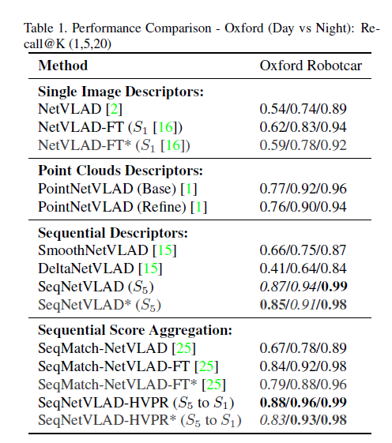

# \[CVPRW 2021] SeqNetVLAD vs PointNetVLAD

这篇报告指出在极端昼夜情况下，在描述子中加入时序信息有可能获得与基于3D数据的描述子相比相近或更好的定位表现。



### Abstract

> Is an explicit 3D structure based place representation always superior to an implicit “spatial” representation based on sequence of RGB images which can inherently learn scene structure?

### Introduction

这篇报告旨在探索比单张图像描述子具有更强day-night robustness的3D点云描述子，与基于图像序列的描述子相比效果如何。是否加入序列化信息后，图像描述子可以获得足以与基于3D数据的描述子相比的效果。

### Experiments

