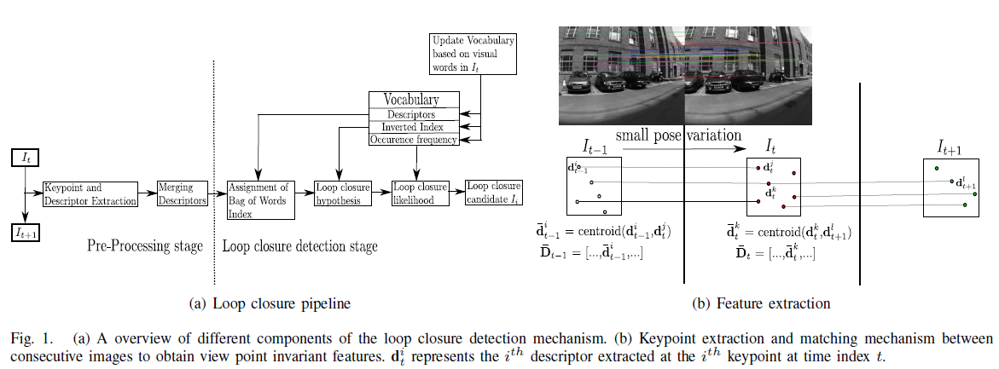
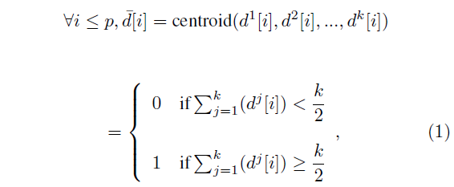
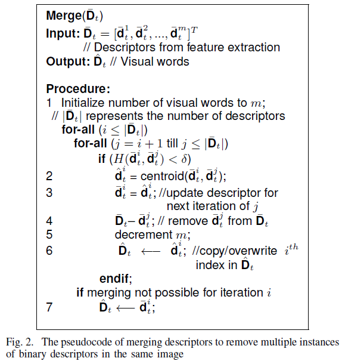
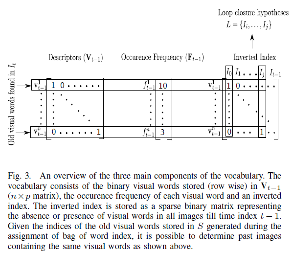
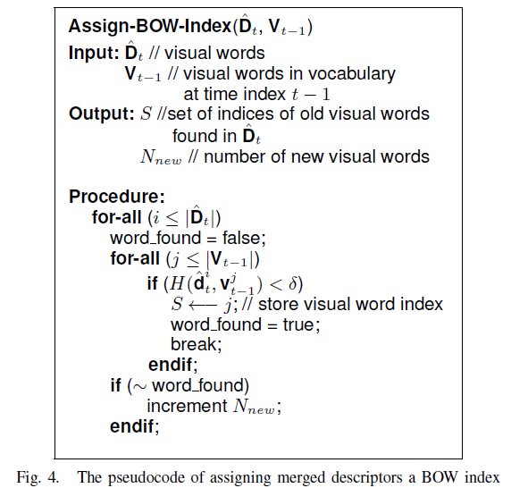
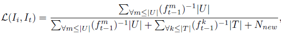
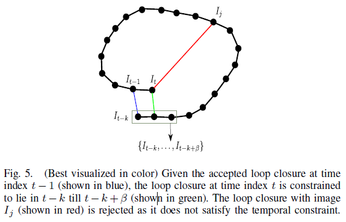
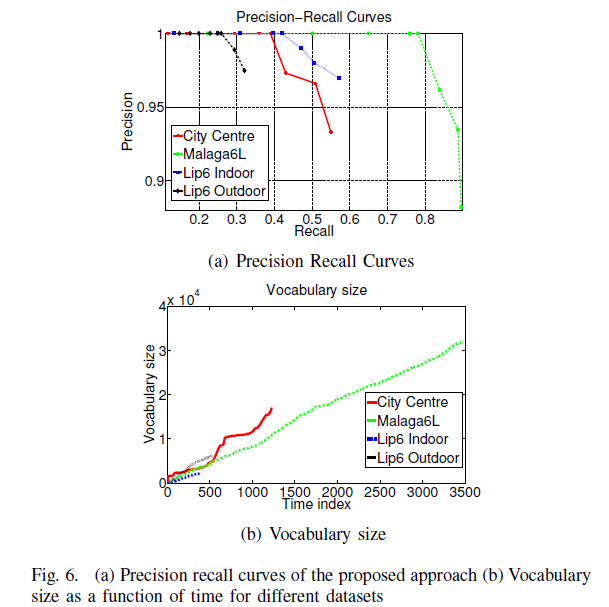
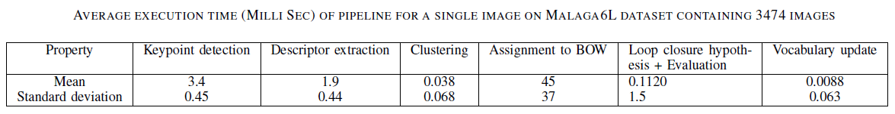
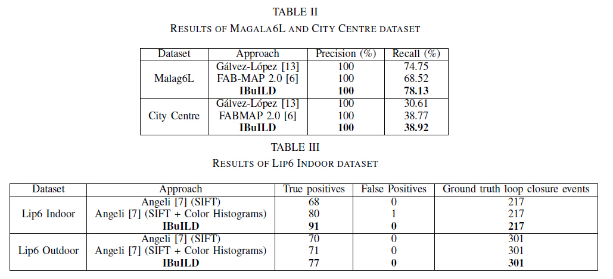

# \[ICRA 2015] IBuILD

这篇论文，作者提出了一个增量式构建词典的方法，词典中的视觉单词有前后帧图像中的特征匹配获得，匹配的图像经过合并（删除重复特征）后开始回环检测。整个流程为：先将视觉单词与词典中的单词相互匹配，匹配到的单词为旧单词，未匹配到的为新单词；基于旧单词，利用inverted index找到回环候选；基于新旧单词的数量和出现频率，利用似然估计得到候选的分数，分数最高的视为回环；此外，增加了temporal consistency constraint；检测完t时刻的回环，再利用当前图像中提取的新旧单词对词典树进行更新，新单词加入，旧单词更新出现频率和inverted index。思路简单明了，效果还不错，就是词典规模没有限制，会随着场景增大一直增加。



### Abstract

本文提出了一个on-line，增量式的二进制词典构建方法，不需要事先的词典训练步骤，完全依赖于场景中的外观信息，不需要里程计和GPS信息。词典构建过程是基于连续图像间的特征跟踪来结合位姿不变性的。除此之外，该方法还与一个简单的似然函数相结合，来产生最可能的回环候选，并且用一个temporal consistency constraint来剔除不一致的回环。

### Introduction

基于图的SLAM算法包含前端和后端两部分。前端处理原始数据，来产生节点和边约束；后端在给定边约束的情况下预测机器人位姿和landmarks的后验分布。回环检测就是在前端中当机器人再一次回到之前访问的地点时，产生节点间边约束的过程。回环检测的表现对于SLAM来说很重要，因为一个错误的边就会导致不一致的地图。后端一般不会检查边约束的对错，而是将这一问题留给前端。因此，为了让自动机器人构建全局一致的地图，回环检测需要在100%准确率的基础上尽可能达到高的召回率。（**这段把回环检测的重要性和为什么采用R@P=1这一指标说的很清楚诶！棒！**）&#x20;

这篇论文提出了一个简单的视觉回环检测方法，它利用连续图像间的特征跟踪来实现online、增量式地词典构建，词典由二进制视觉词典构成。一个基于特征inverse occurence frequency的似然函数被用于产生最可能的回环候选。并且，一个temporal consistency检测被用于剔除不合理的候选。

### Pre-Processing

回环检测的流程如图1(a)所示，该流程分为两个部分：预处理和回环检测阶段。特征提取及描述子合并发生在预处理阶段。

#### Feature extraction

流程中第一步是提取具有视觉不变性的特征。本文中使用了BRISK（Binary Robust Invariant Scalable Keypoint）特征，因为它具有尺度和旋转不变性，并且可以在减少计算和储存消耗的同时达到与SIFT、SURF相似的表现。

本文是从连续图像中提取匹配的特征，如图1(b)所示。使用匹配特征的目的是为了找到当机器人以不同位姿回到相同位置（回环）时最可能提取到的特征。为了匹配特征，本文使用hamming距离来计算相似度：&#x20;

其中符号表示异或，p是特征描述子向量的维度。当连续图像中的两个特征之间hamming距离小于$$\delta$$，则认为他们是一个好的匹配，否则丢弃这段匹配。匹配特征的中心被视为他们的一个代表。中心值应当如下计算：&#x20;

在本文中，中心值在连续图像中计算，并被保存到t时刻的$$\overline{\textbf{D}}_t$$ (**虽然感觉图中的公式和文中有点对不上，但是大体意思应该是只考虑用匹配特征，然后计算前后图像中匹配图像的中心值作为一个represetative**)

#### Merging descriptors

预处理的第二步就是合并之前一步提取的特征，如图1(a)所示。这一步是为了删掉多于的相似特征，以防图像中有重复的纹理。令$$\overline{\textbf{D}}_{t} = [ \overline{\textbf{d}}^{1}_t, \overline{\textbf{d}}^{2}_t, ..., \overline{\textbf{d}}^{m}t ]^T$$（m为描述子的总数）代表连续图像$$I_t$$和$$I_{t-1}$$之间的匹配特征的中心值。（**这里感觉和前面的对应不上诶...前面计算的中心值应该是一幅图像中所有匹配特征求质心，得到一个向量；但是这里感觉是每对匹配特征算一个质心，所以一幅图像由m对匹配特征，就有m个质心...不知道是自己理解错了还是论文写错了...**）经过合并过程，描述子被视作一个视觉单词。算法开始用一个描述子与集合$$\overline{\textbf{D}}_t$$中所有其他描述子进行匹配。当它们之间的距离小于$$\delta$$，描述子被合并，并用他们各自的中心值代替。这一过程是贪婪的，直到没有合并可以进行。最初，$$\overline{\textbf{D}}_t$$中所有描述子都被视作独立的视觉单词，但是经过合并，视觉单词的数量减少。伪代码如下：&#x20;

**(总得来说，就是上一步特征提取中，提取了前后图像中“连续的”特征，然后这一步中将单张图像中重复的特征进一步合并**）合并后的视觉单词被记为$$\hat{\textbf{D}}_t$$。

### Loop Closure Detection

回环检测算法中最重要的就是词典。在$$V_{t-1}$$中除了保存二进制视觉单词外，词典还包括所有二进制视觉单词的出现频率和用于产生回环候选的inverted index。出现频率被记为$$F_{t-1}=[f^{1}{t-1},f^{2}{t-1},...,f^{n}_{t-1}]$$，包含了视觉单词直到t-1时刻在图像中出现的次数。n表示词典中视觉词典的总数。使用时间戳t-1是因为词典更新是基于$I\_t$时检测到的特征的，是在整个流程的末端，因此是在回环后验计算之后。词典还使用inverted index来基于图像$$I_t$$中提取的特征找到回环候选。在本文中，inverted index被保存为一个稀疏的二进制矩阵，表述了直到t-1时刻一个视觉单词在所有图像中的出现与否，如下图所示。&#x20;

#### Assignment of the BoW index

从预处理步骤得到的视觉单词$$\hat{\textbf{D}}_t$$与当前词典$$V_{t-1}$$中的视觉词典进行比较。这一步决定了$$\hat{\textbf{D}}_t$$中新旧视觉单词的数量。匹配阈值$$\delta$$被用于匹配，得到了旧视觉单词（已经存在了的视觉单词）的索引值。这些索引值被存放在S中。这一步伪代码如下所示。&#x20;

最初t=0时视觉词典为空，所以所有$$\hat{\textbf{D}}_t$$中的视觉单词都被认为是新的视觉单词，并被储存为$$V_{-1}$$。

#### Loop closure hypotheses and likelihood evaluation

基于在BoW合并过程中得到的S，回环候选集合可以通过inverted index获得。如图3所示，当给定了旧视觉单词的索引值，很容易获得它们的出现频率和在之前图像中的出现情况。作者用了temporal constraint threshold $$\beta$$来防止算法从相邻图像中检测回环。因此，回环候选只能从t=0到$$t_L$$区间内产生，$$t_L=t-\beta$$。令$$L={I_i,...,I_j}$$表示从inverted index中得到的回环候选，U表示回环候选与当前图像中共同存在的视觉单词。候选与当前图像的似然值可以计算为：&#x20;

其中T是在候选图像中出现但是不在当前图像中出现的视觉单词的索引值，$$N_{new}$$是新视觉单词（在当前图像中出现但是不在候选图像中出现的单词）的数量。归一化后得到：&#x20;

具有最大归一化似然值的候选被认为是回环。

#### Temporal consistency

#### Vocabulary update

计算似然值后，词典会根据新视觉单词的数量扩展词典。另外，旧视觉单词的出现频率也会更新，所有新视觉单词的出现频率被初始化为1。最后inverted index基于当前图像中检测到的视觉单词更新。（**所以只是增加新视觉单词，然后更新旧视觉单词的出现频率和inverted index么？**）

### Experimental Evaluation

描述子维度设为512，temporal constraint threshold $$\beta$$设为10.&#x20;

由于只有增加单词，没有删除，没有词典规模会一直增大，这点值得改进。&#x20;

