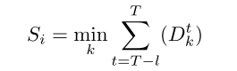
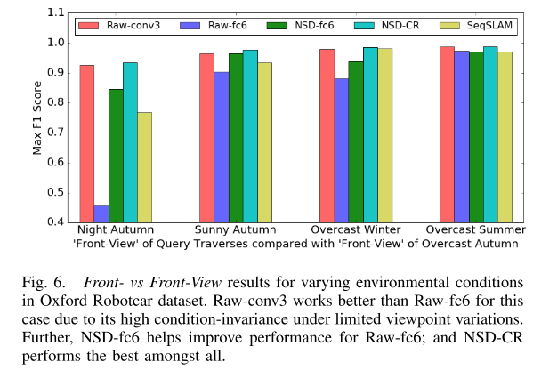

# \[ICRA 2018] Don't look back

利用Place365网络提取特征，得到具备视角不变性的全局描述子，对全局描述子进行标准化，得到外观不变性。利用SeqSLAM框架搜索匹配的图像。为了解决相对视角的问题，从图像左右分别提取区域，提取两个全局描述子，分别计算距离，取较小值作为相似度。



### Abstract

In this work, we develop a novel methodology for using the semantics-aware higher-order layers of deep neural networks for recognizing specific places from within a reference database. To further improve the robustness to appearance change, we develop a descriptor normalization scheme that builds on the success of normalization schemes for pure appearance-based techniques such as SeqSLAM.

### Introduction

作者先说了一下place categorization和place recognition之间的联系和区别。place categorization相对更简单，只是识别了当前场景的类型，如parking garage，但是place recognition还要识别出在parking garage中拍摄当前图像时相机的具体位置。&#x20;

在这篇论文中，作者研究了神经网络高层的语义级别的全连接层的适应性，而非依赖于视角的中层卷积层，来获得视角不变性和条件不变性的场景识别。特别调研了语义级别的图像表征在应对极端视角变化时的表现。除此之外，作者来提出一种描述子标准化方法，来获得多变环境条件下的外观鲁棒性。并且展示了上下文信息可以用于生成一个拓展的图像描述子，进一步提升场景识别的表现。最后，作者通过与场景描述子的PCA分析得到了一些有价值的观点，突出了场景识别任务中时空特性的重要性。

### Method

#### Place Representation

作者使用了**Places365**网络去表征场景，高层的全连接层可以输出场景的语义描述，所以作者使用**fc6**输出的4096维向量来描述场景。虽然全连接层输出的特征具被视角不变性，但是缺乏外观不变性。

#### Feature Normalization

作者为了增加场景外观不变性，对描述子进行了标准化：&#x20;

其中$${\mu}_s$$是数据集中所有图像描述子的均值，$${\delta}_s$$是方差。标准化后的特征描述子集合称为Normalized Set of Descriptors (NSD)。对于reference images，由于图像可以事先获得，所以直接在全部图像中计算均值和方差。对于query image，均值和方差随着图像输入不断更新。

#### Sequence Search in Cost Matrix

作者计算了query image和reference images之间的余弦距离（应该是1-cosine similarity），得到了一个cost matrix，利用SeqSLAM中的序列匹配方法，搜索匹配的序列：&#x20;

$$S_i$$是reference image i的最小序列匹配损失。k是序列匹配的斜率（参考SeqSLAM），是在cost matrix对角线±2 rad间变化。$$D^T$$是时间T时的余弦距离，在时间长度为l的序列上累加。&#x20;

$$I_{min}$$是匹配的reference image

#### Cropped Regions

为了解决opposite-view的问题，作者在图像中提取左右两个region，分别提取Normalized Descriptor，得到两个4096维的描述子，在匹配时，两个描述子都计算余弦距离，取较小的作为度量。(称为NSD-CR)

### Performance

#### Across Datasets

证明了在front v.s. rear-view的情况下，NSD-CR算法表现最好。

#### Across Layers

证明了fc6是可以较好的平衡外观不变性和视角不变性的。

#### Across Networks

证明了提出的方法NSD对于任何网络都有效，并且通过place-centric training得到的网络p365、NetVLAD表现比object-centric training得到的网络要更好，因为它表征了场景的类别属性。

### 一点看法

这篇论文通过利用分类网络的高层全连接层来获得语义信息，解决视角不变性。采用cropped regions的方法来解决front v.s. rear view的问题，但是我感觉有些局限，相当于已知视角变化是相同方向或相反方向加一个小视角偏移。像X-view适用的范围更广，所以，图模型大有可为😎
