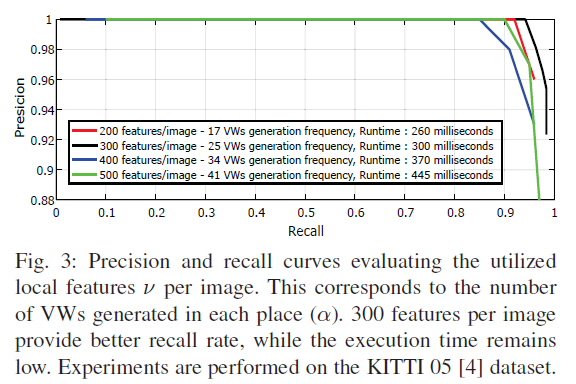

# \[ICRA 2018] VWs to Places

这篇论文中，作者提出了一个增量式的回环检测方法，通过特征跟踪的情况来将图像序列动态地划分为places。在各places（即一段图像序列中）累积特征，利用GNG聚类方法来生成视觉单词。在检测时，对于搜索区域内的place进行投票，根据当前图像特征到已有视觉单词的关联对places进行投票。可以预想的，如果出现回环place，那么该place的票数应当更多，否则票数呈现随机分布的状态。在判断回环时，采用两个判断条件：1.二项分布概率小于阈值；2.累积视觉单词数大于某一阈值。找到回环候选的place后，对于place中的历史图像，找到具有相同描述子最多的图像，作为回环候选，经过几何验证和时序一致性验证后，得到回环。



### Abstract

本文作者提出了一个"将视觉单词分配到经过的特定地点"的回环检测方法，该方法无需事先的训练词典过程或特征维度缩减过程。通过对输出的图像流进行动态的分割，获得place，然后利用一种在线的聚类方法将视觉单词与place关联在一起。在检索时，图像描述子被转换为地图上的视觉单词，对视觉单词对应的place累加票数。该方法通过概率函数的方法来检索回环。通过在特征空间中的最近邻投票机制，算法可以找到选定place中最合适的匹配图像。geometrical check和temporal check帮助提升了算法的表现。

### Introduction

在这篇论文中，作者提出了一种高效的image-to-sequence的基于视觉的回环检测方法，利用对在线生成的视觉单词的投票机制和概率函数，该算法可以准确的检测到之前访问过的地点。在输入的图像流上，算法用一个动态的分割方法，在机器人巡航路径上定义了place这一概念。随后，累积的局部特征描述子被Growing Neural Gas (GNG) 聚类机制处理，来生成对应的视觉单词。 当新的query图像输入算法，被提取到的描述子投票给包含最近邻视觉单词的数据库中的序列。算法使用二进制概率密度函数来定位可能的place，然后用一个最近邻描述子技术来在选定的序列中识别image-to-image的关联。除此之外，temporal check和geometrical check被用于检查query和候选图像。论文的主要贡献如下：&#x20;

### Methodology

该算法用一些在线定义的视觉单词来描述每个place。第一步，时间和内容上相近的图像被聚集在一起，由此而产生的图像序列被定义为place。然后，利用GNG聚类方法对序列中积累的描述子进行处理，产生对应的视觉单词。在检索过程中，从最近帧中提取的特征被转换为轨迹中最相似的视觉单词。每个描述子到视觉单词的转换都对应着序列中的新的一票。有binomial probability function决定聚集了最多视觉单词票数的place。再用描述子空间中的最近邻方法来识别特定place中最相似的图像。最后，被选出的候选图像要经过几何一致性和时间一致性检验。整个算法的流程如图所示。&#x20;

#### Place Formulation

算法输入的数据为图像流。对输入算法的每个图像I，提取v个最显著的SURF特征。机器人在巡航时，有时相机采集的数据会无法产生足够的视觉信息，比如观察到全黑色的平面。为了避免产生不一致的place，包含少于$$\xi$$个特征的图像会被剔除。在在线过程中，描述子空间不断被检测到的特征向量$$d_I$$更新。该算法使用完整的SURF空间，没有进行特征维度缩减。 在算法中，新的place S由特征匹配一致性检测来产生。举例来说，在时间t，当最后n张图像的描述子之间的联系不在存在时，输入的图像流$$I(t-n),...,I(t-1),I(t)$$被分割出来：&#x20;

其中，|X|表示集合X的势。（**应该就是指匹配特征数小于1吧**）对于每个place，也保留了一个描述子数据库$$D_S$$:&#x20;

#### Representation of Places by Visual Words

为了将视觉单词分配到place上，局部特征$$D_S$$被作用输入数据输入GNG聚类算法，与其他惯用的需要制定聚类数的聚类方法不同，GNG增量式地添加新的视觉单词，直到达到一个误差最小的标准。作者提出的算法使用了GNG方法来量化特征描述子，直接使用了原论文“A Growing Neural Gas Network Learns Topologies”中的参数。由GNG产生的视觉单词的最大集合$$VWs(\alpha)$$被定义为与图像中提取的特征v相等，这是为了提供一个视觉单词与图像特征之间的直接联系。因此，当达到一个频率标准$$\varphi$$（每个place中视觉单词的最大数量/序列的平均长度$$\mu$$，即$$\varphi=v/mean(\mu)$$时，一个新的视觉单词被产生。因此算法希望尽可能减少计算复杂度，所以GNG的迭代次数($$\varepsilon$$)被设为允许的最低值。最后，一个包含产生的视觉单词的视觉词典数据库被保留下来：&#x20;

inverted indexing list也被保留，用于在inference时提供更快的图像到序列的关联。

#### Query to Place Assignment

当给定一个query图像$$I^{Q}_{t}$$时，算法在所有产生的places上进行搜索，来找到候选回环。不同于大多数基于BoW模型的方法使用视觉词典的直方图来进行比较，该算法使用投票机制，使用最近邻方法来将query中的局部特征映射到$${VV}_{db}$$产生好的视觉单词上。在这一转换过程中，票也根据视觉单词的来源被分配到places上。每个place i的投票密度$$x_i(t)$$构成了决定概率相似分数的因素。&#x20;

当机器人的运行速度变慢或停止，有可能query和database中观察到一样的场景。在这样情况下，传入的相机观测数据具有很强的空间关系，会导致false positive。并且，它们也具有同样强的时间关系，来表明这一回环是错误的。所以，算法根据时间上的限制定义了一个搜索区域$${VV}_{sa}$$来提出刚获得的相邻图像：&#x20;

当投票过程完成，算法使用binomial probability function来检查可能的回环place。如果机器人访问了一个新的场景(从未遇到过)，投票过程应是随机的，这意味着$${VV}_{sa}$$中每个地方的投票密度将较低。因此，当机器人经过一个重新访问过的区域时，特定位置的投票密度应该很高。基于binomial distribution function的性质，后一种情况对应着一个低概率事件。在本算法中，这样的情况被视为候选回环：&#x20;

即认为，对每个place的投票是服从二项分布的（投/不投，重复n次）。其中，N表示query中视觉单词$$VWs(d_{Q(t)})$$的数量，$$\lambda$$对应着place i的视觉单词，而$$\Lambda$$是搜索区域$${VV}_{sa}$$中所有视觉单词的总和。对每个place计算概率分数，如果一个place被确认为之前访问过，它必须满足两个条件。它的分数必须满足阈值：&#x20;

除此之外，累积的视觉单词数量对于选定的place必须大于分布的拓展值：&#x20;

该式可以避免一些投票数比随机投票还少的特殊情况（比如算法刚运行的时候）。

#### Image to Image Association

最后一步，算法要检索出选定的place $$S_m$$中最相似的一帧图像。基于KNN分类器（K=1），query的描述子$$d_Q$$与$$S_m$$中的描述子$$D_{S_m}$$相互匹配。具有最多匹配的图像$$I^S$$被视为回环候选。为了消除false positive，算法还使用了RANSAC算法来计算fundamental矩阵，如果计算过程失败，或者说inlier的数量少于$$\tau$$时，候选被忽略。最后，该方法在最后的$$\beta$$帧输入图像中加入了时间一致性检查。更具体地说，当$$\beta$$帧图像满足上述的回环条件时，该回环被接受。

### Experimental Evaluation

数据集：&#x20;

参数设置：&#x20;

每幅图像提取特征数量对算法的影响，不是越多特征越好，比较weak的特征提取出来，可能会影响算法。&#x20;

GNG迭代次数对算法的影响：&#x20;

算法总的表现：&#x20;

与baselines的比较：&#x20;

