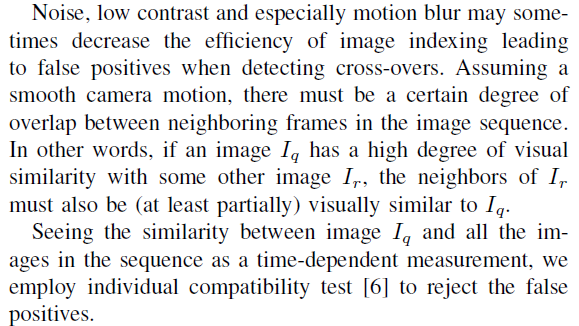

# \[IROS 2009] Online Visual Vocabulary

这篇论文提出了一个很完整的增量式构建词典树的方法，利用特征跟踪获得基本单元，自下而上构建词典树，词典树的根节点为视觉单词，叶节点为基本单元，词典树（视觉单词）的数量由一个目标函数优化得到，无需人工干预，很新颖。词典的更新构成采用了增量式地更新，利用一些方法避免了重复计算。使用LDA对特征进行降维。应用场景为水下场景的SfM算法。



### Abstract

受到content-based image retrieval算法的启发，回环检测算法使用visual vocabularies来度量图像间的相似度。但是这类算法有两个缺陷：（1）他们需要很强的人工干预，即通过trial-and-error的方法来训练和调试参数，（2）他们只适合批处理数据，即所有数据在处理前都是已经获得的（应该是指算法只在见过的场景中表现良好）。因此，作者提出了一个算法，在线构建和更新vocabularies，来高效地表示场景中的图像，并且词典构建过程不需要人工干预。

### Introduction

在这篇论文中，作者提出了一个增量式构建视觉词典的框架。该算法不需要人工干预，不需要关于环境的先验信息。在导航过程中，当视觉信息输入到系统中，系统会构建一个简化的词典。该词典会进行更新，以正确地对场景中出现的视觉信息建模。该词典使用一种考虑视觉数据的全局分布的方法来构建，提升了效率。并且，作者提出了一种新的用于特征-聚类之间的联合方法和图像检索方法，适合在线的检测。 提出的方法被应用在水下导航和建图的SFM算法中，视觉词典被用于量化帧间的相似度，从而进行回环检测。 

### Visual Vocabulary

当前sota的算法都处于一个off-line的阶段，这一阶段需要实现从场景中获取视觉特征。这些特征然后通过某种聚类方法被用于构建视觉词典。典型的off-line词典构建方法使用K-means，K-medians或者fixed-radius clustering方法，这些方法需要使用者去设置许多参数，比如聚类簇数。为一个最优的词典找到合适的参数是一项繁琐的任务，需要不同的试错。比如，一个拥有过多单词的词典不会有足够的抽象能力来检测图像间的相似度，反之，一个单词太少的词典将受到混淆，单词过于泛化导致无法区分。

> the adequate parameters for an optimum vocabulary is a tedious task which generally involves a trial and error approach. For example, a vocabulary with too many words would not have enough abstraction power to detect similarities between images. In contrast, a vocabulary with too few words would be too confusing and generalized to be discriminant.

作者提出了一种先进的视觉词典构建方法，它是可扩展的（scalable，因此适用于on-line检测）和自动的（automatic）。为此，作者使用了修改版的agglomerative clustering。agglomerative algorithm从将每个element作为独立的cluster（以下称之为elementary clusters）开始，然后利用某种相似度度量方法将它们合并为更大的clusters中，直到达到一些收敛条件（比如最小clusters数量，最大cluster半径等）。

#### Vocabulary Building

在本方法中，elementary clusters是通过对场景点的视觉跟踪产生的，一个elementary cluster对应着一个追踪的特征。视觉词典通过增量式地合并这些clusters。词典构建过程可以总结为两步：

1. 词典初始化阶段。词典由前m张图像中的elementary cluster初始化，这些cluster逐渐合并，直到收敛（合并的准则在后文中详细描述）；
2. 词典更新阶段。当机器人移动，机器人获得了场景中的更多视觉信息，这些信需要包含到词典中。因此，对于每m张图像，新的elementary cluster被提取出来。这些cluster被加入到词典中，然后全部clusters逐渐合并，直到收敛。这一步每输入m张图像重复一次。&#x20;

#### Cluster Characterization

词典中每个cluster由它在N维空间中的位置和大小（半径）定义。这样提供了关于cluster分布和clusters间交互的完整信息。因为elementary cluster是由特征跟踪获得的，我们这样定义：&#x20;

.png>)

其中，$$C_k$$是cluster的中心值，由图像i中场景点k的平均特征向量给出。$$R_k$$是点k的协方差矩阵。

每次cluster合并是指两个cluster的合并（如图2）。新产生的cluster的参数直接从合并的clusters中获得，不需要重新从初始数据开始计算。这样做，节省了计算时间和内存消耗，尤其是在某些大的cluster中。新cluster的位置和大小由下式给出:&#x20;

.png>)

其中，$$C_a$$和$$C_b$$分别为要合并的两个cluster的中心值，这两个cluster分别有$$n_a$$和$$n_b$$个elements。

#### Cluster Merging

一般的距离方法依赖于相似度度量方法，比如欧拉距离、曼哈顿距离、切比雪夫距离、马氏距离、向量夹角等，但是这些距离只是局部的分析了数据，所以在高维的聚类空间中是次优的。因此，作者提出一种新的距离方法，将数据的全局分布也考虑进来。该方法基于Fisher's linear disciminant，将数据聚类来最大化目标函数：&#x20;

.png>)

其中tr()求得迹，$$S_B$$表示**between clusters scatter matrix**，而$$S_W$$表示**within clusters scatter matrix**，由下式求得&#x20;

其中C是所有数据的全局中心值。N表示所有element的数量，而$n\_k$是cluster k中包含的element数量。 实际上，合并过程可以描述为：

1. 对于每个cluster，我们用kd-tree的方法搜索欧式空间中的邻近cluster，作为合并的待选；
2. 对于每对可能要进行合并的clusters，我们计算两个cluster合并后目标函数的值Q'。如果目标函数的值增大，那么两个cluster被合并，同时$$S_B,S_W$$随之更新。（实际上，在合并时，作者对于所有可能合并的cluster都计算了Q的增益，将其从高到低排序，然后按照这一顺序进行合并。这样做，合并过程就和分析cluster的顺序无关了。） 每一个合并都会改变词典中数据的分布，需要重新计算$$S_B$$和$$S_W$$。直接重新计算会非常耗时，我们提出了一种增量式的更新策略：&#x20;

#### Convergence criterion

上述合并过程将重复进行，逐渐合并clusters，直到没有可以让Q增加的合并。通过这种方法，本算法提供了一种自然的收敛标准，不需要任何人工参数。

#### Vocabulary update

在词典更新阶段，新的elementary clusters加入，包含新的视觉特征。对于每个新加入的elementary cluster $$\zeta_e$$，$$S_B$$和$$S_W$$必须相应的更新。为了避免重复计算scatter matrix，作者提出了一种新的更新方法。 更新$$S_W$$只涉及$$\zeta_e$$的covariance matrix$$R_e$$，用element的数量$$n_e$$（每个elementary cluster中elements的数量是指特征跟踪中的帧数）加权：&#x20;

**这里为什么不是**$${S'}_W=\frac{NS_W+n_eR_e}{N+n_e}$$**呀，有点没看懂诶....** 增加新的cluster会影响全局的数据中心C，新的中心值C'为：&#x20;

考虑到C的变化，那么$$S_B$$应该更新为：&#x20;

其中，$$\delta_C=C'-C$$，V是每个新加入的cluster与全局中心值之间差异的加权和。V可以增量式地获取：&#x20;

#### Linear Discriminant Analysis (LDA)

对于视觉词典中包含的cluster信息，我们需要找到一种数据变换方法来是cluster的区分度最大，并且可以让我们减少数据的维度，来提升词典构建和图像检索的速度。因此，作者最大化以下LDA目标函数：&#x20;

其中，w是一个决定最大cluster分散度方向的向量。将最大化J(w)当做一个一般的特征值问题，我们得到一个特征向量对应着w的数据变换。选取G中对应着w中较大值的m列，我们可以将数据的维度降低到s维。 **为什么会降低到s维？不是m维**

### Image Indexing

一般来说，有两个方面决定了视觉词典的有效性：

1. 相似的图像特征应当被对应到相同的cluster（可重复性）.
2. 不相似的图像特征应该对应着不同的clusters（区分能力）。

> Generally, there are two aspects that define the efficiency of a visual vocabulary: (i) similar image features should be associated with the same clusters (repetitiveness) and (ii) dissimilar image features have to be associated with different clusters (discriminative power).

在on-line词典中，作者定义了第三种特性：stability。因为词典一直在更新，作者的目的是相似的特征应当在词典更新的不同阶段都对应着相同的cluster。

#### Cluster association

特征与视觉单词间的对应是通过比较每个特征与词典中所有cluster来获得的。特征被对应到最相似的cluster。大多数图像检索方法利用特征空间中的距离来计算特征和clusters之间的距离。这种方法适合在静态预训练好的词典中使用。&#x20;

如图3所示，传统的特征association方法是不适用于on-line词典的（**很棒的关注点！**）。因此，作者提出的feature-cluster association方法是基于树的。在前文的词典构建过程中，词典树被构建好，树的节点对应着clusters，而树的分支对应着cluster的合并层次。树的根节点对应着视觉单词，树的叶节点对应着elementary clusters（从图像中tracking得到的基本单元）。&#x20;

在feature-cluster association过程中，自顶向下遍历树，计算特征和node之间的欧式距离。为了加速，算法只访问与特征相近的分支，为此，作者计算特征和视觉单词之间的距离，并选取满足的树，其中$$D(f,\zeta_k)$$是特征f与$$\zeta_k$$之间的距离，$$D_m$$是特征f与视觉单词之间的最小距离，而$$\tau$$是一个大于1的预设常值。 被选取的树将被并行访问，为了提升效率，算法使用了一个类似于式15的停止准则，不需要访问离f较远的分支。特征最后被关联到最相似的叶节点对应的视觉单词上。（就是自顶向下查找，找到最相似的叶节点，这一颗树的根节点，即视觉单词，被关联到特征）

#### Image re-indexing

在更新阶段，词典的设置被改变了。因此，无法计算在不同更新阶段索引的图像之间的相似性，而且在每次词典更新后对图像进行索引不是一个可行的解决方案，因为它的计算成本很大。 作者为此提出了一个转换$${}^pT_{p-1}$$来体现更新阶段词典的变化。这个转换可以实现对image re-indexing，而不需要重新进行image indexing：&#x20;

_其中_$$H^{p-1}_{I}$$_是图像I在p-1词典更新阶段时的检索，而_$$\overline{H^{p}_{I}}$$_是图像I在p-1词典更新阶段时的近似检索。 在更新阶段，词典经历了以下改变：_

1. 添加elementary clusters。如果新的cluster没有被其他已存在的clusters吸收，它们将包含新的视觉信息。在这种情况下，任何图像的特征在更新之前都不太可能与它们相关联。因此，这部分$$\overline{H^{k}_{I}}$$被初始化为0；
2. cluster合并。在这种情况下，两个或多个clusters合并，所有之前关联到这些cluster的特征将被关联到新合成的cluster上。因此，与新cluster关联的出现elements数是正在合并的clusters的elements数之和。 为了反映这些变化，$${}^pT_{p-1}$$需要初始化对应着新添加的cluster的直方图元素，求和对应着合并的clusters的元素。举个例子：

#### Image similarity

作者还使用了TF-IDF权重。

#### Cross-over detection

### Experimental Results

该回环检测算法被应用在一个SfM算法（T. Nicosevici and R. Garcia. Online Robust 3D Mapping Using Structure from Motion Cues. In MTS/IEEE OCEANS Conference, pages 1–7, 2008.）中。SfM算法应用SIFT、SURF、MSER、Harris等特征进行特征跟踪。

第一个实验在实验室中进行，使用了一个包含书、箱子和杂志的相对平坦的场景。场景的视觉组成是 复杂的，结合了无纹理区域、自然场景、几何图像和抽象的画。测试集包含215张640x480的图像，利用Canon G9 compact camera采集。算法利用SURF提取特征，特征描述子为64维，反映了特征附近的Haar小波响应。词典用前20张图像进行初始化，然后每10张图像更新一次。&#x20;

在序列的末端，词典的规模增长速度逐渐变慢。&#x20;

作者采用了一个直接的data association方法，来测试数据聚类的质量和所提出索引方法的效率。对于每个图像特征，我们直接将其与欧式距离小的elementary cluster相关联。然后，利用词典树检索该图像特征，如果该特征最后检索到了与相关联的elementary cluster对应的叶节点，被认为是一次“命中”，否则是一次“错失”。作者测试了不同LDA维度缩减和$\tau$值，最后得到，当LDA将特征维度从64降到24，并且$$\tau=1.4$$时，错失率为0.96%。这一参数设置可以很好地减少计算耗时，同时很好的保留词典的能力。在这个序列上，词典更新的平均时间为每次更新1.36秒，图像检索的平均时间为每帧0.23秒。&#x20;

回环检测的结果使用similarity matrix给出的.

第二个实验是在水下数据集进行的，该数据集包含235张720x530的图像。回环检测结果依然由similarity matrix给出。（好像早期的研究偏向于similarity matrix做直观的显示，没有p-r曲线和p@r=1这样的指标）&#x20;

