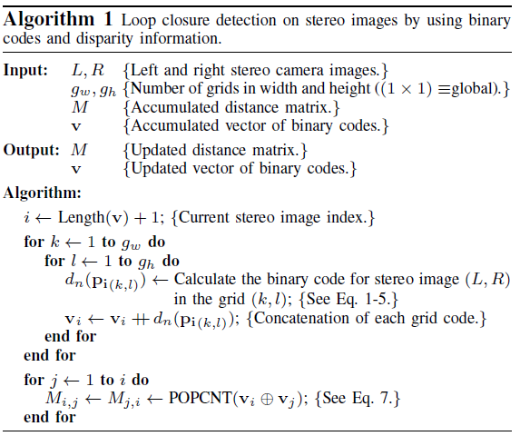
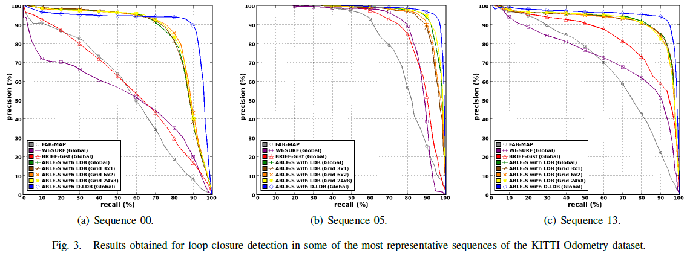

# \[IROS 2014] ABLE

这篇论文作者提出了一种全局描述子，在LDB的基础上加入了disparity信息，提升了回环检测的效果。作者标注了KITTI数据集的回环真值，用以评测回环检测。



### Abstract

这篇工作提出了一个基于二进制code和视差信息的双目场景识别算法。算法（ABLE-S）在全局框架中使用Local Difference Binary（LDB）描述子来获得鲁棒的全局图像描述，该描述是基于图像像素对间亮度和梯度之间差异的。LDB相比其他描述子，如仅依赖于图像亮度的BRIEF，有更好的描述能力。除此之外，作者还讲视差信息加入了二进制描述子（D-LDB）。视差可以提供一些有用的信息，来解决场景识别中常见的问题，如perceptual aliasing。 论文用KITTI数据集测试算法。并且，作者提供了一个回环的真值，以方便回环检测算法表现的比较。

### Introduction

作者提出FAB-MAP有一些缺陷，即需要事先训练环境的视觉词典和相关联的概率方法，使得算法无法适应实时的应用。&#x20;

在这篇论文中，作者提出了一个用于视觉回环检测和场景识别的算法，该算法使用基于像素对的亮度、梯度和视差比较的全局二进制描述子，如图1所示。作者将视差信息加入了LDB，得到了D-LDB。在实验中，作者证明了视差的加入提供了更准确的视觉定位，减少了视觉场景识别中的常见问题，如perceptual aliasing。最后的实验证明，ABLE-S算法获得了超过FAB-MAP、WI-SURF、BRIEF-Gist的表现，并且计算消耗更低。&#x20;

### Binary Descriptor

二进制描述子最好的性质为可以用hamming距离进行高效的匹配。&#x20;

假设一个平滑后的图像块p，其中心为关键点(x,y)，那么二进制检测可以定义为：&#x20;

其中，f(i)是一个函数，返回p中特定pixel或cell的图像特征响应。f(i)可以采用如BRIEF、ORB和BRISK中二进制描述子一样的平滑后的图像灰度值。除此之外，f(i)也可以是如LDB和M-LDB中不同二进制比较结果的串联，比如平均图像灰度、p中特定cell的图像梯度$$G_x$$和$$G_y$$。 为了减少场景识别问题中perceptual aliasing等问题的干扰，作者拓展了LDB，加入了平均视差$$D_{avg}$$的二进制比较结构：&#x20;

最后，合成的描述子$$d_n(p)$$为一个n次二进制检测的向量，n是描述子的维度，通常被矫正为：&#x20;

### Proposed Method

#### Binary code calculation

在本文中，作者采用了LDB，因为LDB相对BRIEF加入了梯度信息。作者还加入了视差信息，得到D-LDB。视差是通过SGBM(Semi Global Block Matching)获得的。&#x20;

作者将图像块的大小定义为64x64，在提取全局二进制描述子之前将图像缩放。另外，作者将二进制描述子的维度定义为256 bits。描述子通过LDB的随机比特挑选方法来满足维度要求。&#x20;

该全局描述子将缩放后图像块的中心作为关键点，来进行计算，没有显性的旋转和缩放。然而，可以采用其他替代方法，将图像划分为多个grids，将每个grid的中心视为关键点，然后计算每个grid的二进制描述子，拼接到一起得到最后的二进制code。这一方法可以考虑采用不同宽和高的grid($$g_w \times g_h$$)。

#### Binary codes matching

对要分析的m个场景，提取二进制描述子，构成向量v。计算二进制描述子之间的hamming距离，得到距离矩阵M。POPCNT是一个machine SSE4.2 instruction，它可以进行二进制codes之间的快速匹配，因为它可以有效的计数二进制序列中为1的位数。&#x20;

#### Algorithmic proposal for visual loop closure detection

（**看这个流程，计算耗时岂不是是线性增长的？**)

### Evaluation

作者标注了KITTI数据集回环的真值。&#x20;

