# \[IROS 2016] Encoding Image Sequences

提出一种在图像序列上的BoW模型，离线构建词典树，将输入的图像流按照里程计反馈，划分为等物理长度的片段，对每个片段和片段中的图像提取特征，量化为BoW向量，利用inverse indexing table找到具有共视关系的序列，利用序列BoW向量进行匹配，根据时间一致性对相似度矩阵进行滤波，得到匹配序列，在匹配序列中，根据inverse indexing table找到共视图像，利用图像BoW向量进行检索，加入时空一致性检验。



### Abstract

这篇论文中，作者提出一种利用匹配图像序列而非单张图像来检测回环的方法，该方法基于一个树形结构的视觉词典，通过扩展这一方法来使用视觉词汇向量描述整个区域的视觉信息。

### Introduction

本文将回环检测过程分为两个阶段，首先在图像序列间匹配，然后在单帧图像间匹配。所提出算法的主要优势在于：

1. 回环候选的数量被减少，因为一段序列中包含很多图像，这一特性在轨迹较长时很有意义；
2. 虽然单图像很相似，但是该方法可以提出在general view中不同的匹配&#x20;

在这篇论文中，作者利用BoW模型，将描述一张图像的BoW向量（I-VWV）拓展为描述一段序列的描述子（S-VWV），作者通过将每张图像中的视觉单词结合到一个向量中来描述图像序列。实际上，仅当度量两图像BoW向量$$\overline{x},\overline{y}$$的相似度$$f(\overline{x},\overline{y})$$保留了线性映射的可加性时，单独图像相似度的和与本文所提出方法得到的结果一致。在实际中，它只是近似。

### Proposed Methodology

这篇论文中，作者通过一种两层匹配检测回环。在第一层中，找到图像序列间的对应关系；在第二层中，匹配序列中的单独图像。这篇论文将图像数据集按照时空接近性划分为groups，然后用sequence-visual-word-vectors进行匹配。随后，算法利用这种先验知识来找到图像本身之间的联系。&#x20;

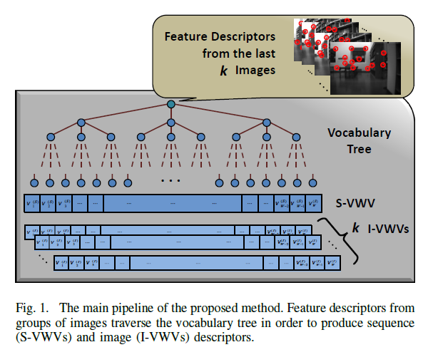

#### Creating Visual-Word-Vectors for Images and Sequences

所提出算法的第一部分包括离线构建视觉词典，来量化图像特征空间。算法使用了树型结构的词典，用二进制描述子。从Bovisa 2008-09-01的10K张室内室外图像中提取3M个BRIEF描述子，构成通用的训练样本D，利用层次化的K-median聚类方法，采用K-means++ seeding和汉明距离，构建了一个K=10,L=6的词典树，视觉单词有$$W=K^L$$个。$$\mathcal{N}^D$$对应着在D中所有视觉单词的集合，$$\mathcal{N}_i^D$$对应着D中第i个单词的集合。&#x20;

为了将得到的图像划分为序列，作者用到了从机器人里程计得到的信息。在机器人移动时，已经过的轨迹被划分为没有重叠部分的$$\mu$$米的片段，每个片段包含着一组图像，构成一个新序列S。每个组的大小记为k，受机器人移动速度和$$\mu$$的影响。这里程计失效的情况下，在速度和帧率相对稳定的情况下，可以得到一个近似的距离。&#x20;

图1描述了获得序列S以及它的k个图像成员的BoW向量的过程，$$I_m\in S (m\in [1,....,k])$$。作者用已构建好的词典和tf-idf权重相结合，获得两种描述子：从每个图像$$I_m$$中提取出的I-VWVs，和所提出的序列化描述向量S-VWV。利用FAST算法，从S中的每张图像中提取300个BRIEF图像特征，这些特征被量化到视觉单词上，$$\mathcal{N}^{(I_m)}_i$$和$$\mathcal{N}^S_i$$分别表示在$$I_m$$中出现的第i个视觉单词和在序列S中出现的第i个视觉单词，$$\mathcal{N}^{(I_m)}$$和$$\mathcal{N}^S$$包含$$I_m$$中的所有单词和S中的所有单词。&#x20;

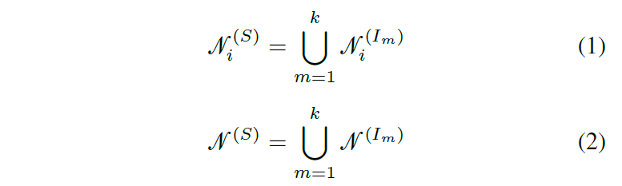

对应的k个I-VWVs描述子为$$\overline{v}^{(I_m)}=(v_1^{(I_m)},...,v_W^{(I_m)})$$，而S-VWV为$$\overline{v}^{(S)}=(v_1^{(S)},...,v_W^{(S)})$$，在每个序列中用tf-idf权重定义：&#x20;

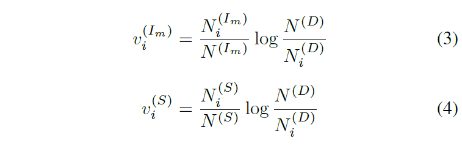

其中N表示$$\mathcal{N}$$的基数。 接着，作者利用inverse indexing来检索有共同视觉单词的个体。 每个叶节点$$w_i$$包含两个列表，一个记录出现过的图像检索，一个记录序列检索。

#### Sequence to Sequence Matching

作者用L1-score来在query序列和database序列间寻找回环候选：&#x20;

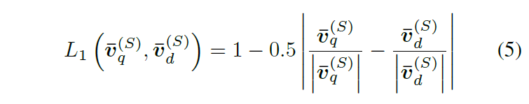

当新的序列输入，可以用上式得到序列相似度矩阵：&#x20;

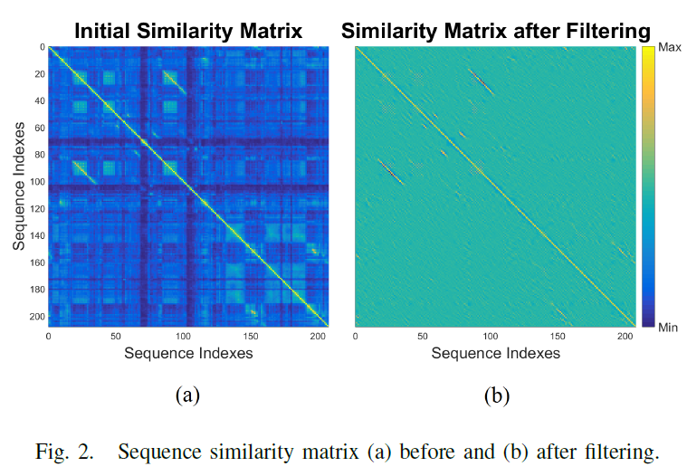

除了L1-score外，如果邻近的序列匹配分数高，则会给一个较高的奖励。例如，以h=3为窗口，如果$$S_{q-i}-to-S_{d-1},S_q-to-S_d,S_{q+1}-to-S_{d+1}$$的分数都很高，则提升$$S_q-to-S_d$$的分数。相反，如果一个序列与多个序列的匹配分数都很高，则认为这个序列是歧义的，降低其分数。如图3所示。&#x20;

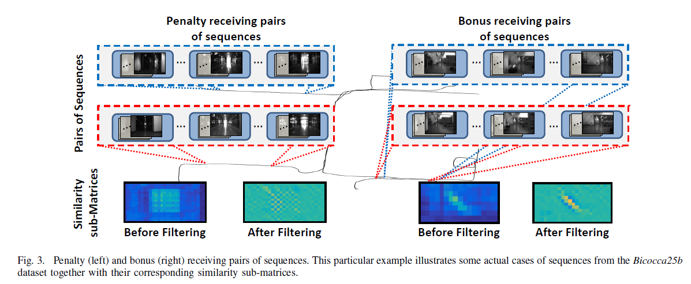

这两种观点反映了temporal consistency的一种量化解释，可以用一个2维的滤波器来结合在一起：&#x20;

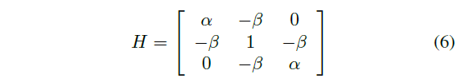

其中$$\alpha,\beta>0$$。这个kernel表示一个大小为3的时间窗口，但是他可以拓展为更大的滤波器。经过滤波的相似度矩阵如图2（b）所示，相似度高于a的序列被认为是候选回环，进行下一步的i2i关联。

#### Image to Image Matching

每一帧$$I^{(S_{q_i})}_i\in S_{q_i}$$仅与序列$$S_{d_j}$$中image inverse indexing table指向的图像比较，并得到最佳匹配$$I^{(S_{d_j})}_j\in S_{d_j}$$。这里还用到了temporal consistency和RANSAC计算基本矩阵进行时空上的回环验证。

### Experiments

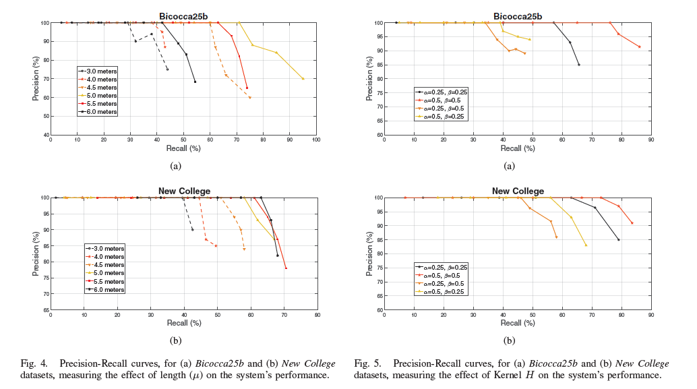

通过参数试验，选择$$\mu=5m,H=3,\alpha=0.5,\beta=0.5$$&#x20;

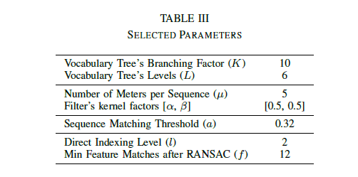

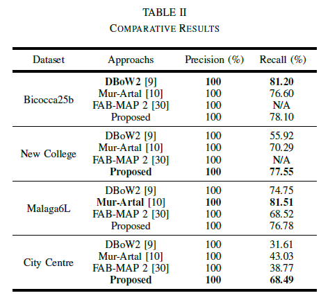

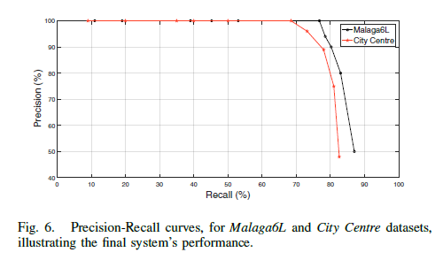
