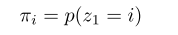

# \[IROS 2017] Semantic SeqSLAM

利用语义信息将图像序列划分，代替了SeqSLAM中固定尺寸的划窗策略，提升在一些条件多变场景中的鲁棒性。在获得图像的语义标签时，先用CNN获得分类概率，再输入HMM，根据图像的时间连续性，来获得图像的语义标签。



### Abstract

论文提出place recognition可以分为两个子问题：特定场景识别和场景分类。这篇论文的创新点在于"use place context to inform place recognition"，即把两个子问题结合起来，相互补充。场景识别得到的语义信息，可以帮助PR提升在昼夜、光照、室内外变化时的表现。

### Introduction

在这篇论文中，作者分析了环境中局部条件变化对于具有全局条件不变的PR算法的影响。并提出一个可以解决这种在一次探索过程或不同探索过程中，出现条件变化情况的方法。这种方法结合了语义标签和场景分类结果，通过将场景分割来改进场景识别。一旦一个场景被分类，作者将使用SeqSLAM进行场景识别，并使用一种动态的加权策略，来控制场景匹配到具有相似场景特性的、或具有相似场景分类的场景。结果证明，不论baseline的表现如何，论文所提出的几何场景分类信息的方法都可以提升算法表现。

### Method

作者利用VGG16-Places365获得图像的语义标签，将物理位置划分为不同的区域。这些分割后的区域被用于PR来控制场景在特定语义区域内匹配。

#### Place Categorization

作者用CNN预测了reference database中每张图像的分类概率，称为场景属性（共102类）。

#### Physical Space Segmentation

利用语义标签去分割区域需要唯一的标签，而非场景属性。为了避免瞬时的预测错误，考虑到输入图像的时间连续性，作者引入了HMM模型，根据语义标签的分类概率，预测每张图像对应的模型参数和隐藏状态。 假设一段序列有T张图像，则该序列的语义标签为$$X=(x_1,x_2,...,x_T)$$，隐藏变量记为$$Z=(z_1,z_2,...,z_T)$$，其中t时刻的$$z_t$$属于N个隐藏状态中的一个。假设给定$$z_{t-1}$$，$$z_t$$独立于之前的隐藏变量，并且当前的观测$$x_t$$只与当前的隐藏状态$$z_t$$有关。因此，状态转移矩阵A表示为：&#x20;

初始状态分布$${\pi}_i$$表示为：&#x20;

t时刻观测到状态i的概率为：&#x20;

目标为找到一个隐藏的状态序列，描述了reference images的期望语义标签。用后验概率来表示：&#x20;

其中是模型参数。&#x20;

估计了模型参数$$\theta$$后，可以获得reference image的最后语义标签输入的特征向量，即观察量$$x(t)$$是Place Categorization的输出响应向量，是一个102维的向量，每一维的值代表了属于每个场景的可能性。在输入HMM之前，特征向量被标准化到\[0,1]之间。模型参数$$\theta$$由Baum-Welch算法确定，可获得最可能的隐藏状态序列。隐藏状态的数量N由以经验决定。

#### Place Recognition

**sequence-based place matching**

作者使用了SeqSLAM算法来进行场景识别。SeqSLAM通过reference和query images之间的Sum of Absolute Difference (SAD)分数D来实现场景识别。&#x20;

其中$$S_x,S_y$$是下采样后图像尺寸，$$p^i_{x,y},p^j_{x,y}$$是reference和query images的像素值。difference vector利用一个尺寸为R的sliding window，进行neighborhood normalization。&#x20;

在邻近标准化后的SAD矩阵中，在限制的速度范围内，从每个reference image开始搜索长度为$d\_s$的局部图像序列。具有最佳分数的序列通过一个阈值来确定。

**localized and semantically-informed matching**

place matching scores着重体现了环境中局部物理区域的匹配，而非找到一个全局最小值。sliding window的尺寸R体现了环境的跨度/范围。&#x20;

在前文，作者利用HMM模型将数据集分割成若干带有相似环境条件的区域。作者提出用由HMM给出的$$L_t$$决定的邻近区域代替传统SeqSLAM中reference image的邻近图像。被分割出的区域可以表示为：&#x20;

也就是一段段具有相同语义标签$$L_t$$的序列。SAD矩阵的邻近标准化也相应变化。&#x20;

这样的处理使得SeqSLAM计算SAD时的sliding window随着场景条件的变化而变化，不再是一个定值，更具备condition-invariant。

### 一点看法

这篇论文究其根本，是利用语义信息来讲reference image进行划分，代替了SeqSLAM中固定尺寸的sliding window策略，借此提升了在一些跨场景数据集中的表现，这种变长的sliding window可以拓展下应用，在利用temporal consistency的算法中都可以参考借鉴的。
