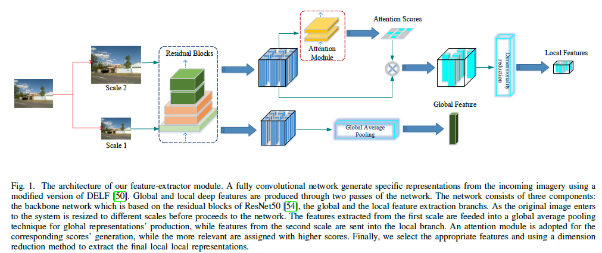
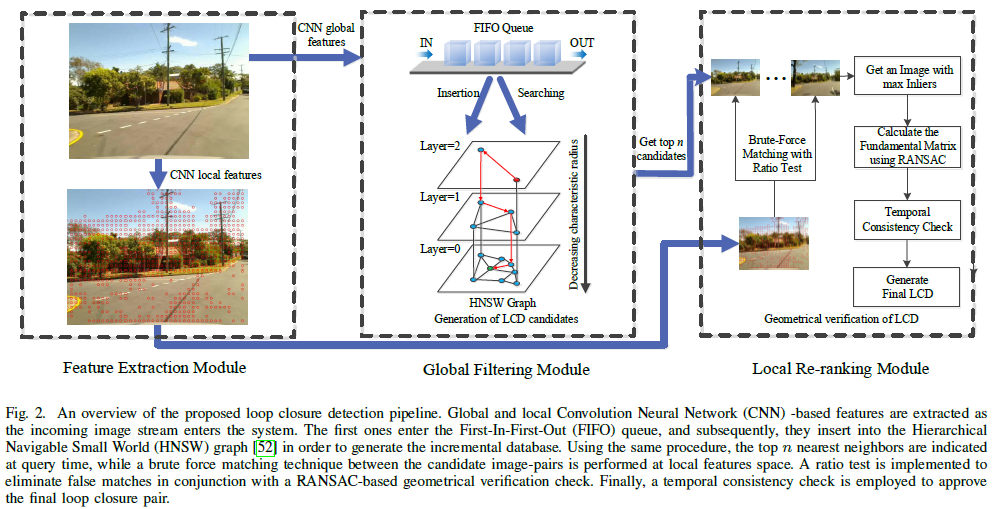
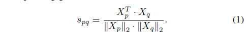
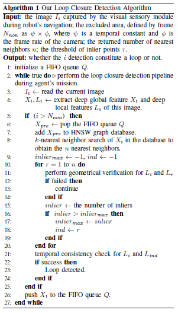
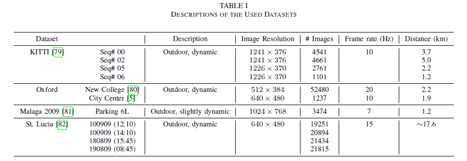
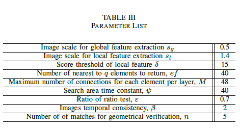
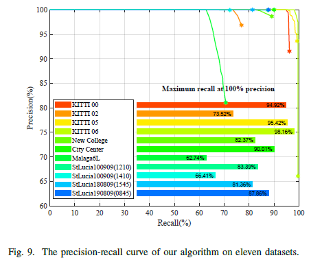
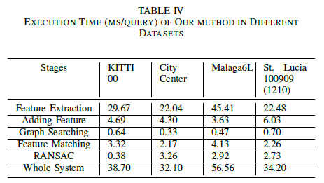
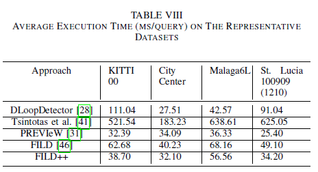
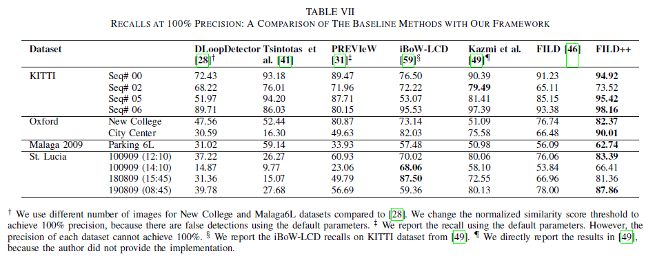

# \[JFR 2021] FILD++

这篇论文中，作者应用同一图像，缩放成两个不同分辨率输入网络，得到全局描述子和局部特征。应用全局描述子和HNSW方法构建一个增量式、层次化的拓扑图，图中包含了图像的邻近关系，由顶自下搜索，可以逐步直到与当前图像相似的回环候选。找到候选后，利用局部特征进行特征匹配，具有足够多的候选进行下一步验证。经过空间和时间一致性检测，输出最终的回环结果。





### Abstract

这篇论文中，作者提出了一个FILD++算法，当相机采集到新的图像，算法通过一个神经网络的两个分支分别得到全局特征和局部特征。接着，一个层次化可导航的small-world graph增量式的利用全局特征构建了一个视觉数据库，来表示机器人的移动轨迹。给定检索的传感器数据，可以通过这些表征来检索轨迹中相同地点，并且得益于局部特征提供的空间信息，图像到图像的匹配也可以进一步得到。

### Introduction

这篇论文中，作者着手于建立一个增量式的数据库（地图），来利用视觉信息实现快速、scalable回环检测。算法利用一个神经网络提取图像的deep features，在机器人移动过程中，一个modified hierarchical navigable small world (HNSW) graph被构建。因此，可以采用一种更快的最近邻搜索来减少计算检索的消耗。

### Image Representation

作者设计的特征提取网络包括两个部分，当图像输入后，将其缩放为两个不同的尺寸，第一个尺寸的图像通过backbone (ResNet-50)后，得到的特征图经global average pooling得到全局描述子；第二个尺寸的图像通过backbone后，得到的特征图，经过一个attention机制的筛选，得到合适的局部特征，经过特征降维，得到最后的局部特征。

#### Global Features

全局特征通过Global Average Pooling得到，将$$w \times h \times c$$的特征图pooling为$$1 \times 1 \times c$$的全局描述子。

#### Attention-based Local Features

attention层由两层1x1卷积构成，目的为学习每个局部特征的分数。具有高于阈值$$\delta$$的分数的局部特征被挑选出来，来避免无用特征的干扰。在第二层中，使用softplus激活函数来保证分数非负。最后，得到一个$$w \times h \times 1$$的score map。

#### Local Features' Dimensionality Reduction

为了缩小特征空间，作者对得到的局部特征进行L2-normalization后，使用PCA进行降维，产生的40维特征再次用L2-normalization处理。

#### Features' Scales

为了获得有代表性的特征，作者选择在提取阶段使用不同尺寸的图像，为了减少图像金字塔消耗的时间，需要作者只选择了两个尺寸的图像，第一个用于生成全局描述子，第二个用于提取局部特征。

### Hierarchical Navigable Small World Graph Database

#### Hierarchical Navigable Small World

一个图G= (V, E)由一组节点V和一组连接他们的边E组成。HNSW来源于NSW，基于增量式的k-NN结构来构建一个图。在这篇论文中，节点由全局描述子表示，边用于连接节点。节点的邻域定义为与该节点直接相连的点的集合，节点的度表示了这个集合的大小。首选的检索策略是先对其父节点进行选择，这样可以避免其他邻近图的主要缺点，并且在面对低维聚类数据时也可以解决表现退化的问题。在NSW方案中，在单次贪婪搜索中跳步的数量和节点的度都呈多重对数变化。另一方面，作者提出的算法为了选择特定节点、分开不同尺度的连接和利用一种启发式的方法选择邻近点，而使用了不同的策略。根据不同层中连接的长度，可以获得一个鲁棒的划分，然后，在一个允许对数级可伸缩的层次化多层图中，搜索过程可以实现。

#### Database Construction and Exploration

与基于BoW模型的方法不同（基于BoW的方法需要离线训练视觉词典），本文提出的算法在机器人探索过程中构建它的数据库，不需要事先获得先验数据。对于每个插入的元素q，根据一个指数衰减的概率分布随机选择整数最大层l。从高到低遍历图，每一层的ef个最近邻点被视为下一层的进入点。继续这一过程，直到插入元素的M个连接达到底层。归一化的乘积（向量间的cosine距离）被选作对应全局描述子间的距离度量。&#x20;

为了构建一个低计算消耗的系统，作者使用了[Advanced Vector Extensions](https://software.intel.com/en-us/articles/introduction-to-intel-advanced-vector-extensions/)指令来加速算法过程。

### Detection Pipeline

#### System Overall

在本算法中，全局描述子用于HNSW图构建和检索，局部特征用于几何验证。算法采用时序一致性来防止false positive的情况。算法伪代码如下：&#x20;

#### Non-Search Area Definition

由于相邻图像一定具有很高的相似性，所以作者设计了一个FIFO队列来存储全局描述子。全局描述子先存入队列，直到机器人离开non-search区域，描述子才会用于插入HNSW图中。这一区域由时间常数$$\psi$$,相机帧率$$\phi$$定义。因此，对于当前图像，算法只搜索$$N-\psi \times \phi$$区域中的图像。其中N是直到当前时刻的所有图像数据。

#### Image Matching

在检索过程中，进行如前文所述的搜索过程，主要区别在于底层获得的最近邻将返回作为结果。搜索的质量由ef控制。作者使用暴力匹配法进行局部特征匹配，因为特征描述子维度很低。算法还加入了distance raio test来检查匹配，阈值为$$\varepsilon$$.

#### Geometrical Verification

算法加入了几何一致性的验证，用RANSAC计算匹配图像的F矩阵，如果计算成功，则用最高的内点数量来作为分数。

#### Temporal Consistency Check

最后，算法加入时间一致性检验来保证检测的正确性，当连续$$\beta$$帧是回环，验证通过。这样虽然会丢失回环序列中的前几个回环，但是作者更希望保证算法的准确性（回环检测对准确性要求更高）。

### Experiment Results

数据集:&#x20;

参数设置：&#x20;

这篇论文一个写作方面很值得学习的点，就是对于算法中使用的各项参数进行了很详尽的消融实验，使得算法评测很客观全面。 总的表现：&#x20;

运行耗时：&#x20;

算法还部署在了移动端，Jetson TX2 平台上。进行了实时性测试。 和baselines的对比：&#x20;

