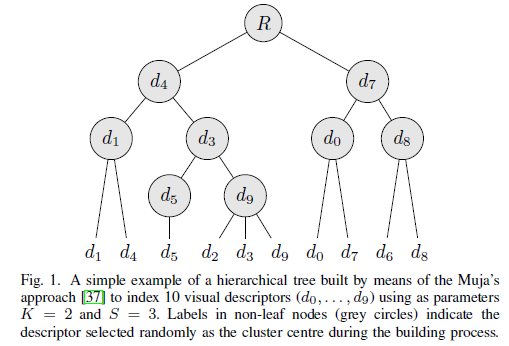
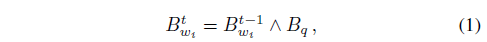
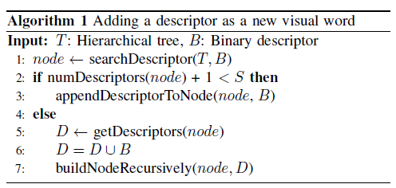
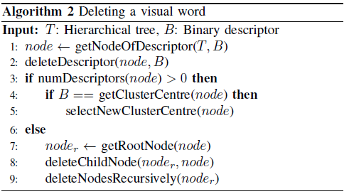
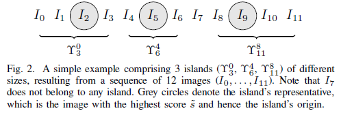
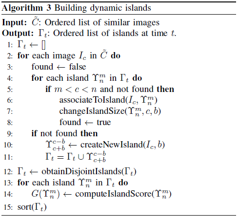
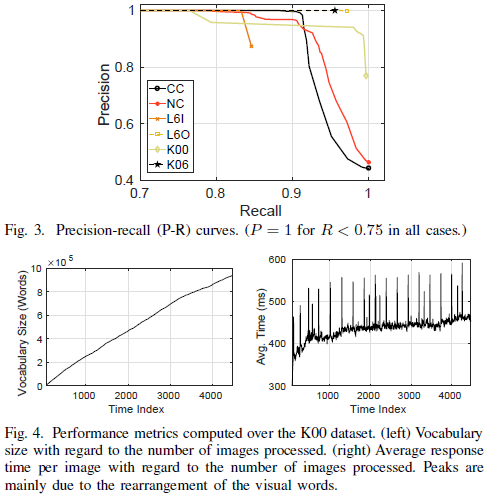
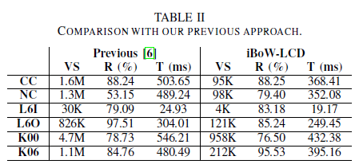
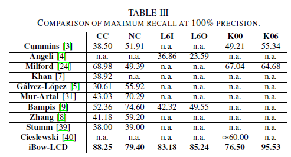

# \[RAL 2018] iBoW-LCD

这篇论文，作者设计了一个增量式构建词典树的方法，算法通过inverse index table来检索具有共同视觉单词的历史图像，然后利用一种新提出的dynamic island的自适应的图像聚类方法，计算当前图像与islands之间的相似度，检索到最相似的island，然后以island中相似度最高的图像作为回环候选，利用极线一致性来完成后验。dynamic island是根据当前图像计算的，不是等长划分的，更能适应不同场景、不同拍摄条件的数据集。在检索过程中，新的特征加入，词典树会有更新视觉单词、增加视觉单词和删除视觉单词的过程。最后实验也证明了，删除无用单词，不会降低算法的表现，还能提升检索效率。





### Abstract

这篇论文提出了iBoW-LCD算法，一种基于二进制描述子的增量式构建BoW词典的算法，无需传统BoW算法中离线训练的阶段。除此之外，算法基于一种名为dynamic islands的概念，这是一种简单但有效的将时间相近的相似图像聚集起来的方法，可以显著减少贝叶斯框架的计算耗时。算法在很多室内室外数据集上都获得了很好的表现，并且计算精度很高。

### Introduction

综述方面大概就两点，一是二进制特征逐渐代替了浮点数特征，二是离线构建词典的BoW模型很难适应新的环境，需要增加计算量去训练新的词典。&#x20;

这篇论文提出了一种增量式的基于BoW模型的回环检测算法。算法可以增量式的构建词典，避免了离线构建词典的弊端。这一策略，与inverse index table相结合，可以很好的检索之前见过的图像。基于islands这一概念，算法避免了检索到时间邻近的图像，可以进行很鲁棒的回环检测。&#x20;

在这篇工作中，作者不光考虑了增加视觉单词，还考虑了通过一种优化的增量式BoW模型来删除无用的旧单词。可以在较少单词的情况下，实现相似的表现。作者之前的工作[ETFA 2014](https://ieeexplore.ieee.org/document/7005121) [ICRA 2016](https://ieeexplore.ieee.org/document/7487247) [TRO 2017](https://ieeexplore.ieee.org/document/7938750) [Book](https://link.springer.com/book/10.1007/978-3-319-75993-7)一般使用贝叶斯滤波来实现，这样会导致随着图像增多，处理时间变长。而在这篇工作中，作者基于一个新颖的概念dynamic islands来检测回环。

### Incremental BoW for Image Indexing

作者基于“M. Muja and D. G. Lowe, “Fast Matching of Binary Features,” in Conf. Comput. and Rob. Vision, 2012, pp. 404–410.”的方法来实现增量式词典。

#### Overview of Muja's approach

作者参考了Muja and Lowe提出的方法，该方法引入一种高效的层次化结构来检索和匹配二进制特征，需要很少的内存空间并且比一般的hashing方法scale better。这一结构由一个树构成，非叶节点包含着聚类中心，叶节点存储着要匹配的视觉描述子。也就是增量式词典树的视觉单词被储存在叶节点中。&#x20;

在构建过程中，算法先随机从初始点集中挑选K个描述子作为聚类中心。然后，余下的每个输入描述子根据hamming距离被分配到最近的聚类中心上。这一过程递归的重复进行，直到一个聚类中的描述子数量小于阈值S。Muja et al.也提出构建多个树$$T_i$$，在搜索过程中并行的使用它们会带来更好的效果。&#x20;

为了并行的利用这些树来搜索描述子，算法对于每个树，从根节点到叶节点遍历树，每步中挑选与检索描述子最相近的节点，并把未被探索过的节点加入一个优先级队列中。当达到叶节点时，该节点中的所有点被线性搜索。当每个树被搜索过一次后，从优先级队列中最近的节点开始继续搜索。直到一定数量的描述子被检查过（在本文中，设为64），这一过程结束。

#### Visual vocabulary update

Muja的方法最初是设计用于检索一个静态的描述子集合。在本文的方法中，作者需要处理一个增量式的视觉词典，所以作者引入了改进。首先，在探索过程中，二进制描述子被匹配和合并，以一种合并的政策来更新词典的视觉单词。作者用bitwise AND operation来实现合并：&#x20;

其中，$$B^{t-1}_{w_i}$$是t-1时刻与视觉单词$$w_i$$关联的二进制描述子。$$B_q$$是检索描述子，而$$B^{t}_{w_i}$$是融合后的描述子。这一策略被实验证明不会导致描述子退化（几乎所有位都变为0）。 其次，在检索过程中没有匹配的描述子将被包含入词典中，作为一个新的视觉单词。为此，每个描述子从根节点到叶节点被搜索。接着，评估将对应的新描述子加入被选定的节点中是否会超过最大叶尺寸S。如果是，则将该描述子加入最初的描述子，递归的重建这个节点。否则，直接将这个描述子加入该节点。&#x20;

然后，算法保留了一个inverted index结构，对于每个视觉单词，它储存了该单词出现过的图像。最初，视觉词典通过把第一幅图像的二进制描述子作为视觉单词的集合来完成构建。当一幅图像输入，它的描述子与检索的视觉单词利用ratio test进行匹配。匹配到的描述子合并到对应视觉单词上。未匹配的描述子被临时当做新的视觉单词加入词典。为了减少检索的复杂度，这些临时的视觉单词只有在连续$$P_f$$帧被匹配到至少$$P_o$$次，才会保留下来。inverted index相应地更新。这一策略的主要目的在于，挑选那些当机器人达到回环位置时更有可能被观察到的视觉单词。&#x20;

最后，作者用一种删除视觉单词的机制来保证词典支持上述的更新策略。当从词典中删除一个描述子后，它所加入的节点和其父节点都将被递归地修改来评估它们是否包含子节点。一个没有子节点的节点将不再需要，因此要删除。如果要删除的描述最与聚类中心一致，则重新选择一个新的中心。&#x20;

#### Retrieval of similar images

inverted index结构可以让搜索范围缩小为与当前图像具有共同视觉单词的历史图像。对于k个之前见过的帧，初始化其相似分数$$s(I_t, I_k)$$为0。令$$z_t$$为从当前图像$$I_t$$中提取出的二进制描述子集合，我们在词典中对于$$z_t$$中每个描述子搜索其最靠近的视觉单词，然后我们根据inverted index来获得具有共同视觉单词的历史图像，并且对于每个检索到的图像的相似度s加一个权重。该权重用tf-idf权重来度量视觉单词在词典树和当前图像中的重要性。当处理完所有$$z_t$$中的描述子，可以获得一个对于当前图像$$I_t$$的最相似的图像及其对应相似分数的列表。图像检索的开源代码在[OBIndex2](http://github.com/emiliofidalgo/obindex)

### Loop Closure Detection

#### Searching for previous images

当在t时刻输入一张图像$$I_t$$，开始检索相似图像。利用一个缓存器来储存最近p张图像，因此防止它们被检索成为回环候选。搜索的结果可以用一个有序列表来表示，有j个最相似的图像，记为$$C_t={I_{s_1}, ..., I_{s_j}}$$，利用它们的相似分数$$s(I_t,I_k)$$来排序。相似分数的范围很大程度上决定于视觉单词的分布，在相邻图像与相似图像间变化很大，因此对于相似分数利用min-max策略进行归一化：&#x20;

.png>)

其中$$s(I_t, I_{s_1}, s(I_t, I_{s_j})$$是对应的最小和最大的相似分数。这一过程可以让相似分数归一化到\[0,1]之间。接着，作者丢弃了一些相似分数小于预设阈值$$\tau_{im}$$的图像，产生一个最终的有序匹配图像列表$$\tilde{C}_{t} \subset {C}_t$$。通过这个阈值，可以删掉一些非常不好的结果，阈值决定了候选图像的数量。

#### Dynamic islands computation

iBoW-LCD算法使用dynamic island的概念，来局部适应图像组的尺寸。这一改进与原本island的区别在于两方面：

1. iBoW-LCD不是使用全部过去的图像来计算island，而是根据前一步获得的相似图像集合$$\tilde{C}_{t}$$；
2. island的尺寸不是固定的，而是根据相邻图像的相似度和相机移动速度来决定的，可以根据图像流来调整islands。&#x20;

这篇工作中，一个island被定义为一组时间戳在两个不同时刻间的相似图像，这一准则可以使得算法将时间上接近的图像聚成一组，避免被检索为回环候选。记$${\Upsilon}^{m}_{n}$$为一个包含时间戳在m和n之间图像的island。另外，每个island中挑选一个具有最高相似分数的图像作为代表性图像。为了管理islands，$$\tilde{C}_{t}$$中的图像被如下处理：对于每张图像$$I_c \in \tilde{C}_{t}$$，评估他们的时间戳是否在已经存在的island所包含的范围内，如果是，则将该图像加入这个island，并且这一island的时间间隔也随之更新来包含$$I_c$$和$$I_c$$前后b张图像；如果不是，则建立一个新的island，并且将island的时间间隔初始化为c时刻周围的2b+1个时刻（前后b个时刻），将$$I_c$$加入新的island。当处理完左右$$\tilde{C}_{t}$$中的图像，产生的island被修改和缩短，如果有必要，让island之间相互不相交，避免有重叠部分。对于每个island，计算一个全局的分数，得到island的匹配列表$${\Gamma}_{t}$$：&#x20;

构建dynamic island的伪代码如下：&#x20;

#### Island selection

在这一步，iBoW-LCD挑选最佳匹配island，$${\Upsilon}^{}(t) \in {\Gamma}_{t}$$。为此，算法回想起前一时刻t-1的最佳island, $${\Upsilon}^*(t-1)$$，并且检查是否有$${\Upsilon}^{m}_{n} \in {\Gamma}_{t}$$与$${\Upsilon}^*(t-1)$$重叠。重叠的island被命名为priority islands，这一想法是受“连续图像应当匹配到与之前图像相匹配的island”这一思路的启发。如果priority islands被找到，具有最大全局分数G的被挑选出来，进行下一步处理。否则，算法直接挑选与当前图像最相似的island，也就是$${\Gamma}_{t}$$中第一个island。

#### Loop closure decision

在这一步中，算法首先挑选island中的代表图像来作为最终的回环候选$$I_f$$。用极线分析来验证$$I_f$$和当前图像$$I_t$$是否是同一场景经过相机转动和平移得到的。为此，作者先用ratio test得到一系列假定的匹配，然后用RANSAC来计算F矩阵，如果内点足够多（F矩阵有意义）则认为这一回环候选是正确的。 这样的集合验证可以提高准确性，但是对每幅图像进行一次检验，势必消耗大量时间。所以，iBoW-LCD采用了一个时间上一致性的特性来避免计算消耗。算法记录着在t时刻，连续的回环数量，当priority island存在并且t时刻的连续回环数量大于阈值$${\tau}_{c}$$，则接受这一回环，不需要计算F矩阵。

### Experimental Results

OBIndex2使用四核CPU去并行的使用四个词典树来进行回环检测，iBoW-LCD只使用一个。&#x20;

P-R曲线是通过改版epipolar geometric check时RANSAC内点的数量得到的。&#x20;

相比之前的工作，iBoW-LCD的词典更紧凑，但是表现更好。&#x20;

