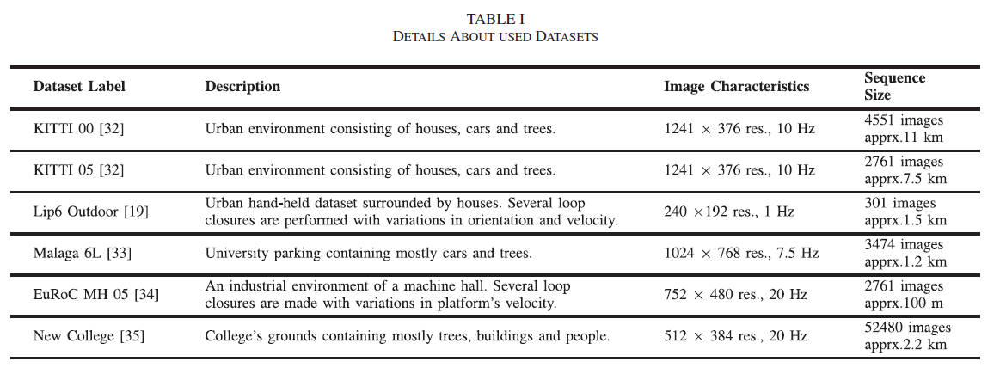

# \[RAL 2019] BoTW

利用特征跟踪来产生tracked words，在线构成词典，无需预训练过程。在检索过程中，当前图像的特征被关联到database中的tracked words，进行投票，利用票数计算二项概率密度函数的值，作为候选回环提取的可信度，对于候选回环进行RANSAC后验。





### Abstract

视觉特征VF，即tracked words (TW)，通过一种有指导的特征检测基机制加上跟踪方法来在线生成，属于一组连续图像。在导航过程中，新的TWs加入数据库中，构成TW的词典。当在数据库中检索回环时，新的局部特征被关联到地图中最近的TWs，对相应的实例进行投票。该算法利用概率方法基于每个位置的投票数来选择最合适的回环。该算法无需预训练阶段。

### Introduction

> Loop Closure Detection (LCD), i.e., the event in which a robot returns to a previously visited location and recalls it,&#x20;
>
> The BoW approaches can offer high performance as well as computational frequency. Nevertheless, their success highly depends on the quality of the Visual Vocabulary (VV) and, in turn, the data the latter was trained with.

本文提出一种基于概率的视觉回环检测方法，利用一个增量式BoW方法进行image-to-map投票，不需要任何预训练。利用一种有指导的特征检测方法和KLT光流法来进行特征跟踪。对于每个被跟踪的特征，用对应描述子的均值生成一个TW。TW被分配到地图中轨迹上的特定位置作为表征，同时构建一个BoTW。局部特征提供了应对视角和速度不同的built-in robustness。在检索时，用kNN对局部特征描述子进行投票，同时用一个二项概率密度函数(PDF)来计算候选回环的可信度。 本文的贡献如下：

> A fully probabilistic scene recognition pipeline with low computational complexity capable of detecting loop closure events through the distributed local-feature votes.&#x20;
>
> An on-line BoTW database generation assigned to the traversed map, consisting of unique TWs.&#x20;
>
> An experimental parameter estimation scheme based on two criteria: (1)The number of tracked features among consecutive frames, indicated as the parameter v. (2)The number of required tracked instances in order for a feature to be converted into a TW, pointed out as the parameter $$\rho$$.

### Methodology

#### Building the BoTW Database

**Point Tracking** 从前一帧$$I_{t-1}$$中提取的v个SURF特征$$SP=\{{sp}^1,{sp}^2,...,{sp}^v\}$$，用KLT光流法跟踪到当前帧$$I_t$$。保留对应的描述子向量$$D_{t-1}=\{d^1_{t-1},d^2_{t-1},...,d^v_{t-1}\}$$。接着，$$I_t$$中的局部关键点$$SP_{t}$$被提取出，得到描述子集合$$D_t$$，并与跟踪来的描述子相匹配。为了可靠的跟踪，在三级分辨率上、在31x31的邻域内、最大双向误差为3的范围内搜索$$I_t$$中的点。&#x20;

**Guided Feature Detection** 为了产生独特的TW来表征地图，作者在不同帧间进行特征匹配。本文采用了有指导的特征检测来避免tracked point ($$TP=\{{tp}^1,{tp}^2,...,{tp}^v\}$$)随着轨迹漂移。用1-NN来在$$TP_t$$与$$SP_t$$之间搜索。对于每个tracked point $${tp}_t$$，检测出其最近的$${sp}^{NN}_t$$，并计算描述子$$d^{NN}_t$$与对应于$${sp}_{t-1}$$的$$d_{t-1}$$之间的距离。当满足(a)关键点位置之间距离小于$$\alpha$$；(b)描述子之间距离小于$$\beta$$时，接受该点。 在特征检测过程中，匹配的局部特征被剔除掉，避免重复识别某一点。当一个tracked feature不再存在（无论它是否构成一个TW），它将被$$I_t$$中检测的一个新特征替代。类似的，当遇到无纹理区域，系统无法获得足够的视觉信息，则跳过这些帧。&#x20;

**Bag of Tracked Words** 当一个点无法继续跟踪，计算它的跟踪长度$$\tau$$，当$$\tau > \rho$$时，利用tracked descriptors的均值构建一个新的单词。&#x20;

其中i表示描述子的第i维，j表示第j个特征描述子向量。另外，在BoTW中保留两个重要的特性：(1)TW的长度；(2)反向检索表。

#### Querying the Database

**Map Voting** 在检索时，当前图像$I\_Q$利用最近邻搜索将由有指导的特征检测步骤定义的描述子投影到BoTW。票被分布到地图中。每个实体l的票的密度$$x_l(t)$$在回环可信度计算中起着很重要的作用。为了避免由于机器人速度不同产生的错误检测，搜索数据库中早于$$I_w$$的帧。其中w=t-2c，其中c对应着点跟踪的最长距离。这样$$I_t$$和database不具有任何共同特征，也不需要设置时间阈值。&#x20;

**Probabilistic Belief Generator** 使用一个二项PDF作为动态的可信预测器。该方法检查了事件的罕见性，并基于这样的假设：每次机器人经过一个迄今为止未见过的位置时，投票应该随机分配到地图上的TWs，这意味着每个位置的投票密度应该很低。因此，因此，每个database实体的聚合投票数应该服从二项分布。此外，当面对一个预先访问过的环境时，相应的投票增加，对应一个高的投票密度，代表一个低期望的概率事件。因此，每当观察到投票分数增加时，系统就标记一个候选回环：&#x20;

其中$$X_l(t)$$表示时间t时database中位置l的累积票数是一个随机变量。N表示检索的TP数量，即经过有指导的特征检测后，点的数量。$$\lambda$$为l中TWs的数量。$$\Lambda$$对应着BoTW的大小（除去被拒绝的位置）。 每个位置二项期望值需要满足回环阈值$$\delta$$:&#x20;

&#x20;同时为了避免一个地点由于极端的差异而导致积累的选票很少的情况：&#x20;

但是，由于选票的分布会影响一组连续的图像，而这组图像应该都能够满足上述条件，因此本文提出的方法选择一个票数最多的&#x20;

**Geometric Check** 利用RANSAC估计F矩阵，当内点多于$$\phi$$时，接受该候选回环。为了加速，只对检索图像中tracked features和候选图像中关联到voted TWs的特征进行匹配。

### Measuring the Performance

数据集&#x20;

参数调试&#x20;

确定参数设置&#x20;

计算耗时&#x20;

与SOTA算法的比较&#x20;

