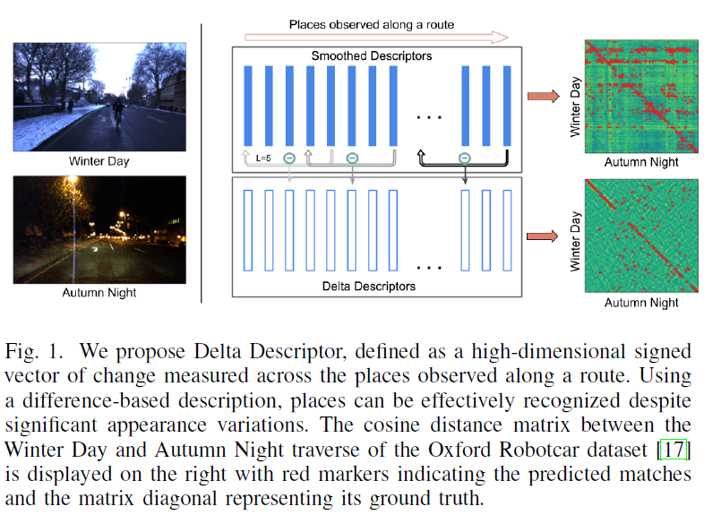
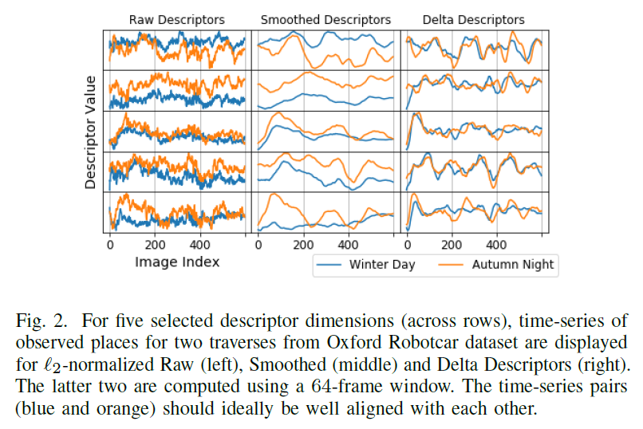
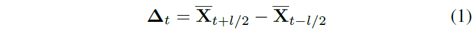
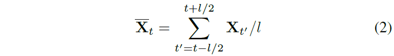
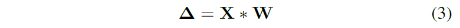
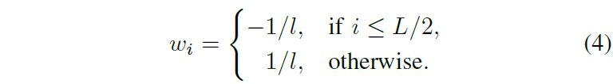
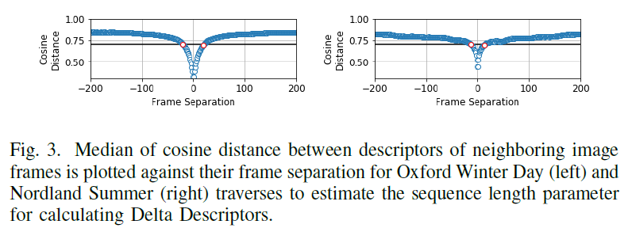
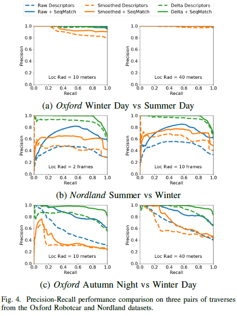
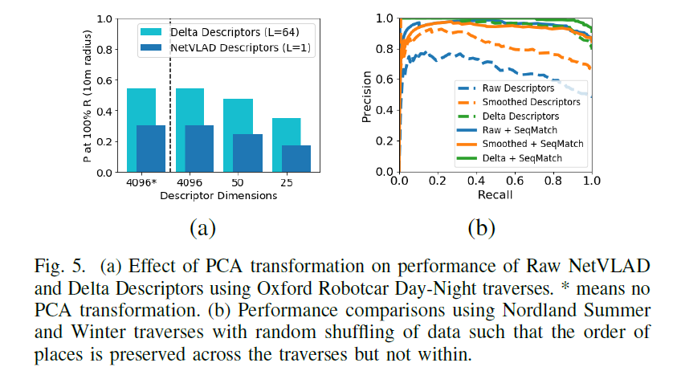

# \[RAL 2020] Delta Descriptors

提出一种序列化图像的描述子，对图像描述子进行时间维度上的smoothing后，计算difference，得到基于difference的delta descriptors。我感觉，SeqNet就是将Delta Descriptors中1D卷积核变成了可训练的，即滑窗内各图像描述子不再是简单的权重为1，后半段减前半段求得difference，而是通过卷积加权求和。





### Abstract

这篇论文，作者提出了Delta Descriptors，追踪任何可学习的全局描述子随时间发生的变化。该描述子通过考察在运行过程中经过地点时随时间变化产生的描述子差异，来无监督地学习补偿在原始特征匹配空间中出现的偏移。与其他方法一样，该描述子容易波动，可以通过与序列化filtering方法相结合来解决这一缺点。该描述子增加了对摄像机运动变化的固有鲁棒性，并在降维时降低了性能的退化比率。

### Introduction

这篇论文中，作者提出一种无监督方法，将现有的可学习的图像描述子转换为基于变化的表征，即Delta Descriptors。由于机器人再次经过一个地点时场景外观会发生变化，原本的描述子会有偏移，导致同一地点的描述子之间距离增大。Delta descriptors定义在差异空间中，隐式地处理这种偏移，使得同一地点的描述子之间距离变小。在本研究中，基于差异的描述这一概念是基于测量可重复访问的地点序列之间的变化的。&#x20;

### Proposed Approach

在这篇论文中，作者提出Delta Descriptors来通过度量随时间变化，不同地点观察到的特征的变化，来利用时序的信息。作者假设，这种变化在不同次观察中是唯一的且一致的，与场景外观的显著变化无关。特别地，度量这种变化可以隐式地忽略深度学习特征的数据偏差，在不同的环境类型和外观条件下提升其效用。&#x20;

**Key Observation** 在VPR算法中，图像序列输入算法，得到高维特征描述子。作者将其视为一个多元时间序列。如图2所示，对于原始特征来说，时间序列中的相邻值变化剧烈。由于基础的深度学习图像描述子(在大多数情况下)没有经过训练，在摄像机运动的轻微扰动或场景中有动态对象时难以保持稳定，因此这种局部变化是一种可以预见的现象。&#x20;

**Defining Delta Descriptors** With these observations, we define delta descriptor, $\triangle\_t$ as a high-dimensional signed vector of change measured across a window of length $l$ over a smoothed multi-variate time-series, $$X_t \in \mathcal{R}^D$$, where t represents the time instant for an observation of a place along a route in the form of an image descriptor.&#x20;

其中$$\overline{X_t}$$表示the smoothed signal obtained from a rolling average of the time series $$X_t$$:&#x20;

在图2中可以看到，所提出的特征对齐得更好，没有原本描述子的偏移情况了。&#x20;

**Simplified Inplementation** 公式1和2可以用一个基于卷积的计算进行简化：&#x20;

其中卷积在原始描述子的时间维度上进行计算，每一维都用一个独立的1D卷积核$$W=(w_1,w_2,...,w_L)$$，定义为一个长度$$L=2l$$的向量：&#x20;

所提出的描述子用cosine距离匹配。

### Experiments

we compute Delta Descriptors using a fixed sequence length of 64 and 16 frames for all the traverses of the Oxford Robotcar and the Nordland dataset respectively.&#x20;

NetVLAD作为baseline。&#x20;

Multi-Delta Descriptor：To achieve this, for both the reference and the query data, multiple Delta descriptors are computed using a range of sequential spans: f30; 40; 50; 60g frames in this case. The match value for any given image pair is calculated as the minimum of the cosine distance over all the possible combinations of sequential spans (16 here) used for computing multiple Delta Descriptors.&#x20;

