# \[RAL 2021] SeqNet

提出了一种hierarchical VPR算法，用NetVLAD提取图像描述子，在filtering阶段，提出了一种SeqNet，其实就是一个中时间维度的1D卷积，将时间维度上的图像描述子聚合成一个序列描述子，与referenced database进行匹配，获得top-K候选。在re-ranking阶段，用简化的SeqSLAM进行序列匹配，用SeqNet(输入长度为1)对图像描述子进行一次线性变换。





### Abstract

本文提出了一种新的混合方法，该方法使用短序列的可学习图像序列描述子来匹配图像，从而实现了使用单一图像学习描述子进行可选择的序列化分数聚合。序列描述子通过一个时间维度上的卷积神经网络SeqNet来产生，用1D卷积将图像序列编码，与database中的对应序列描述子相匹配。之后，作者通过一个独立的步骤对筛选后的图像描述子进行选择性的时序聚合，来得到整体的匹配结果。

### Introduction

一般的序列匹配算法有两个缺点：1）如果不加入额外的序列信息，这种序列分数聚合无法摆脱由单个图像图像描述子引起的高置信度的错误匹配；2）在整个database中进行序列搜索很低效，其与参考地图的尺寸和图像序列长度都成正比。&#x20;

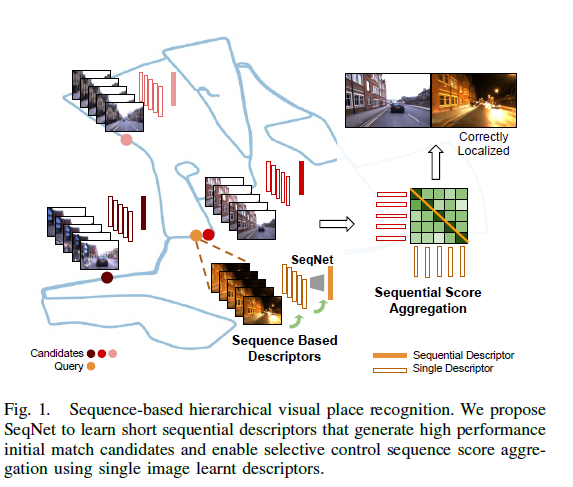

针对固定长度的图像序列，作者提出了一种层次化场景识别算法，基于两个互补的模块：1）一个可学习的图像序列描述子，可以得到高准确率的候选匹配；2）一个与序列化图像聚合相结合的单一图像描述子，可以准确地对候选匹配进行重排序。所提出的用序列描述子产生的初步筛选不仅减少了序列匹配的计算负担，而且可以避免图像描述子带来的false positive。 本文的贡献如下：

> a novel spatial representation, SeqNet, based on sequential imagery, learnt using a single temporal convolutional layer and triplet loss;&#x20;
>
> a low-latency state-of-the-art Hierarchical Visual Place Recognition (HVPR) system that combines the robustness of a sequential descriptor with the order-enforcing nature of a sequential matcher;&#x20;
>
> detailed ablations and insights into the properties of our proposed system including recognizing places from a database traversed in reverse direction; and publicly available source code and supplementary results and visualizations to foster further research in this direction

### Proposed Approach

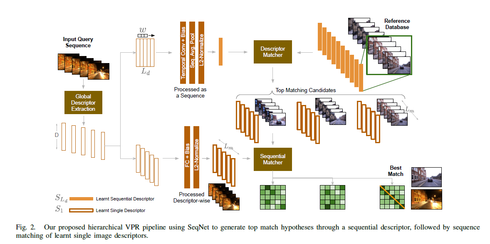

#### SeqNet

作者提出一种temporal CNN来根据序列化图像学习地点在环境中的空间表征。给定一段RGB图像，利用NetVLAD获得对应的图像描述子序列。如图2上半部分，将描述子序列输入SeqNet，获得一个紧凑的表征，记作$$S_{Ld}$$。&#x20;

**Network Architecture** SeqNet由一个Temporal Convolution (TC) layer (有bias，去掉padding)，一个Sequence Average Pooling (SAP) layer和一个L2-Nomalize layer。在TC层中，作者用了一个长度为w的1-D过滤器，以步长为1作用在尺寸为$$L_d\times D$$的输入序列上，其中D表示描述子维度，$$L_d$$表示序列长度。1-D TC作用在输入的序列维度上。输入张量的描述子维度构成了TC层的输入通道，输出通道设置为D。因此卷积核的尺寸为$$D\times w \times D$$。TC层的输出是一个子序列，可以通过SAP层转换成一个单一描述子，即在序列维度（时间维度）上进行平均池化，类似于在图像空间上进行全局平均池化。TC在输入描述子的序列维度上以一个局部滑窗的形式进行了信息交互，SAP保证了输出是长度为1的序列。为了适用于cosine距离，加入了L2-Normalize层。&#x20;

**Triplet Loss**作者使用了和NetVLAD一样的损失函数&#x20;

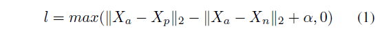

#### Hierarchical Visual Place Recognition (HVPR)

SeqNet将输入图像描述子序列($$L_d \times D$$)转换为一个D维的序列描述子，记为$$S_{Ld}$$。除此之外，作者还训练了$$L_d=1,w=1$$的SeqNet来获得D维图像描述子$$S_1$$，这相当于用一个全连接层来学习了一个线性变换。 对于一组图像序列，利用描述子$$S_{Ld}$$和欧式距离来从database中检索top-K最近邻&#x20;

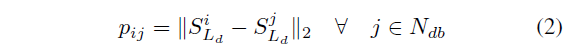

其中$$N_{db}$$是database的大小，$$p_{ij}$$是检索序列描述子和参考序列描述子之间的距离。最近邻候选$$R_i$$利用简化的SeqSLAM来进行重排序，即直接计算描述子差异而不考虑速度。对于top-K的候选中每个匹配，考虑长度为$$L_m$$的图像描述子$$S_1$$，并与database中的图像描述子做比较：&#x20;

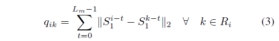

基于query和reference序列之间一对一匹配的假设，序列分数在图像正确排列时达到最小。因此分数最小的候选作为最后的匹配。

### Data Splits

> For each of the datasets, train, validation and test splits were defined without any geographical overlap to observe generalization. The image counts for reference and query databases for train, val and test are presented in Table I. As the Nordland dataset is unique in its environment-type and spans across multiple cities in its long-route journey, we use Summer-Winter for training and validation, and use Spring-Fall for testing. For the Urban City (Day vs Night) datasets, having access to the day-night data explicitly from different cities, we use the same validation set (from Brisbane) for both the cities (Brisbane City Loop and Oxford Robotcar). For MSLS, no splits were performed within any city and models trained on just one city (Melbourne) were used for testing across 4 other cities, and one city (Austin) was used for validation. However, to limit the training time, we limited the training set to a maximum of 5,000 images.&#x20;

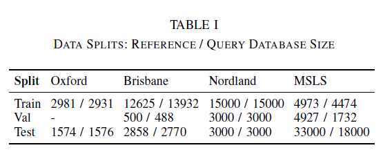

### Experiments

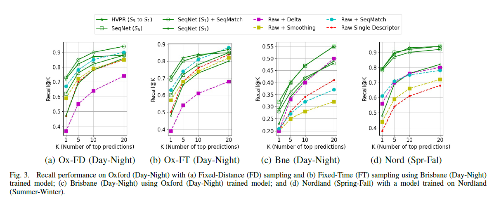

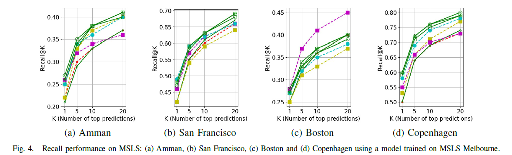

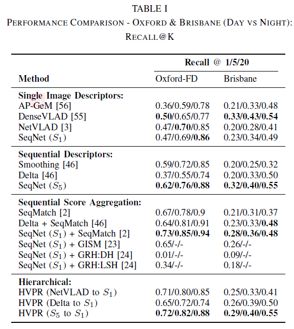

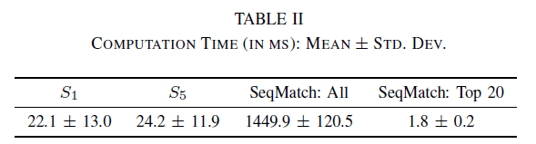

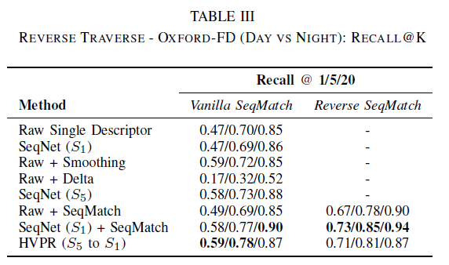

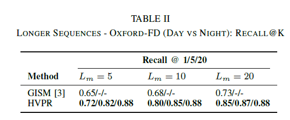

Global Max Pool (GMP) descriptor, obtained from the final convolutional layer of ResNet50 trained on object recognition task.&#x20;
