# \[RAL 2021] STA-VPR

提出一种时空上对齐序列的匹配方法，来增强中层CNN特征的视角不变性。时间上，利用局部匹配DTW来减少匹配图像序列的时间复杂度；空间上，将图像特征图沿水平方向纵向切片，得到图像局部特征，利用自适应DTW来对齐局部特征，得到图像相似度。





### Abstract

CNN中间层的特征对于剧烈外观变化更加鲁棒，但是缺乏对于视角变化的鲁棒性。作者将整体中间层特征划分成局部特征，提出一种自适应动态时间warping方法（DTW）来对齐空间上的特征，并计算两幅图像间的距离。实现了外观不变性和视角不变性的VPR。同时，一种局部匹配DTW（LM-DTW）算法被用于匹配图像序列，进一步提升效果，并保证线性时间复杂度。该篇工作无需重新训练网络。

### Introduction

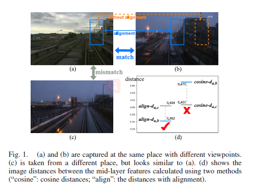

如图1所示，不对齐特征就匹配图像的话，CNN特征会造成错误，算法的视角不变性较差。因此，作者将中层CNN特征划分到多个局部特征，然后用自适应dynamic time warping（DTW）来对齐它们，同时度量图像相似度。每个局部特征与具有相同语义信息的局部特征相匹配，算法可以获得正确的图像相似度，提升算法对视角变化的鲁棒性。&#x20;

除此之外，作者还对齐了时间维度上的图像序列。Local matching DTW（LM-DTW）算法被用于匹配图像序列。这种空间对齐算法可以用于提升现存的序列匹配算法（如SeqSLAM）应对视角变化的鲁棒性。 算法被命名为STA-VPR（sptial-temporal alignment for visual place recognition），主要贡献为：

1. 分析了中层CNN特征为什么缺乏对大视角变化的鲁棒性，然后提出对齐基于CNN的局部特征，来解决这一问题；
2. 提出自适应DTW算法，通过划分中层特征来对齐局部特征，计算图像距离，与之前的工作\[Visual sequence place recognition with improved dynamic time warping]相结合，构成STA-VPR算法。

### STA-VPR

#### Place Description

给定一张图像，用CNN模型来提取中层特征图，得到$$W \times H \times C$$维的张量。然后垂直的划分为W个独立的$$H \times C$$维的矩阵，并将矩阵展平到向量。这样，每张图像可以用W个局部特征来表示，每个特征为HxC维向量。

#### Spatial Alignment for Image Distance Measurement

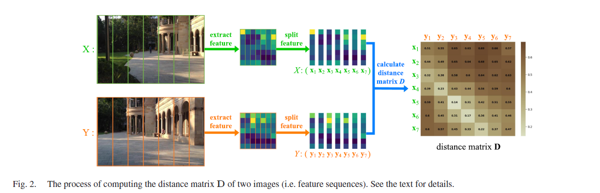

作者将W个局部特征视为空间序列，并提出一种自适应的DTW算法来自动对齐两个序列，并计算它们之间的距离。如图2所示，图X和图Y可以表示特征序列$$X(x_1,...,x_i,...,x_W)$$和$$Y(y_1,...,y_j,y_W)$$。用余弦距离来度量局部特征的距离：&#x20;

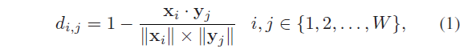

由此，可以得到一个$$W \times W$$的距离矩阵D。自适应DTW算法的目标是为了找到矩阵D中最优的warping path来最小化整体距离。同时，序列X和Y之间的alignments用warping path P中的点表示：&#x20;

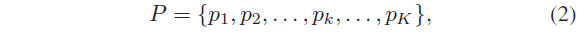

其中$$max(W,W)\le K \le W+W-1$$. warping path需要满足以下条件：

1. 边界性： $$p_1=(1,1), p_K=(W,W)$$；
2. 连续性：如果$$p_k=(d,e), p_{k+1}=(d',e')$$，则$$d'-d\le 1, e'-e\le 1$$。这可以保证序列中每个局部特征都被用于计算；
3. 单调性：如果$$p_k=(d,e), p_{k+1}=(d',e')$$，则$$d'-d\geq 0, e'-e\geq 0$$。这可以保证warping path中的点在空间顺序上时单调的。

根据连续性和调性，如果warping path已经经过点(i,j)，下一个点将会是(i+1,j),(i,j+1),(i+1,j+1)中的一个。 为了获得最优的warping path，作者用动态规划来生成一个$$W \times W$$累积距离矩阵S，其中元素$$s_{i,j}$$是从(1,1)到(i,j)最优路径的累积距离，计算如下：&#x20;

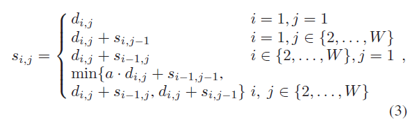

其中，自适应参数a反映了视角变化的度：&#x20;

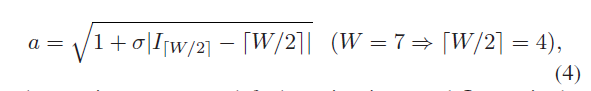

其中，$$\sigma$$是常数，$$I_{[W/2]}$$是序列Y中与序列X中间特征$$x_{[W/2]}$$最相似特征的索引值：&#x20;

两个序列从(1,1)到(W,W)被对齐。用warping path来表示对齐。&#x20;

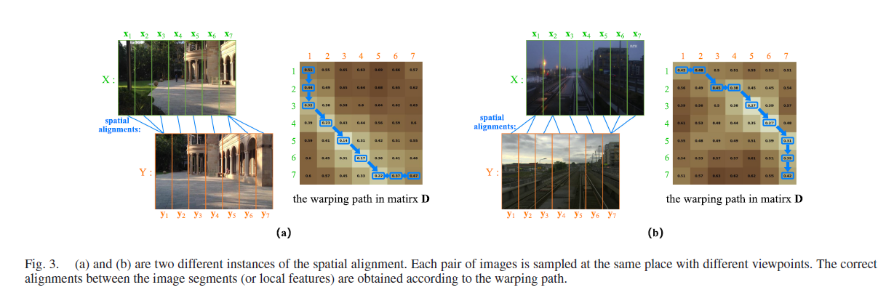

考虑到，warping path上的元素个数是不确定的，用整体损失$$C_{W,W}$$来归一化累积距离$$s_{W,W}$$，最后得到图像X和Y之间的距离：&#x20;

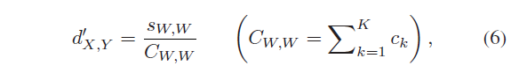

其中path损失$$c_k$$为：&#x20;

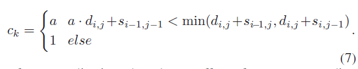

归一化后，减少了非对应对齐的不利影响，图像距离范围在\[0,1]之间。 当视角变化较小时，自适应DTW退化到原始DTW，公式3变为：&#x20;

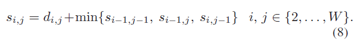

#### Dimensionality Reduction and Restricted Alignment

计算距离矩阵D需要49次计算，特征向量的维度较大时，匹配过程会消耗大量时间和资源。作者使用高斯随机投影(GRP)来将每个局部特征的维度减少到512维。除此之外，作者还提出使用受限对齐(RA)来减少距离计算的次数。如图3所示，虽然两张图像的视角变化很大，但是warping path没有经过矩阵D的左下角和右上角区域。因此，可以直接设置这些区域内的点为无穷大：&#x20;

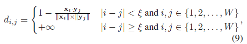

其中$$\zeta=3,W=7$$.

#### Temporal Alignment for Image Sequence Matching

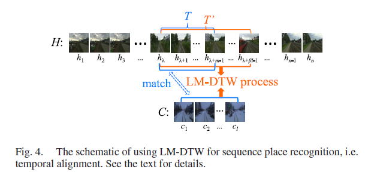

作者基于时间维度对齐的想法提出了图像序列距离度量的方法。假设机器人过去采集了一段图像序列$$H(h_1,h_2,...,h_n)$$，当前图像序列为$$C(c_1,c_2,...,c_l)$$。需要从H中找到一段子序列$$T(h_\lambda,...,h_{\lambda+m-1})$$，作为C的最佳匹配。第一帧$$h_\lambda$$和长度m是未知的。l是一个常数，m和l不一定相等。&#x20;

如果用原始的DTW去遍历所有可能的T，来找到最优的。需要使用两层循环，第一层控制长度m，第二层控制起始帧$$h_\lambda$$，DTW在循环中需要耗费$$O(l\times m)$$时间，其中m是可变的，l是固定的。因此，该方法的总时间复杂度为$$O(n^3)$$，是不可行的。&#x20;

为了获得线性的时间复杂度，作者提出了一种局部匹配DTW（LM-DTW）算法。假设T的第一帧为$$h_\lambda$$，作者在序列C和以$$h_\lambda$$为起始帧、长度不短于T的序列T'上进行LM-DTW，来在T’中确定T的位置。T'的长度为k，$$m\le k \le n-\lambda+1$$。这本文中，作者假设$$m \le \beta l$$因此可以设置$$k =\beta l$$，$$\beta$$是常数。这一假设来源于一个简单的先验，即机器人通过同一位置的平均速度之比不会超过常数$$\beta$$。&#x20;

在LW-DTW算法中，首先计算C与T'间得$$l \times k$$的矩阵矩阵$$D'_{CT}$$，利用公式3来获得一个$$l \times k$$的累加距离矩阵$$S'_{CT}$$，这一步与\[Spatial Alignment for Image Distance Measurement]相似，唯一的不同在于自适应参数a设为1。从产生矩阵$$S'_{CT}$$的动态规划过程中，可以得到$$S'_{CT}$$的最后一行的元素$$s'_{l,x}$$是(1,1)到(l,x)最优warping path的累加距离。归一化之后，$$\frac{s'_{l,x}}{C'_{l,x}}$$表示C与T'前x帧的距离，所以让$$\frac{s'_{l,x}}{C'_{l,x}}$$最小化的x就是T的长度：&#x20;

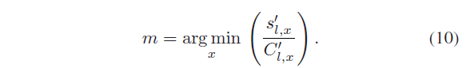

同时，C和T之间的距离为$$min(\frac{s'_{l,x}}{C'_{l,x}})$$，它们之间有warping path对齐。 在这种情况下，相当于改变了理想warping path的端点(不再是(l, k))，或者说放宽了原始DTW的边界条件。LW-DTW需要消耗$$O(\beta l^2)$$的时间，即时间复杂度为O(1)。作者只需要从$$h_1$$到$$h_n$$尝试n次，来控制初始帧，然后找到具有最小序列距离。因此算法的整体时间复杂度为O(n)。除此之外，还可以通过并行计算来更快的计算。通过这样的方法，可以在时间上对齐C和T。

### Experiments

数据集&#x20;

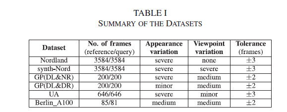

参数设置&#x20;

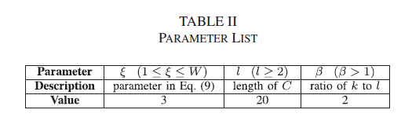

消融实验&#x20;

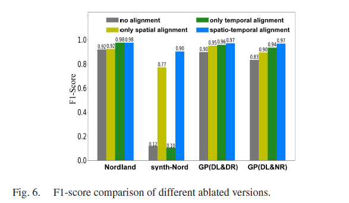

不同对齐方法的研究&#x20;

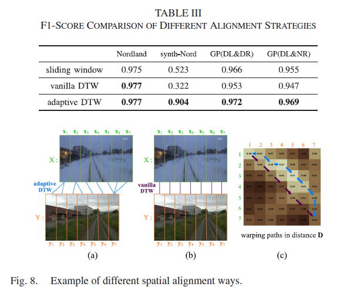

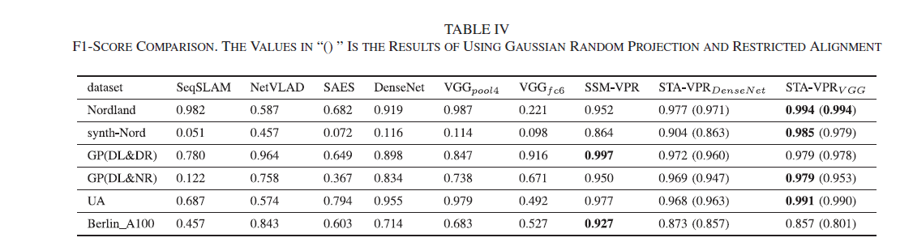

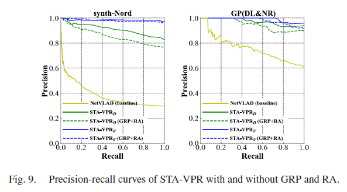

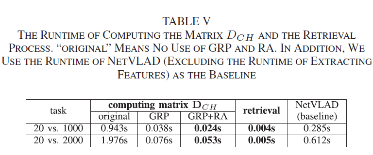
