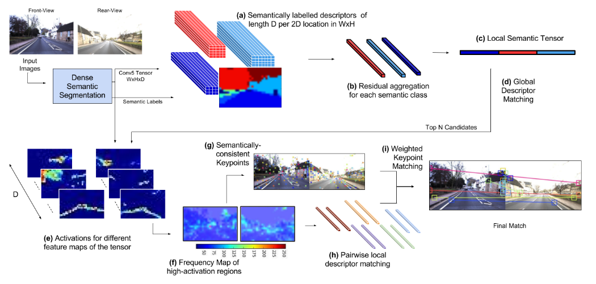

# \[RSS 2018] LoST

结合基于语义和外观的全局描述子，和空间一致的局部关键点对应关系来进行场景识别。由语义标签和卷积特征图获得一种全局特征描述子LoST，对于匹配图像，提取特征图中响应值最大的位置作为关键点，进行特征匹配，进行空间一致性验证。可以应对相对视角的问题。





### Abstract

We first propose a novel Local Semantic Tensor (LoST) descriptor of images using the convolutional feature maps from a state-of-the-art dense semantic segmentation network. Then, to verify the spatial semantic arrangement of the top matching candidates, we develop a novel approach for mining semantically-salient keypoint correspondences.

### Introduction

作者提出现有的sota场景识别算法，在面对extreme appearance variation时的表现受到严重挑战。所以作者希望用语义信息来解决viewpoint and appearance variations问题，并且只有limited filed-of-view camera，而非全景相机或lidar。本文的贡献点在于：&#x20;

1. 提出一个PR算法，结合了基于语义和外观的全局描述子和空间一致的局部keypoint correspondences；
2. 由语义标签和卷积特征图获得一种新的图像描述子，LoST；&#x20;
3. 一种新的从匹配图像对中挖掘和筛选具有语义显著性的keypoint correspondences方法。

### Method

#### Local Semantic Tensor

本文中，作者提出一种方法，利用语义标签分数和来自于稠密语义分割网络获得的卷积特征图来semantically pool features.&#x20;

作者使用了在Cityscapes数据集上训练好的RefineNet作为语义分割网络，提取conv5层输出的卷积特征图，特征图的尺寸为$$\frac{1}{32}H\times \frac{1}{32}W \times D$$，其中H和W都是原图的大小，D为2048维。得到的语义标签分数尺寸为$$\frac{1}{4}H\times \frac{1}{4}W \times D$$，D为20，表示Cityscapes中的20类语义类别。在使用时，将语义分数缩放到与特征图一样的尺寸。 作者设计了语义描述子L，称为Local Semantic Tensor(LoST)。该描述子通过卷积特征图和语义标签概率计算得到：&#x20;

其中$$l_i$$是特征图中在i位置的D维描述子$$x_i$$的语义标签，$${\mu}_{s}$$为语义类别s的平均描述子，均值是根据每个像素最可能的语义标签来计算的。图像描述子$$L_s$$是用像素i输出语义类别s的概率$$m_{is}$$来计算的。$$m_{is}$$是标签分数在D维上进行L1-normalization得到的。实际上，每个语义描述子$$L_s$$是特定语义类别s中residual descriptor与其他语义类别的带噪声分布的聚合，通过语义标签概率来进行加权。(与VLAD描述子很相近，这里采用语义信息进行聚类)。最后图像的描述子L是road、building和vegetation三类$$L_s$$经L2-normalization后拼接得到。&#x20;

在reference database中，作者将公式2中计算平均值的范围从单张图像拓展到邻近15张图像。 在candidate search中，利用余弦距离计算query与reference images之间的距离，取10个candidates。

#### Correspondence Extraction

在这篇论文中，作者将maximally-activated locations视为keypoint。作者认为，既然高层的卷积特征图可以捕获图像的语义信息而且语义信息是由相互对应关系的，那么可以合理假设，卷积特征图中包含着correspondence，并且这种correspondence可以映射到特征图中的高响应关键点位置。对于一堆图像，我们可以从高层网络中提取出D个keypoint correspondence。&#x20;

如果匹配的图像是理想的或者完全一致的，那么correspondence会很完美。但是在实际场景中，会有一些原因造成false correspondence：1.卷积核隐形地被训练去检测特定特征，但是这些特征没有出现在当前图像中，可能会导致网络在随机位置被触发，错误的检测出特定特征；2.同一图像中多个类似物体，会导致cross-correspond；3.动态物体也会引起false corresponde

#### Spatial Layout Verification

为了限制correspondence的数量并且防止false correspondence，作者使用了基于语义一致性的先验筛选。

**Semantic Label consistency**

对于每对keypoint correspondence，作者是用语义标签去筛选，那些具有相似标签的被保留下来。这一步可以筛掉一半多的correspondence，特别是那些受原因1影响的情况。进一步地，作者用neighborhood density test来筛选剩下的correspondence，即在keypoint周围3x3的邻域内，只有一个correspondence被保留下来。这一步可以帮助减少相同语义类别的小范围内冗余的correspondence。

**Weighted Keypoint Matching**

对于剩余的corresponding keypoints，记为M，从conv5层提取的k和k'处keypoint的D维描述子$$x_k, x_k'$$。同时，将图像左右翻转(处理rear-view图像)，得到keypoint对应的翻转坐标$$p_k, p_k'$$。然后这些keypoint的位置通过加权欧拉距离来完成匹配：&#x20;

其中$$w_{kk'}$$是对应descriptor $$x_k, x_k'$$的余弦距离，在所有匹配对M上进行normalization。$$r_c$$是候选c的匹配分数，具有最低分数的候选被认为是最终的匹配。

**我的理解**

这部分看的有点懵，我的理解是，作者将D维feature map中的每一维都提取出来，找到图中最大响应值的位置，作为keypoint。这样对于query和reference image，每张图像可以提取出D个keypoint，并且两张图像的keypoint已经有了一一对应的的关系，也就是D个keypoint correspondence。对于这D个keypoint correspondence，作者对每个correspondence先用语义进行了筛选，如果每个correspondence中对应的keypoint的语义类别是相同的，那么保留这个correspondence，否则剔除。并且，为了减少同一语义类别中小邻域内存在大量keypoint，作者在3x3的区域内，只保留了一个correspondence。在计算query和reference之间的匹配分数时，由于已知了keypoint correspondence，所以只需要计算匹配误差就行。也就是加权欧拉距离，但是这里**为什么要计算翻转后keypoint坐标的欧拉距离？**还没想清楚。难道是假设了遇到的情况都是opposite-view？而且视角都在同一水平面内平移？这种情况有点局限吧。

#### Image Sequence Matching

作者用OpenSeqSLAM的方法加入了temporal consistency，也就是累加序列的匹配分数，找到最优的匹配候选。

### Performance

LoST是指只采用图像描述子的检测方法，LoST-X是指整个算法。

sequence matching:&#x20;

single\_frame matching:&#x20;

