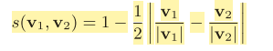
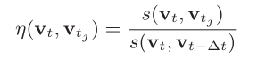
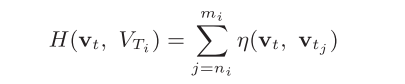
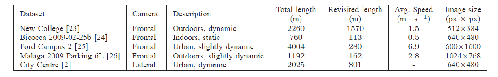
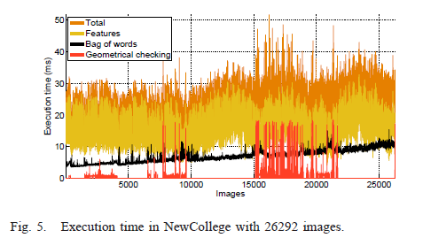
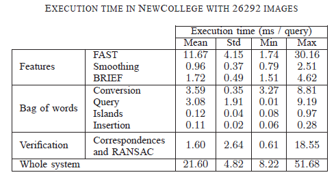
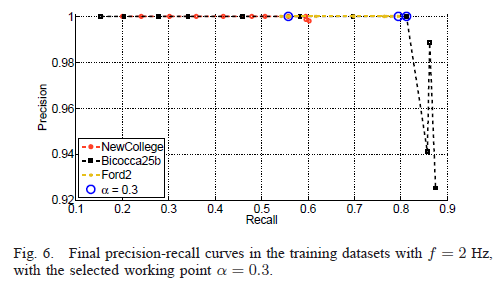
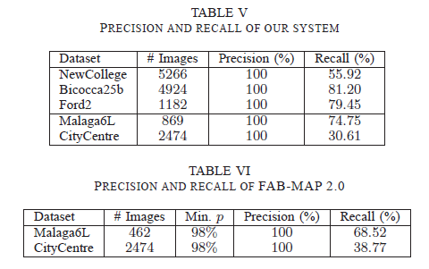

# \[TRO 2012] DBoW

个人感觉是“离线训练词典，在线回环检测”这种检测策略的里程碑了，被广泛用于SLAM系统中，效果和实时性都很好。主要贡献是提出了一种更为鲁棒的二进制特征（改进自FAST+BRIEF），用一个树型词典去离散化特征空间，并在树的结构中加入了inverse index table和direct index table的结构，inverse index table储存了图像中单词的权重和图像出现的图像索引值，direct index table储存了图像中特征及其关联的叶节点（视觉单词）。



### Introduction

贡献点可以总结为几点：

1. 使用了一种改进的FAST+BEIFF二进制特征；
2. 把邻近图像联系起来，组成island，防止过于靠近的图像被匹配到（算是一种temporal constrant）；
3. 在词典树中加入inverse index来实现快速的图像检索，加入direct index来保留图像间的correspondence，加快geometrical check的速度。

### Binary Features

作者使用FAST来检测关键点，用BRIEF计算描述子，描述子维度为256维，由于描述子是二进制的，所以可以采用xor运算来计算描述子间的距离，加快计算速度。

### Image Database

由于作者使用二进制描述子，所以构建了二进制词典树，使用K-means++ seeding初始化K-means的初始medians，medians中非二进制值得被置为0。 计算两个BoW向量得相似度时使用了L1分数：&#x20;

在词典树中，作者使用了inverse index table来保留该单词出现过的图像索引值。当一张新的图像加入database，inverse index table会随之更新。 作者来使用了direct index table，对于每张图像，作者在direct index table中储存了该图像出现过的单词所属的位于l层的节点，以及该节点包含的局部特征。此结构可以用于在获得candidate loop时，准备进行geometrical check时计算同属于一个word或者同属于一个节点的特征的correspondence。

### Loop Detection Algorithm

#### Database query

对于每个query图像，利用词典树，搜索到一系列匹配的candidates以及对应的分数，由于这些分数受query image和它其中的单词分布影响，所以作者对分数进行了归一化：&#x20;

#### Match grouping

为了避免相邻的图像被匹配，作者将相邻图像构成了island，将其视为一个匹配。如果query匹配到的candidate的时间戳之间差距很小，那么就将这些candidate视为一个island，其匹配分数为：&#x20;

具有最高匹配分数的island被挑选出来作为matching group，进入下一步的验证。

#### Temporal consistency

当获得最好的matching island后，对其进行时间一致性的检验，即其之前的k个query也必须被匹配到，当其通过检验后，挑选island中具有最高匹配分数的一个image作为当前query的匹配。

#### Efficient geometrical consistency

作者的几何检验思路是计算匹配图像对的F矩阵，利用RANSAC，至少需要有12个匹配点对。为了加快特征匹配，作者用direct index去粗略搜索。

### Experiments

#### Methodology

实验采用的数据集如下，其中一些数据集没有回环的真值，所以作者人工标注了真值。&#x20;

作者在所有实验中，采用了相同的词典，K=10，L=6，用Bovisa 2008-09-01数据集中的10K张图像提取9M特征进行训练得到。&#x20;

运算效率很可观的。&#x20;

准确率-召回率曲线和最大召回率。这两个指标一般用于评测回环检测，对于SLAM系统来说，还是准确率为100%时最大召回率这个指标最为重要。
