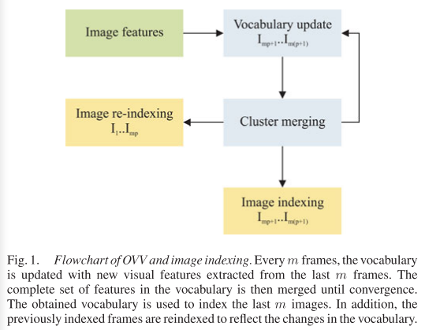
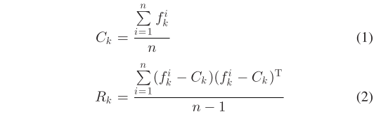
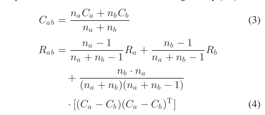
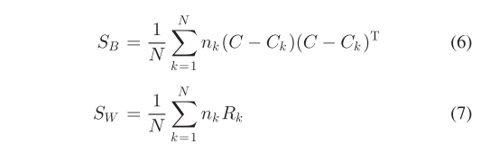
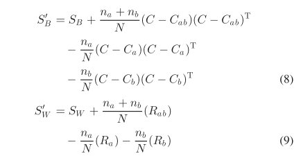
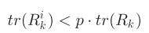
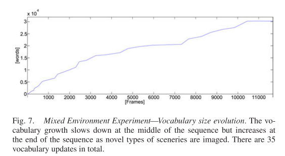
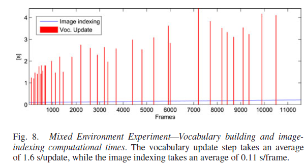

# \[TRO 2012] Online Visual Vocabulary

这篇论文是在OVV IROS 2009的基础上拓展的期刊论文，在这篇论文中，作者对于词典的更新间隔进行了改进，不再是每隔m张图像更新一次词典，而是通过判断特征与单词的关联率来判断词典是否需要更新。并且，对于具有较少信息的分支，词典进行了剪枝，使得结构更加紧凑。



### Abstract

> Detecting already-visited regions based on their visual appearance helps reduce drift and position uncertainties in robot navigation and mapping. Inspired from content-based image retrieval, an efficient approach is the use of visual vocabularies to measure similarities between images. This way, images corresponding to the same scene region can be associated. **State-of-the-art proposals that address this topic use prebuilt vocabularies that generally require a priori knowledge of the environment**. We propose a novel method for appearance-based navigation and mapping where the visual vocabularies are built online, thus eliminating the need for prebuilt data. We also show that the proposed technique allows efficient loop-closure detection, even at small vocabulary sizes, resulting in a higher computational efficiency.

SLAM系统一般会将回环检测任务当作一个2D-2D的图像检索任务来完成，bag-of-word模型是一个高效的解决方案，但是现存SOTA的算法是现在一个训练集上训练一个pre-built vocabulary，这里就需要用到人类对于环境的先验认知（比如室内还是室外，词典的规模等）。这篇论文提出了一种在线训练词典的方法，所以无需训练数据集。实验结果证明了提出的算法即使使用一个比较小的词典，也可以达到不错的回环检测效果，计算效率非常高。

### Introduction

传统BoW的算法流程大致分为两部分：1.离线部分，从训练集中提取特征完成聚类，构建视觉词典，特征的聚类被当作描述图像的视觉单词；2.在线部分，提取当前图像的特征，量化到视觉单词上，用视觉单词的直方图向量来描述图像，完成图像相似度的计算。

> BoW image representation employs two stages: 1) In the training stage, sets of visual features are grouped or clustered together to generate visual vocabularies, i.e., collections of generalized visual features or visual words; 2) in the second stage, the images are represented as histograms of visual word occurrences.

当前BoW模型的缺点之一就是使用了静态的pre-built vocabulary，需要先验的知识，但是在复杂、大型的场景中，这一定是不合理的（我们的试验也证明了这一点，室内场景构建的词典在室外检测效果不好，室外训练的词典在室内效果不好）。 作者提出了一种无需先验和人工设计参数的增量式词典训练方法，online visual vocabulary (OVV)。另外，作者也设计了一种新的聚类方法，用一种新的、考虑到整个聚类分布的聚类收敛标准。&#x20;

### Visual Vocabulary

> Finding the adequate parameters for an optimum vocabulary is a tedious task which generally involves a trial-and-error approach. For instance, a vocabulary with too many words would not have enough abstraction power to detect similarities between images. In contrast, a vocabulary with too few words would be too confusing and generalized to be discriminative.

作者先提出了static pre-built vocabulary的一个弊端，就是词典的规模完全由人工反复实验获得，耗时且不一定最优。而且对于词典树来说，当词典的规模过大，特征的鲁棒性下降了，对于视觉的干扰过于敏感；反之，当词典的规模过小，特征的disciminativeness下降，特征容易误匹配。 作者因此提出了一种增量式的视觉词典训练方法，为了实现这一点，作者采用一种修改后的聚类方法（Agglomerative clustering）.

#### Agglomerative clustering

该聚类方法是一种自底向上的层次聚类方法，过程如：

1. 先将每个元素单独定为一类（elementary clusters）.
2. 合并指定距离最小的类.
3. 重复（2）直到所有元素都归为同一类。

#### Vocabulary building

在这篇论文中，首先跟踪图像中的特征点，用这些跟踪到的点作为elementary clusters，减少了用于构建词典树的特征数量。词典树通过增量式的合并这些clusters来构建，构建过程可以总结为两点：

1. 初始化：词典先用前m张图像提取到的tracked features去初始化一个词典，然后由底向上构建词典树；
2. 更新：我理解的是，OVV用了一种滑动窗的概念，每m张图像中提取出的elementary clusters都被加入到词典树中，然后整个词典树继续由底向上完成构建。这样，新出现的场景中的特征也会被更新到词典树中。

#### Cluster characterization

每个cluster具有两个属性，聚类中心值$$C_k$$，和协方差矩阵$$R_k$$。$$C_k$$反映了cluster在整个t为特征空间中的分布，$$R_k$$反映了cluster内被合并的子cluster之间的关系。&#x20;

**Cluster updating**

每个聚类都是通过合并两个聚类来获得的，所以新的聚类属性可以根据原本的两个聚类的属性来获得。&#x20;

这样可以节省运算的消耗。

#### Cluster merging criterion

作者认为原本在Agglomerative clustering度量距离的方法是局部最优的，没有考虑到特征的全局分布。所以作者提出了新的聚类方法，在聚类时，同时增加各类之间的间距和类内的compactness。这一点至关重要，因为视觉词典的有效性由两个方面决定：1) repetitiveness，即相似的图像特征应当被关联到相同的cluster，2) discriminative power，即不想似的图像特征应当被关联到不同的cluster上。新的聚类方法基于Fisher’s linear discriminant。先计算了两个矩阵：&#x20;

其中C是所有数据的中心值，N表示所有数据的数量，$$n_k$$表示在第k个cluster中包含数据的数量。$$S_B$$代表了between clusters scatter matrix，我理解的是体现了类与类之间的分散程度（类间距离），这个值越大越好；$$S_W$$代表了within clusters scatter matrix，是体现了类内数据的分散程度（类内紧密度），这个值越小越好。然后用$$S_B$$和$$S_W$$的迹的比值作为目标函数，在聚类时应使目标函数尽可能大:&#x20;

实际上，合并分两步进行：

1. 对于每个cluster，利用kd-tree在它的领域内（欧拉空间中）搜索可能合并的candidate；
2. 对于每个candidate，计算合并前后的Q，如果Q有提升，那么将两个cluster合并，并且更新相应的$$S_B$$和$$S_W$$。&#x20;

由于每次合并都会引起$$S_B$$和$$S_W$$的更新，所需的计算量较大。所以作者提出一种增量式的更新方案：&#x20;

#### Convergence Criterion

在算法中，重复上一节的合并过程，直到Q值无法提升。此时，词典的repetitiveness和disciminative power都达到了最大。这样的收敛标准无需人工干预。

#### Adding New Clusters

在词典更新阶段，新的elementary cluster被加入。对于每个新加入的elementary cluster $$\zeta_e$$，$$S_B$$和$$S_W$$要相应的更新，为了减少更新时的计算量，作者使用增量式更新的方法，和之前iros会议版本的方法一样。

#### Linear Disciminant Analysis

与之前iros会议版本的方法一样。

#### Vocabulary Update Criterion

在实际操作中，词典不是间隔固定时间更新一次的，而是自适应的更新。在图像检索过程中，特征被关联到词典中的clusters上。对于每个特征$$f_l$$和cluster $$\zeta_k$$之间的关联，我们检查特征是否当特征是否属于该cluster： 其中，$$\delta_k$$为cluster $$\zeta_k$$的标准方差，| |表示每个维度上的绝对值比较。即特征的每个维度都符合式15的条件时，我们认为该特征属于该cluster。在每一个特征更新阶段，当特征落入cluster的比率小于90%，则更新词典。（**相对会议论文的改进**）

### Image Indexing

#### Cluster Association

与之前iros会议版本的方法一样。

**Image Reindexing**

与之前iros会议版本的方法一样。

#### Image similarity

与之前iros会议版本的方法一样。

### Increasing Vocabulary Efficiency

在导航和建图过程中，新的视觉特征被加入，OVV的规模会一直增大。作者在词典构建和图像检索过程中使用了approximate nearest neighbor techniques来提高效率。同时，为了进一步提升OVV的计算效率，作者对包含较少信息的节点进行了剪枝。当时，进行剪枝。其中$$R^{i}_{k}$$是cluster $$\zeta_k$$中节点i的半径，p是一个预设标量。在实验中，作者发现p=0.1效果最好。（**没太懂这里的意义，R不是elementary cluster的协方差矩阵么**）

### Experiments

OVV的词典会随着环境的增大而逐渐增大。&#x20;

可以看到，图像检索的时间基本稳定，没有随着环境规模变大而增长。词典更新的频率也逐渐降低。&#x20;

作者比较了incremental indexing和full indexing的表现（对应着image reindexing节），说明增量式的方法在大幅度减少计算消耗的同时，还保持了不错的表现。
