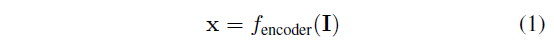

# \[AAAI 2020] AtLoc





### Abstract

这篇工作中，作者利用注意力机制来让网络关注具有更强几何稳定性的目标和特征，用单张图像作为输入，也获得了很好的定位表现。

### Introduction

这篇论文中，作者提出一种不需要多帧连续图像的定位算法，算法关注图像中时序一致和信息量较大的局部区域，而忽略了动态物体，以单张图像作为输入。算法名为AtLoc-Attention Guided Camera Localization，是一种基于注意力机制的位姿估计网络。

### Attention Guided Camera Localization

单张图像输入网络，经过visual encoder获得了隐式的表征，根据这些特征，注意力模块计算自注意力图来将特征映射到一个新的特征空间中，位姿回归模块将新的特征映射到相机位姿，即三维的位置向量和四维的四元数（旋转）。

#### Visual Encoder

采用在ImageNet上预训练过的ResNet34模型，将最后1000维的输出全连接层改为C维的全连接层，并去掉SoftMax。C为输出特征的维度，设置C=2048。即给定输入图像$$I\in\mathbb{R}^{\hat{C}\times H\times W}$$，提取特征$$x\in \mathbb{R}^{C}$$:&#x20;

#### Attention Module

作者引入了自注意力机制，来生成一个注意力图，让模型学习到图像中稳定的、几何鲁棒的特征。作者采用了一个non-local形式的自注意力机制，有助于捕获长期依赖和图像特征的全局联系。从visual encoder中提取的特征$$x\in \mathbb{R}^C$$首先用于计算点乘相似度：&#x20;

其中$$\theta(x_i)=W_\theta x_i, \phi(x_j)=W_\phi x_j$$.&#x20;

设置正则项$$C(x_i)=\sum_j S(x_i,x_j)$$，给定另一个线性变换$$g(x_j)=W_g x_j$$，输出的注意力向量y为：&#x20;

最后，自注意力机制可以写为：&#x20;

出自之外，作者还加入一个残差连接，$$\alpha(y)=W_\alpha y$$:&#x20;

其中，以上权重矩阵都用全连接层实现，注意力图维度变低（n=8维）。

#### Learning Camera Pose

分别用MLP来将注意力机制指导的特征Att(x)映射到位置向量p和旋转向量q上：&#x20;

损失函数为：&#x20;

其中$$\beta$$和$$\gamma$$为平衡位置损失和旋转损失的参数。log q是单位四元数的对数形式：&#x20;

其中u是单位四元数的实数部分，v是虚数部分。

#### Temporal Constraints

作者还提供了一个加入图像间时空一致性约束的模型AtLoc+。直观上讲，时空约束可以让模型学习全局一致的特征，因此提升定位精度。在这篇工作中，时空约束损失函数为：&#x20;

其中i和j是图像索引值，$$I_{ij}=(p_i-p_j,q_i-q_j)$$表示图$$I_i$$和图$$I_j$$之间的相对位姿。$$\alpha$$为调和参数。

### Experiments

