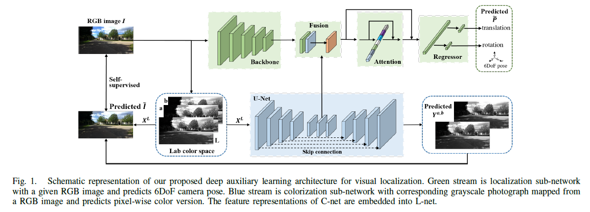
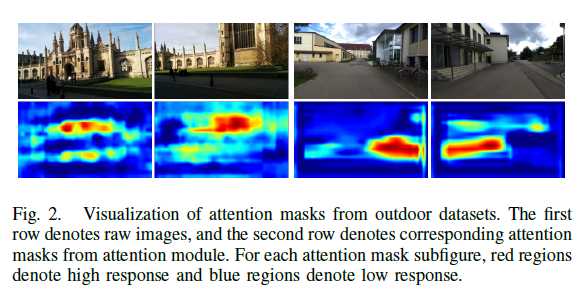
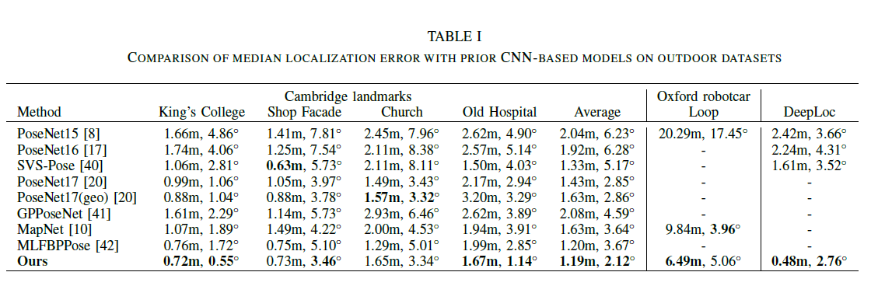
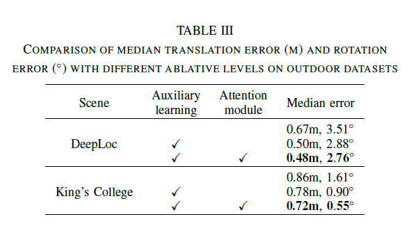
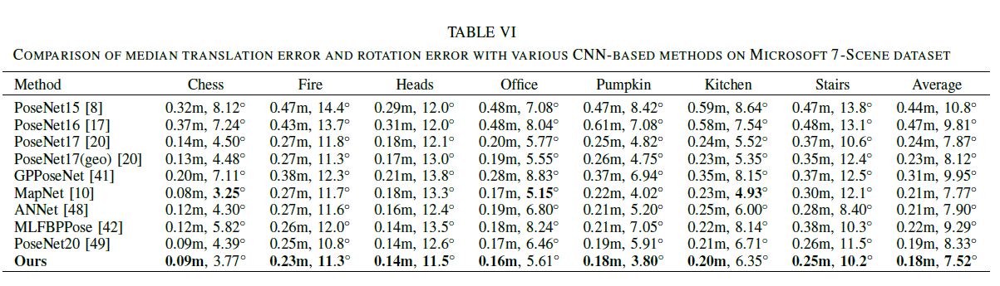

# \[arxiv 2021] auxiliary colorization



## Abstract

引入几何或者语义信息可以提升APR的表现，但是需要大量人工标注。为此，作者提出了一种辅助学习策略，利用自监督表征学习任务引入场景相关的高层语义。在这篇工作中，从着色任务中得到的特征表征被嵌入到定位网络中，获得用于位姿回归的有区分能力的特征。同时，利用注意力机制提升定位表现。

### Introduction

> Traditional localization methods estimate camera pose from 2D-3D matching between query images and a map by applying an Perspective-n-Point (PnP) in RANSAC loop. The map is predefined with scene information that is generally presented as sparse key points with 3D geometry information and feature descriptors.

本文的贡献在于：

1. 提出了一种辅助学习结构，包括一个定位网络和一个着色网络。通过着色网络捕获高层语义信息来辅助定位。
2. 设计了一种场景相关的注意力机制，来选择激活显著的目标和有用的区域。

### Approach

所提出的网络包含两个子网络，一个是定位网络（L-Net），一个是着色网络（C-net）。分别向L-Net和C-Net输入RGB图像和灰度图，预测绝对位姿和颜色。作为一个互补的任务，C-Net用于训练着色任务，但是目的在于提供场景相关的特征表征，来帮助L-Net用高层语义信息来回归位姿。除此之外，作者还设计了一个注意力机制，来挑选对于定位有意义的区域。

#### Colorization Sub-Network

作者在CIE Lab color space中进行着色任务，因为这一空间中距离可以度量感知差异。C-Net预测以亮度L通道的$$X^L$$为输入，预测对应的a、b颜色通道$$\tilde{Y}^{a,b}$$，真值为$$Y^{a,b}$$。作者采用了轻量化的U-Net结构，下采样四次，并在上采样过程中加入skip connection。作者只采用L1距离作为损失函数&#x20;

作者选择下采样16倍的特征作为图像的语义表征，引入定位网络中，记为$$M_c$$。

#### Localization Sub-Network

给定一张RGB图像$$I\in \mathbb{R}^{H \times W \times 3}$$，L-Net可以预测出绝对位姿P=\[x,q]，其中$$x\in \mathbb{R}^3$$表示平移，$$q\in \mathbb{R}^4$$用单位四元数表示旋转。L-Net由用于特征提取的backbone、融合部分、注意力机制和回归层四部分构成。&#x20;

**Backbone** 采用ResNet-50作为backbone，从Res5 block输出的下采样16倍的特征作为输出，记为$$M_l$$。&#x20;

**Fusion Operation** 为了从着色任务中引入相关的特征，避免不相关特征的干扰，这里这样融合两部分得到的特征：&#x20;

其中符合表示在channel维度拼接。W和b是可学习的。&#x20;

**Attention module** 注意力模块包含两步，第一步是压缩和激励过程。用一个channel维度的向量$$V=GMP(M_{fuse})$$来激活$$M_{fuse}$$，其中$$V\in \mathbb{R}^C$$是通过global max pooling来获得的，可以将空间信息压缩到一个全局表征中。然后用通道维度的点乘实现激励。&#x20;

下一步为获得一个注意力掩码，来对$$M_{fuse}$$中的不同区域赋予权重。通过对$$M_{SaE}$$进行跨通道的global average pooling来获得这样的掩码，是一个单通道的mask，高响应值表示区域更应被关注。&#x20;

为了不损失信息，将原本的整体特征$$M_{fuse}$$与加入注意力后的表征$$M_{atten}$$融合，用于最后的回归。

&#x20;**Regressor** 全连接层作为回归层，为了避免过参数化，将4维四元数转换为3维的旋转表示&#x20;

损失函数用L2距离&#x20;

#### Joint Learning

整体的损失函数为：&#x20;

### Experiments

同时，作者证明了作为辅助任务的着色任务或语义分割任务也可以得到很好的表现。说明任务之间是互补的、互相促进的。
