# \[BMVC 2018] Anchor points



### Abstract

作者定义了route map中的anchor point，并设计了网络结构来根据当前输入预测场景中最近的anchor point和相对anchor point的偏移。这种最相关的anchor point并不一定是真值位置上最近的点，因为位姿不同可能导致anchor point不可见。作者提出了多任务损失函数，来发现最相关的anchor point，无需真值。&#x20;

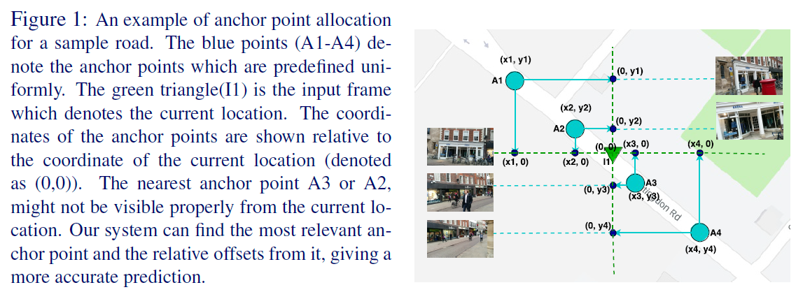

### Approach

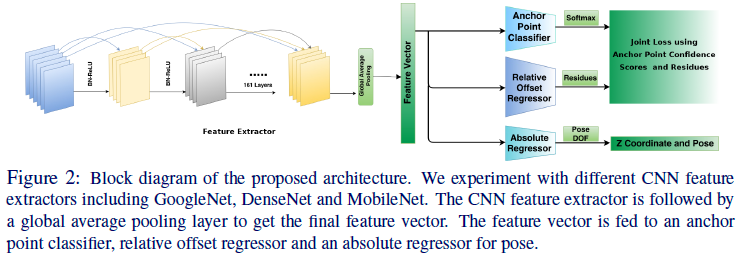

作者提出将位姿估计问题建模为multi-task问题，第一个问题是将输入的图像分类到某一个anchor point上，第二个问题是估计相对该anchor point的相对偏移。作者用了标准的CNN网络去提取特征，之后用一个全局平均池化来获得一个向量，如图2所示。作者在这之后，将向量输入三个分支，获得三种输出。

&#x20;**Anchor Point Classification** 在给定的地图中，作者将地区等间隔的划分为若干区域，每个区域的终点被定义为anchor point的二维空间坐标，这些anchor point的全局坐标是已知的，作者将检索最相关的anchor point这一问题视为图像分类问题。给定一张图像，预测最相关的anchor point。值得注意的是最相关的anchor point有时并非是图像位置最靠近的。因此，作者不需要图像最相关的anchor point真值，作者将预测的概率视为每个anchor point的可信度分数，与相对偏移在损失函数中相结合。在Anchor Point Classification head中，作者加入了一个全连接层和softmax，输出概率值，维度等同于预处理过程中获得的anchor point数量。&#x20;

**Relative Offset Regression** 作者还预测了关于anchor point的相对偏移，由于没有真值的最相关anchor point信息，所以作者输出了关于所有anchor point的相对偏移，然后让模型去拟合这些相对偏移。因为anchor point的真值坐标是已知的，所以所有图像的真值相对偏移也可以获得。对于每幅图像，作者对所有anchor point预测了X，Y坐标相对偏移，即假使有N个anchor points，则Relative Offset Regression head输出2N维向量。&#x20;

**Absolute Offset Regression for Z and Pose** 作者指出，只可以用anchor point来提供X、Y坐标的相对偏移，无法提供Z坐标和相机朝向，原因如下：1. 一个场景的Z坐标和相机朝向与前一个场景无关，它是反直觉的，无法提供像X、Y坐标那样的连续性；2. 拟合Z坐标和相机朝向的相对偏移会使得回归任务变得更复杂，影响模型表现。因此，作者保留了4-DOF的全局位姿预测，分别代表Z轴全局坐标和相机的朝向角度。这里，作者用四元数表示朝向角度。

#### Loss Function

作者使用的损失函数包括三个部分。 令anchor point classification head的输出为$$\hat{C}$$，对每个anchor point赋予可信度分数。X,Y表示图像相对anchor point的偏移。则X、Y坐标相对偏移的损失函数为：&#x20;

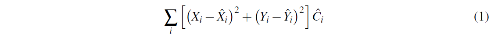

Z全局坐标和相机朝向角度的损失函数为：&#x20;

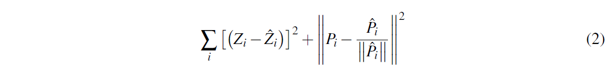

此外，作者还加入了一个与最近anchor point真值的交叉熵损失函数：&#x20;

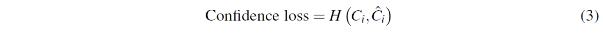

最终的损失函数为：&#x20;

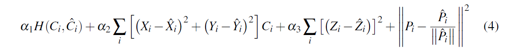

### Dataset and Experiments

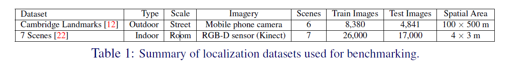

作者发现用ImageNet预训练过的特征提取网络表现更好。 在数据预处理阶段，作者在视频中每隔n张图像将场景均匀地划分为多个anchor point，并计算每张图像相对所有anchor point的X、Y坐标偏移。&#x20;

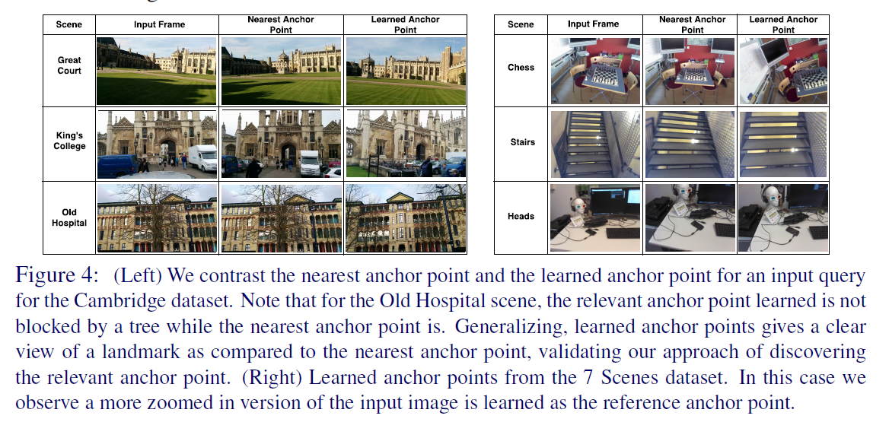

### Results and Discussions

与PoseNet相比：&#x20;

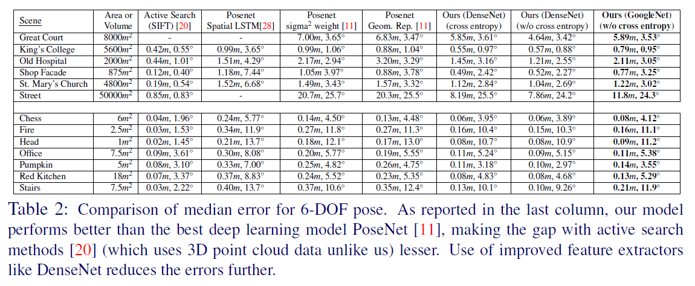

在室外场景中，发现不加交叉熵损失，模型效果更好，说明模型可以自己学习寻找最相关的anchor point，而且最相关的anchor point可能不是位置最靠近的。&#x20;

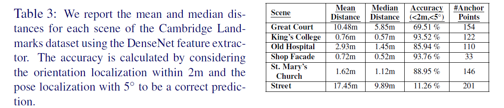

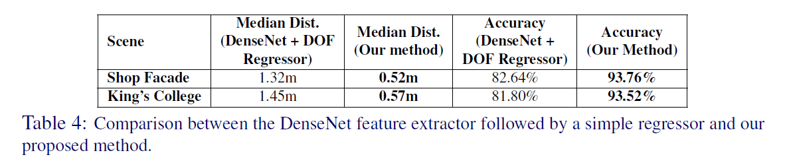

实时性：&#x20;

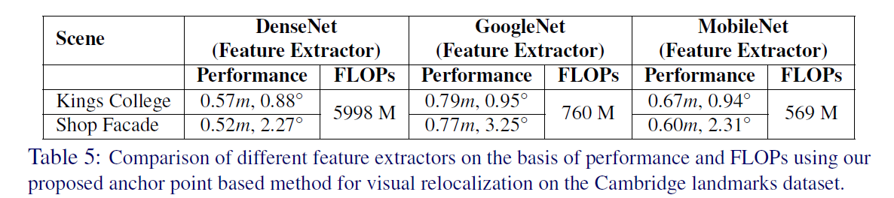

模型表现随anchor point的数量有变化&#x20;

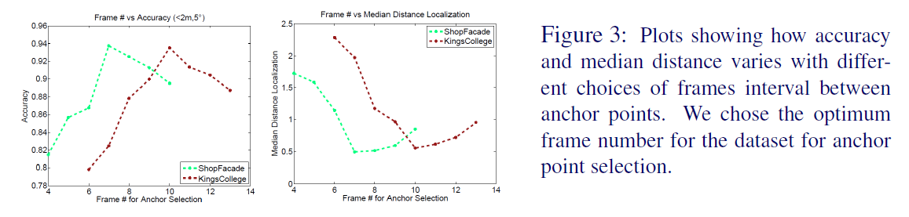

