# \[CVPR 2017] PoseNet2



### Abstract

作者指出，PoseNet虽然可以利用高层特征进行定位，并且对光照、运动模糊和未知相机内参鲁棒，但是它的损失函数很简单，需要调试超参数。所以，这篇论文，作者探索了很多损失函数，基于几何和场景重投影误差来训练网络。

### Model for Camera Pose Regression

网络输入单目RGB图像，预测得到相机位姿p，包括三维位置向量x，和角度向量q，这里用四元数表示角度。位姿是相对任一全局参考帧确定的。在实践中，作者将全局参考帧设置为所有相机位姿的中心位置。

#### Architecture

作者用GooLeNet作为位姿回归网络，加载ImageNet预训练参数。并做出如下模型修改：

1\. 删掉最后用于分类的线性回归和softmax层；

2\. 增加全连接层，输出7维向量；

3\. 加入nomarlization层，将四元数归一化。

#### Pose Representation

相机的位置可以很容易的在欧式空间中表示。但是角度比较困难。作者比较了几种不同的方法，如欧拉角、角轴、SO(3)旋转矩阵和四元数。比较它们在训练中的功效。&#x20;

首先，欧拉角一般用于3D旋转的交互表示，会存在一些问题，比如它不是单射的（相差2$$\pi$$仍然表示用一个角），因此用于单模态标量回归任务。此外，它们不能为给定的角度提供唯一的参数化表示，会出现万向锁问题。角轴同样如此。&#x20;

旋转矩阵是旋转的过参数化表示，对于3D问题，旋转矩阵属于特殊正交群，必须满足标准正交性。在反向传播时，很难约束旋转矩阵的标准正交性。&#x20;

因此，作者选用四元数作为旋转的表示。任意单位长度的四维向量都可以映射到适当的旋转上，这比旋转角度更易于约束。它在单位球面上定义旋转，主要缺点是每个旋转都有两个映射，每个半球一个。

#### Loss Function

**Learning position and orientation**

可以通过一个欧式空间中的目标函数$$L_x(I)={||x-\hat{x}||}_\gamma$$来拟合相机位置。&#x20;

旋转可以用目标函数$$L_q(I)={||q-\frac{\hat{q}}{||\hat{q}||}||}_\gamma$$。四元数的主要问题在于它不是单射的，每个旋转对应着两个值（分别位于一个半球上），即q与-q相同。为了解决这一问题，作者限制所有四元数位于一个半球上，让每个旋转只对应一个四元数。

**Simultaneously learning position and orientation**

在PoseNet中，作者使用了一个简单的线性加和，来同时训练网络估计位置和角度：&#x20;

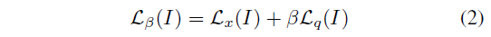

标量$$\beta$$用于平衡两部分损失。作者发现只单独训位置或旋转效果不如联合训练好，说明单独训练会损失一些对于位置和旋转必要的信息。但是，$$\beta$$需要很精细的调整。作者发现，$$\beta$$在室外场景比较大（250-2000），在室内比较小（120-750）。作者用grid search去微调$$\beta$$.&#x20;

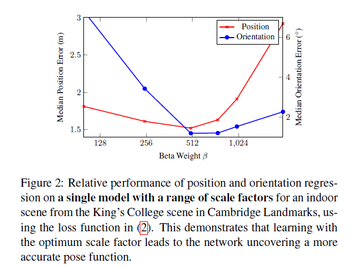

**Learning an optimal weighting**

作者旨在设计一个不需要超参数、来最优的学习估计位置和旋转。这篇论文中，作者提出了一种可以学习位置和旋转损失之间权重的损失函数。为此，作者使用homoscedastic uncertainty。homoscedastic uncertainty是一种不依赖于输入数据的不确定性度量，与heteroscedastic uncertainty相反。并且，它可以获取到任务本身的不确定性。&#x20;

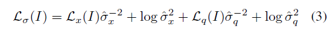

其中，通过反向传播优化homoscedastic uncertainties $${\hat{\sigma}_x}^2,{\hat{\sigma}_q}^2$$。这些不确定性是自由的标量，表示homoscedastic（任务的）噪声。 这个损失函数包含两个部分：拟合的参数和不确定性正则项。利用损失函数隐式地学习方差$$\sigma^2$$.方差越大，对回归的残差有调和作用；较大的方差(或不确定性)导致较小的残差损失。第二个正则项防止网络将不确定性估计为无穷大。&#x20;

在实践中，作者学习$$\hat{s}:=log {\hat{\sigma}}^2$$，因为它更稳定，可以避免分母为0，&#x20;

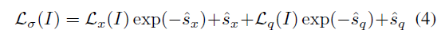

作者随机选择初值为$$\hat{s_x}=0.0,\hat{s_q}=-3.0$$.

**Learning from geometric reprojection error**

场景几何的重投影误差可以自然的将旋转和位移结合起来，得到一个损失标量。为了定义这个损失，作者首先定义了一个函数$$\pi$$将三维点g投影到二维图像坐标$${(u,v)}^T$$上:&#x20;

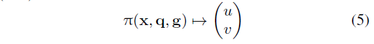

其中，x和q表示相机位置和朝向，函数$$\pi$$定义为：&#x20;

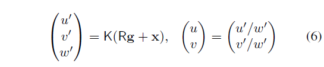

其中K是相机内参矩阵，R是q对应的旋转矩阵。作者用根据真值位姿和估计位姿得到的重投影误差来定义损失，取图像I中可见的场景3D点几何G'，损失函数为：&#x20;

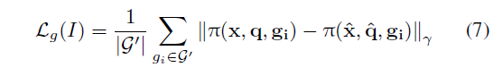

由于该损失函数用真值和预测的位姿来投影3D点，所以可以使用任意的相机模型，只要相机内参相同即可，因此为了简单起见，坐这儿假设相机内参K为单位矩阵，不需要相机标定。

**Regression norm**

作者选用了表现最好的L1范数。

### Experiments

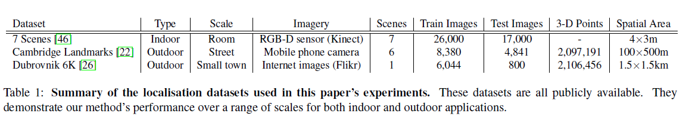

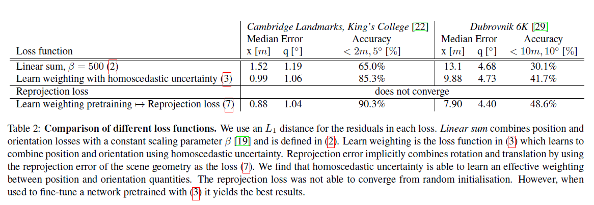

单独使用重投影误差损失函数从零开始训练，网络不收敛，但是用于fine-tune用优化参数的欧式距离损失函数训练的模型，会获得更好的表现。&#x20;

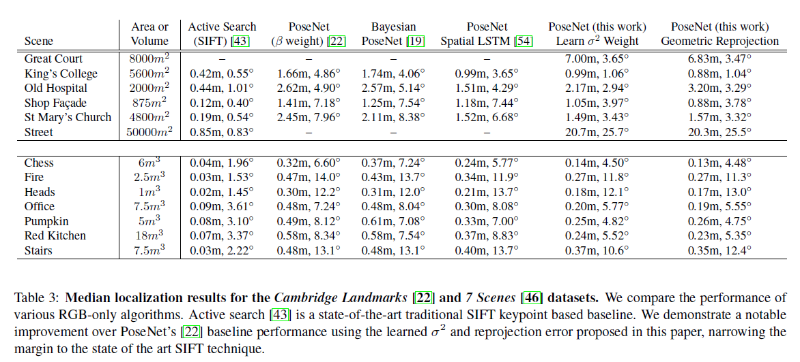

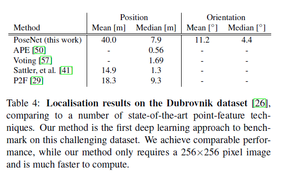
