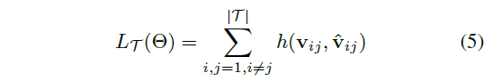
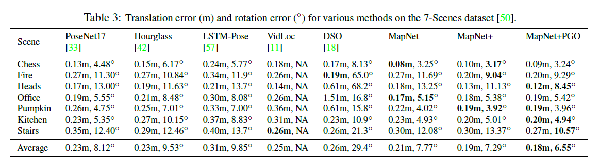

# \[CVPR 2018] MapNet





### Abstract

作者提出用一个深度神经网络来表示地图，称为MapNet，可以学习到一个数据驱动的地图表示。MapNet融合了视觉里程计信息、GPS信息和图像，将其融合在一起来进行定位。这些输入之间的几何约束，一般用于BA或图优化，被定义为损失函数，用于MapNet的训练和推理。除了可以提升定位精度，该方法还可以根据场景中无标注的视频序列，用自监督方法在线更新MapNet。作者还提出了一种新的相机旋转的表示方法，可以更有助于相机位姿的回归。

### Introduction

这篇论文中，作者用DNN来表示一个普适的地图，可以灵活地融合多种传感器输入，可以用无标注数据随时间更新。论文的主要贡献在于：

1. 之前很多位估计网络是只用图像来训练。在MapNet中，作者展示了如何使用观察之间的几何约束进行训练。这些约束可能来自不同的传感器，如VO提供的图像对之间的约束、GPS提供的位移约束、IMU提供的旋转约束等，这些称为geometry-aware learning，可以明显提升相机定位效果；
2. MapNet+可以在没有绝对位姿监督时，利用上述提到的观察间的几何约束来持续更新DNN权重。出自之外，作者还探索了MapNet预测（局部有噪声但是没有漂移）和VO（局部平滑但是有漂移）之间的互补噪声特征，并将其融合到一个滑窗形式的位姿图优化过程中。
3. 作者提出一种新的相机旋转的参数化形式，即单位四元数的对数形式，帮助训练。

### Proposed Approach

图2显示了该篇论文提出的三种模型。MapNet用于通过图像估计位姿，并加入了不同位姿预测间的约束；MapNet通过采用无标注序列中VO和GPS提供的几何约束来改进预训练好的MapNet；最后，在推理过程中，作者用滑窗PGO来通过融合MapNet+输出的绝对位姿估计和VO，获得平滑的、无漂移的相机位姿。

#### Camera Pose Regression with DNNs

模型backbone采用ResNet34，在最后一个卷积层后加入一个全局平均池化，接一个有2048个神经元的全连接层，一个ReLU，和概率为0.5的dropout，最后通过一个全连接层输出6维相机位姿。 PoseNet采用四元数来表示旋转，但是用四元数是对三维旋转的过参数化，并且需要对输出的四元数归一化。虽然欧拉角没有过参数化，但是它不利于回归（绕$$2\pi$$，表示同一角度）。 四元数的对数 log q是三维的，没有过参数化，并且可以直接拟合，无需归一化。单位四元数为$q=(u,v)$，其中u是标量，v是三维向量。其对数为：&#x20;

对数形式$$w=log~q$$可以转换回单位四元数：$${exp}~w=(cos ||w||，\frac{w}{||w||}sin ||w||)$$.

#### MapNet: Geometry-Aware Learning

MapNet训练一个DNN $$\Theta$$从训练集$D={(I,p\*)}$中的RGB图像I估计6维相机位姿$$p=(t,w)$$，采用监督学习的方法，$$f(I;\Theta)=p$$。MapNet不仅最小化每张图像绝对位姿的损失，还最小化图像对之间的相对位姿损失：&#x20;

其中$$v_{ij}=(t_i-t_j,w_i-w_j)$$为图像$$I_i,I_j$$之间的相对位姿。&#x20;

#### MapNet+： Update with Unlabeled Data

MapNet+采用VO、GPS、IMU等额外信息T来自监督地更行MapNet的权重。 假设额外信息是相同场景的一些视频，$$T={I_t}$$。用VO算法可以获得相邻帧之间的相对位姿$$\hat{v}_{ij}$$。为了用T更新地图，作者finetune预训练过的MapNet，最小化有标注数据上损失和无标注数据上的损失：&#x20;

其中$$L_T(\theta)$$是估计的相对位姿和VO提供的相对位姿之间的距离：&#x20;

因为VO算法在相机i的坐标系统中计算$$\hat{v}_{ij}$$，所以相对位姿$$v_{ij}$$也要转换到相同坐标系下：&#x20;

直观地讲，MapNet+获得了VO和DNN位姿估计的互补特性，VO是局部准确的，但是会随着时间漂移，而DNN模型是有噪声的，但不会漂移。其他传感器，如IMU和GPS，都可以按照这样的形式来定义损失函数$$L_T(\Theta)$$.

#### MapNet+PGO: Optimizing during Inference

在推理过程中，MapNet+PGO用位姿图优化来融合MapNet+得到的绝对位姿和VO得到的相对位姿，来获得平滑的全局一致的位姿估计。采用大小为T帧的划窗。假设MapNet+的初始位姿估计为$${\{p_i\}}^T_{i=1}$$，VO得到的两帧间的相对位姿为$$\{\hat{v}_{ij}\}$$。MapNet+PGO通过优化如下损失来优化位姿$${\{p^o_i\}}^T_{i=1}$$:&#x20;

其中$$\overline{h}()$$是PGO中标准的位姿距离函数。PGO是一个迭代的算法，用公式6从$$p^o_i,p^o_j$$计算$$v^o_{ij}$$。这里作者固定了DNN的参数，只优化位姿。

### Experiment

