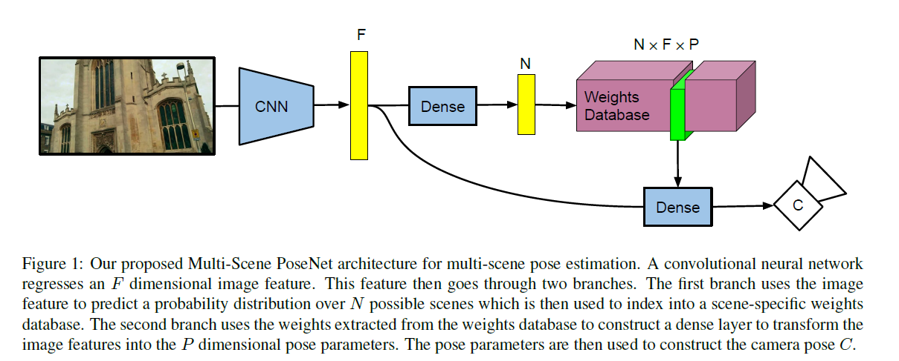
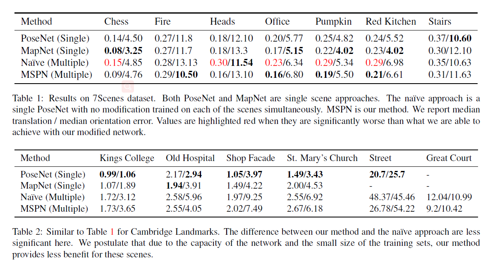
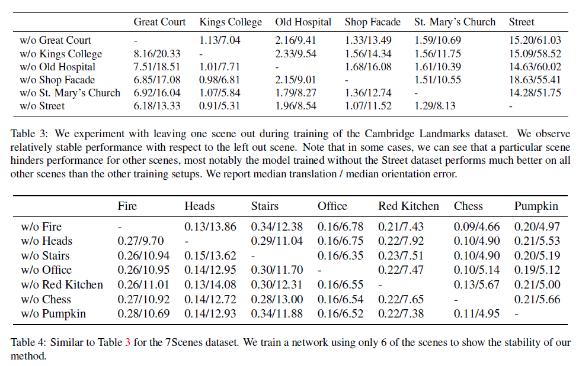
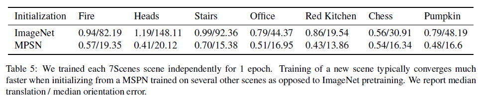
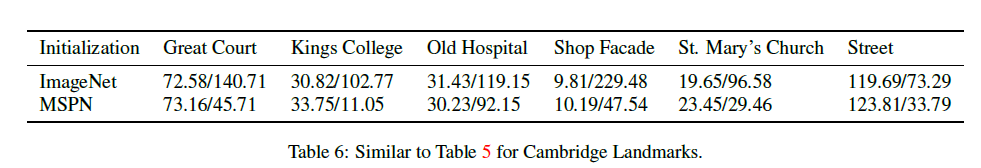
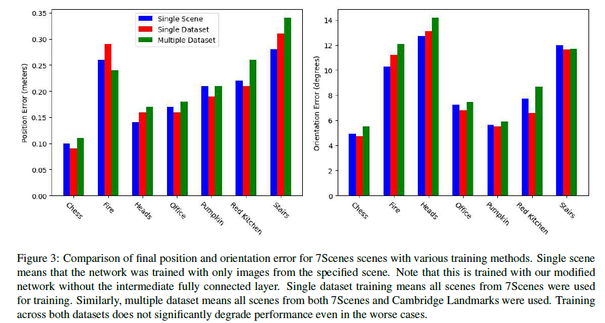
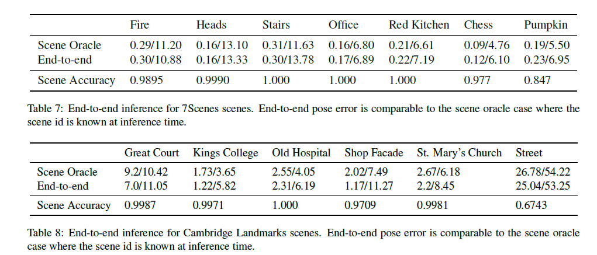

# \[CVPRW 2020] MultiScene PoseNet



### Abstract

位姿估计网络一般是对每个场景训练单独的模型。作者提出一种多场景posenet（MSPN），可以实现在任意多场景上的位姿估计，只需要一个模型，该模型只有少部分组件是和场景特定相关的。

### Introduction

作者提出了PoseNet的一种变型，即多场景PoseNet（MSPN）。主要的观点是让场景识别在网络结构中显式的体现出来。作者通过一种二阶段网络来实现这一点。第一部分网络在不同场景中共享，学习一种一般化的相机定位特征。这种特征被用于场景预测（用于检索和场景相关的权重）和最后利用被检索到的权重预测的位姿。因为每个场景在该模型中有一个独立的head，该方法可以看做一个多任务学习，其中每个场景是一个独立的任务。这使得模型可以通过一个公用的模型来在不同场景中进行定位。

### Multi-Scene Absolute Pose Regression

首先，作者利用一个CNN来提取F维特征，该特征被用于回归表示N个场景的N维概率。最可能的场景被用于在数据库中检索与场景相关的权重，得到一个$F \times P$的全连接层，其中P是位姿的维度。最后图像特征用挑选出来的全连接层映射到位姿。损失函数为：&#x20;

### Evaluation

