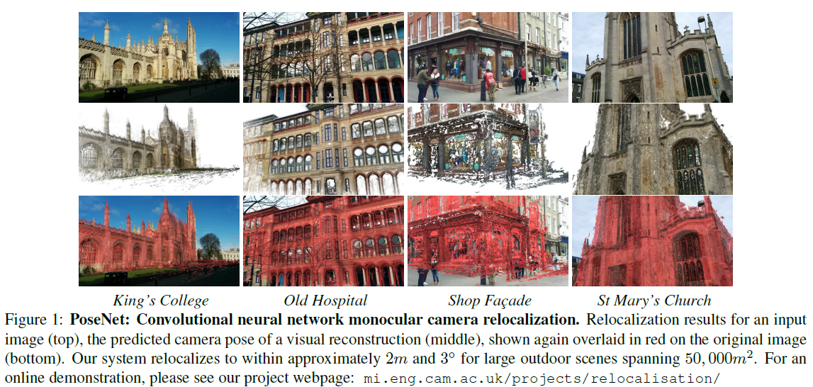
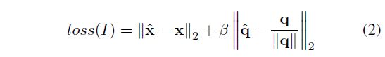
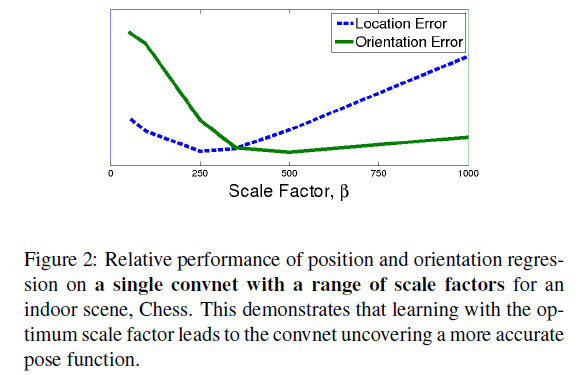
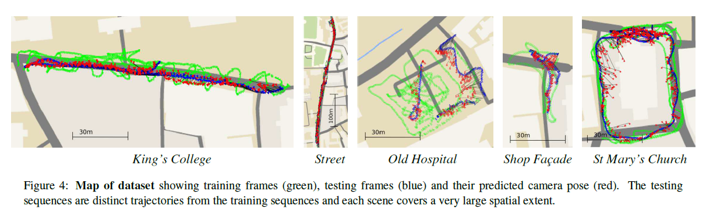
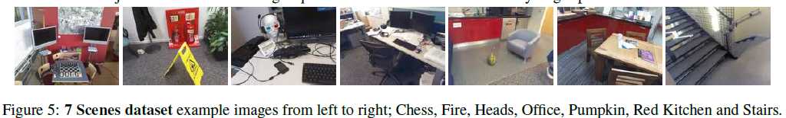
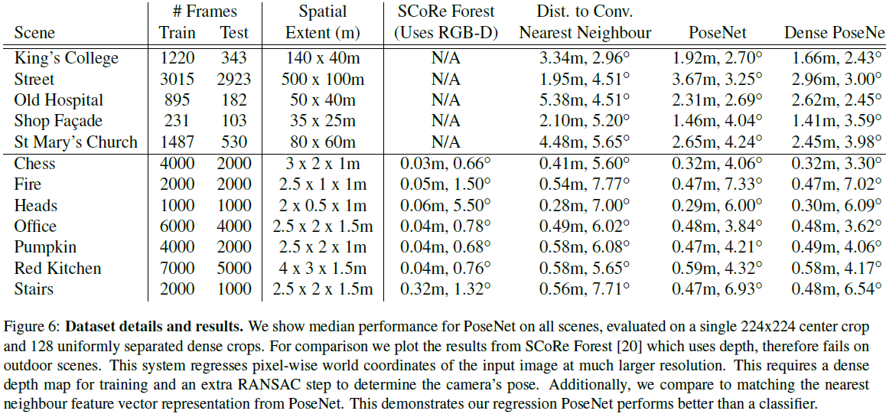
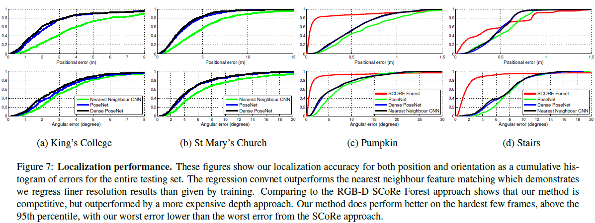

# \[ICCV 2015] PoseNet



### Abstract

作者在这篇论文中提出了一种鲁棒的、实时的单目6DOF重定位系统，该系统以end-to-end的方式训练了一个神经网络，来根据一幅RGB图像拟和6DOF相机位姿，无需额外的处理或图优化。该网络由23层卷积层构成，证明了卷积神经网络可以用来解决图像平面拟和问题。

### Introduction

这篇论文中作者提出了一个可以拟合相机位姿的神经网络。为了实现这一目的，作者先利用从识别到定位的迁移学习，然后利用SfM从场景视频中自动产生训练数据（相机位姿），这样可以避免人工的标注。本文的另一贡献在于理解卷积神经网络产生的图像表征。作者展示了网络可以学到易于映射到位姿、且可以由一些额外的训练样本推广到看不到的场景的特征向量。&#x20;

基于视觉的重定位在粗略的相机定位任务中已经有了不错的表现，但是它们局限在优先的、离散的场景中，使得位姿估计成为一个分散、独立的系统。本文提出了一种直接从外观估计连续位姿的方法，而且场景可能包含多个目标，并且不需要被连续观察到。

### Model for deep regression of camera pose

本文所设计的神经网络，输入是一张图像I，得到一个位姿向量p，包含相机的位置x和用四元数表示的朝向q：p=\[x,q]，位姿是相对一个任意的全局参考系确定的。

#### Simultaneously learning location and orientation

为了拟合位姿，作者使用如下损失函数：&#x20;

旋转的集合存在于四元数空间的单位球上。然而，欧氏距离损失函数无法使q保持在单位球上。作者发现，在训练过程中，q可以变得足够接近$$\hat{q}$$，以至于球面距离和欧式距离之间的区别变得不重要。为了简单且避免不必要的约束阻碍优化，我们选择忽略球面约束。&#x20;

我们发现，单独训练单个网络来回归位置和方向，与使用全6DOF姿态训练时相比，效果较差。如果只有位置或方向信息，卷积神经网络就不能有效地确定代表摄像机姿态的函数。我们也尝试将网络向下分支成两个独立的网络来回归位置和方向。然而，我们发现，由于相似的原因，它的有效性也较低。如果分开训练，那么位置和方向之间的相互影响的信息就会被忽略，进而影响训练。

#### Architecture

在实验中，作者使用了GoogLeNet作为基础来构建位姿回归网络。具体的调整如下：

1. 用affine regressors代替三个softmax分类器（GoogLeNet有两个辅助分类器）。softmax层被删除，每个全连接最后输出7维向量，表示3维的位置和4维的方向；
2. 在最后的输出层前插入一个2048维的全连接层，用以生成一个可以探索泛化能力的局部特征特征向量；
3. 在测试时，标准化四元数表示的方向向量，使其范数为1. 对于输入图像，先将最小边调整为256，然后crop为224x224，输入网络。网络在训练时采用random crops（不影响相机位姿）在测试时，分别对中心裁剪后的图像和128个等间隔裁剪的图像进行位姿估计，最后平均其计算结构，作为输出。&#x20;

为了训练和测试，我们尝试在裁剪之前将原始图像缩放到不同的大小。放大输入相当于在下采样到一边长度为256之前裁剪输入。这增加了输入像素的空间分辨率。我们发现，这并没有提高定位性能，这表明对于重定位来说，context和视野比分辨率更重要。

### Dataset

作者提出了一个室外街景重定位数据集\[Cambridge Landmarks]\(mi.eng.cam.ac.uk/projects/relocalisation/)，该数据集包含5个场景。&#x20;

作者使用了7 scenes数据集作为室内场景的测试集。

### Experiments

作者先和直接利用特征向量找训练集中最近邻的方法进行比较，说明神经网络可以更细致的回归位姿，具有超出训练集样本范围的泛化能力。&#x20;

还与RGB-D SCoRe Forest算法进行了比较。
