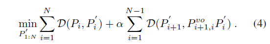
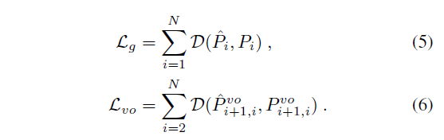
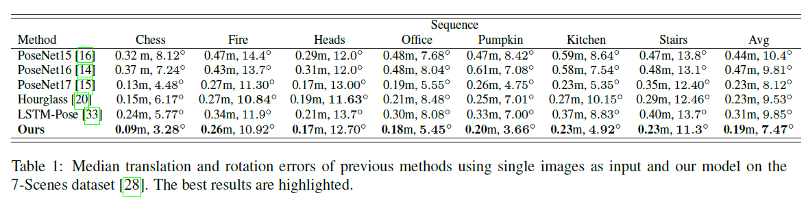

# \[ICCV 2019] Local Supports Global



## Abstract

作者在连续图像中探索时空一致性，与视觉里程计相结合来缓和视觉歧义。更确切的说，作者引入了两个有效的环节，即内容增强的位姿估计和基于运动的调整。内容增强环节通过VO建立的局部地图的共视关系来增强观察，进而缓解位姿估计的不确定性。基于运动的调整被定义为一个位姿图，其中相机位姿用VO提供的相对位姿来优化，作为一个额外的运动约束。因此，全局一致性得到了保证。

### Introduction

在这篇论文中，作者提出通过与深度VO相结合，从序列中学习相机重定位。VO子网络从连续图像中学习连续帧之间的相对位姿，保留序列中历史信息的隐藏状态被当做局部地图，模型使用两阶段策略来学习相机重定位。原始特征首先根据在全局位姿估计的局部地图中的共视性来增强，即内容增强模块；然后用VO的估计作为一个局部运动约束，来保证位姿图中所估计的全局相机位姿的一致性。&#x20;

网络整体结构如图1所示，编码层从图像中提取特征，VO将序列图像作为输入，用卷积LSTM计算相对位姿。根据soft attention用隐藏状态增强提取的特征，然后处于一个位姿估计器，来回归每个观察的相机位姿。最后，用全局位姿作为顶点，相对位姿作为边，构建位姿图，来保证预测结果的一致性。该模型在一个统一的模型中估计相机定位和VO预测，可以端到端训练。 文章的贡献点为：

1. 通过与VO相结合，利用序列中的局部信息来提升全局相机位姿估计；
2. 模型根据用局部地图的共视性增强过的特征来预测全局位姿；
3. 在训练和测试阶段，VO的结果可以作为额外的运动约束，来调整全局位姿。

### Method

#### Feature Extraction and VO Estimation

**Feature Extraction** 用ResNet34来提取图像特征，丢掉全局平均池化层和全连接层，得到3D特征图。因为相机定位和视觉里程计是两个很相关的任务，因此可以共享特征提取网络的参数。记第t帧的特征$$X_t$$，两个连续帧的原始特征在通道维度拼接起来，输入一组残差网络来获得用于VO任务的融合特征$$X^{vo}_t$$_。_&#x20;

**Visual Odometry Estimation** 用卷积LSTM来保留特征的空间关联。融合后的特征被输入循环单元中：&#x20;

其中$$H_{t-1},H_t$$表示t-1时刻和t时刻的隐藏状态。$$O_t$$为t时刻循环单元U的3D输出张量，它经过一个全局平均池化和三个全连接层（2048-3-3），得到6维的相对位姿$$P^{vo}_{t,t-1}$$.保留历史信息的隐藏状态被视为局部地图，以促进重新定位任务。

#### Content-augmented Pose Estimation

作者还利用序列中的多次观察来降低单张图像的歧义性。作者用VO构建的局部提取中的共视关系，来解决这一问题。&#x20;

**Content Augmentation** 这篇工作中，观察和局部地图都由特征来隐式表示。因此，特征空间的关联表示了局部地图和提取特征之间的共视关系。作者用一个soft attention机制来定义这种关联。在时间和空间两个维度都应用注意力机制。&#x20;

对于观察$$I_t$$，原始特征图为$$X_t$$，通过对时空领域所有隐藏状态加权，选择最相关的信息。由于$$X_t$$和$$H_i$$都是3D张量，参考GFS-VO，作者在$$X_t$$和$$H_i$$的向量化特征图的每个通道上计算余弦相似度：&#x20;

其中，$$A^T,A^S$$分别代表时间和空间关联。N是隐藏状态数量，C是隐藏状态通道数。$$X'_t \in \mathbb{R}^{H \times W \times C}$$是融合了共视信息的特征。soft attention可以用于发现共视的信息，保留局部特征中该帧之外的信息。更重要的是，可以与特征空间中整个图像序列隐式地交互，增大视野。&#x20;

**Global Pose Estimation**给定t时刻的增强特征，可以用于估计器估计对应的全局位姿。$$X'_t$$用两个3x3的卷积层来融合。然后特征输入到GAP层和3个全连接层（2048-3-3），将特征映射到全局位姿上。FC层保留了很多全局信息，该过程可以视为在某一视角的局部地图与场景全局特征间的registration。

#### Motion-based Refinement

VO可以提供相对位姿，但是会随着时间而产生漂移。而估计的全局不受漂移影响，但是会有不确定性。因此，这两个子任务可以一起训练。这篇论文中，作者加入了位姿图来保证预测的一致性。在图中，所有全局特征会被定义为节点，而相对位姿为边，如图4所示。&#x20;

**Joint Optimization in Training**在训练阶段，联合训练全局位姿和相对位姿：&#x20;

D是两个位姿间的距离。$$L_{joint}$$表示预测的全局位姿和局部位姿之间的一致性。&#x20;

**Pose Graph Optimization in Testing**在测试中，VO子网络可以在连续帧之间准确的恢复相对位姿。为了减少全局位姿的不确定性，作者采用标准的位姿图优化，固定边，优化节点，最小化误差：&#x20;

由于没有回环约束，所以用相对位姿来保证全局位姿的一致性，并且加入全局位姿的更新误差，来保证全局位姿不会偏离原预测值太多。

#### Loss Function

网络需要同时优化全局位姿和VO：&#x20;

函数D为：&#x20;

总的loss为：

### Experiments

