# \[ICCV 2021 ]Multi-scene Transformer







### Abstract

作者提出用transformer来学习多场景的绝对位姿估计，其中encoders被用于用自注意力机制聚合activation maps，decoders将隐层特征和场景编码变换到位姿。这一机制，可以让模型关注对于定位很有信息量的一般特征，并将多个场景并行编码。

### Introduction

大部分绝对位姿回归网络被用于估计一个场景下的位姿，即对于一个有N个场景的数据集，需要对每个场景训练、部署并选择模型。这篇论文中，作者将并行学习多个场景，来提升位姿估计网络的准确度。&#x20;

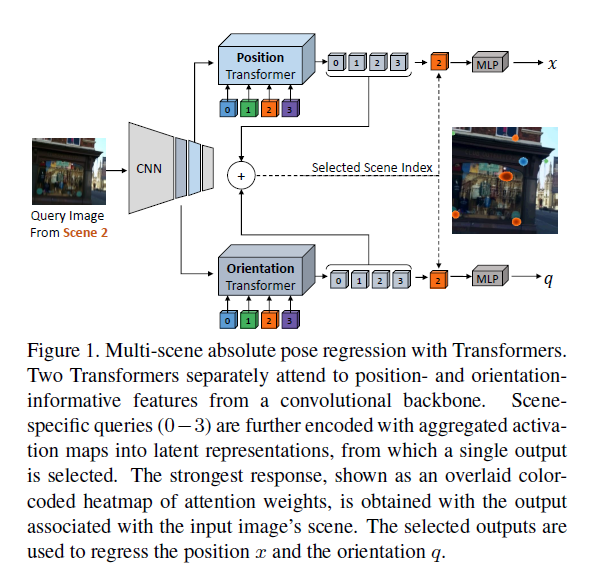

作者用transformer来估计多场景位姿，用encoders来关注和位姿有关的特征，用decoder来将编码的场景标识变换到位姿标识。位姿估计分为两个任务，位置估计和角度估计，与不同的视觉信息有关，作者使用了两个不同分辨率的共享参数的CNN backbone和两个不同的transformer，每个任务一个。decoder的输出被用于对场景分类，并选择对应的位置和角度估计。

### Multi-Scene Absolute Camera Pose Regression with Transformers

作者用独立的位置和旋转transformer encoder来自适应的聚合CNN backbone输出的中间层激活图。位置和旋转encoders关注不同的图像信息：位置信息集中在角点，旋转信息集中在拉长的边。&#x20;

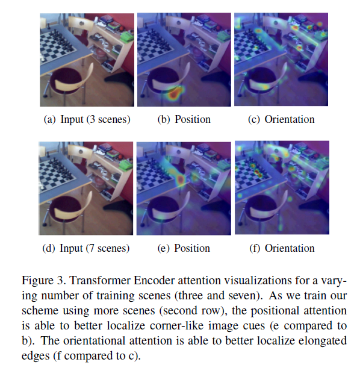

作者使用独立的位置和旋转transformer encoder，用$${\{x_i\}}^N_1$$和$${\{q_i\}}^N_1$$来分别检索，获得每个场景的位置和旋转embedding。相应的输出序列$${\{X_i\}}^N_i$$,$${\{Q_i\}}^N_1$$相应地编码了每个场景的定位参数。这一结构受DETR启发，即用不同的query来检索一个activation map，每个query与一个不同的任务相关。因此，encoder-decoder transfromer可以在一次学习多个场景，获得和定位相关的图像信息。为了回归位姿，将$${\{X_i\}}^N_i$$,$${\{Q_i\}}^N_1$$拼接并分类，然后检测到的场景的embedding $${X_i},{Q_i}$$用MLP回归到位姿上。&#x20;

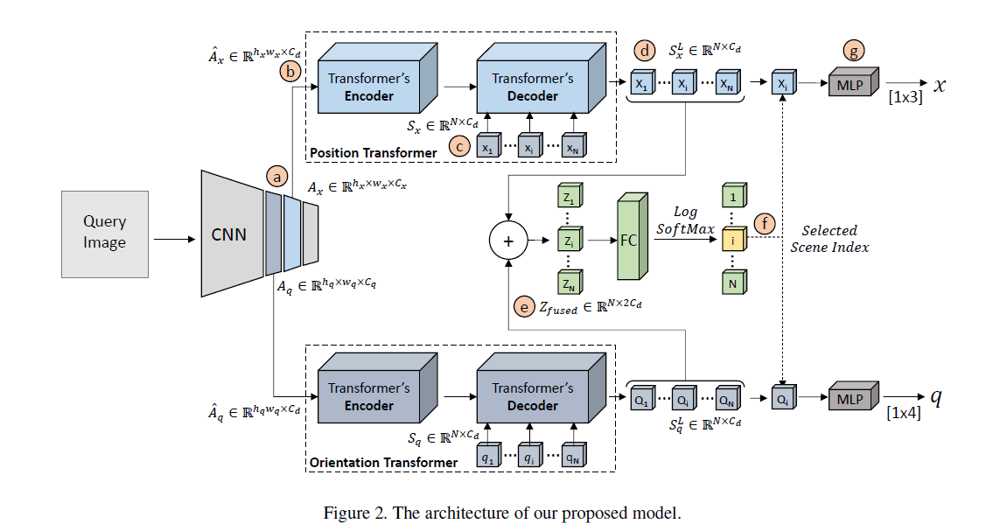

#### Network Architecture

模型的结构如图2所示。输入图像$$I\in \mathbb{R}^{H \times W \times C}$$，从CNN backbone的两层中分别提取一个activation map $$A_x,A_q$$，对应用于位置和旋转回归任务。用一个1x1卷积和展平过程将$$A\in \mathbb{R}^{H_a \times W_a \times C_a}$$变化为一个序列$$\hat{A} \in \mathbb{R}^{H_a \cdot W_a \times C_d}$$。activation map中的每个位置分配了一个可学习的位置编码，来保留空间信息。为了减少参数，分别对X，Y轴学习一个一维的编码。即对于activation map A，定义位置编码向量$$E_u \in \mathbb{R}^{W_a \times C_d/2}, E_v \in \mathbb{R}^{H_a \times C_d / 2}$$，这样，每个空间位置（i，j）用两个对应的编码向量拼接在一起表示：&#x20;

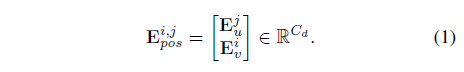

输入transformer的序列为：&#x20;

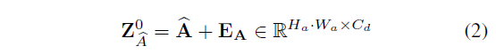

其中$$E_A$$是A的位置编码。作者用DETR的transformer结构，在每个注意力层中加入位置编码。tranformer encoder包含L个相同的层，每一层包括多头注意力层和多层感知器。每一层在每个模块前加入LayerNorm(LN)，并加入残差连接：&#x20;

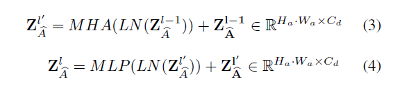

最后一层的输出经过一个额外的normalization：&#x20;

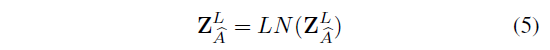

给定一个有N个场景的数据集，transformer encoder首先根据公式3对两个可学习的query序列$${\{x_i\}}^N_1,{\{q_i\}}^N_1$$使用自注意力机制。然后再根据公式3和4在encoder-decoder之间使用注意力机制。这个结构并行地对所有位置输出预测。transformer decoder输出序列$${\{X_i\}}^N_1,{\{Q_i\}}^N_1$$，对每个场景输出一个隐藏的embedding。给定query图像时，只有一个对应当前图像场景的embedding会被使用。为了选择合适的场景，将transformer的输出合并：&#x20;

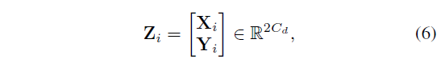

然后输入一个全连接层+log softmax。具有最大可能性的向量被挑选出来，$${\{X_i\}}^N_1,{\{Q_i\}}^N_1$$中对应的输出也被挑选出来，输入一个MLP，得到回归的位姿向量。

#### Multi-Scene Camera Pose Loss

位姿回归的损失函数为：&#x20;

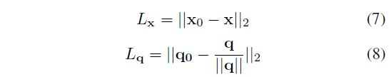

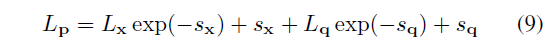

然后作者还加入了Negative Log Likelihood损失来训练场景分类：&#x20;

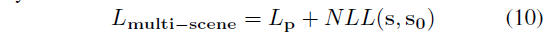

### Experiments

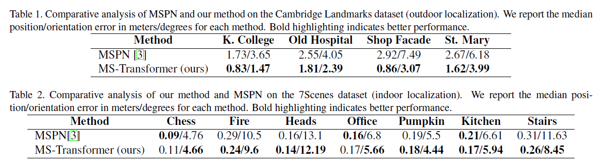

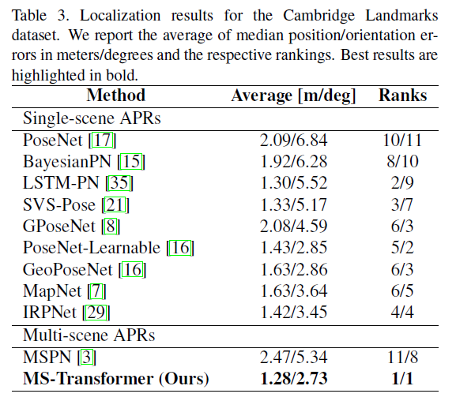

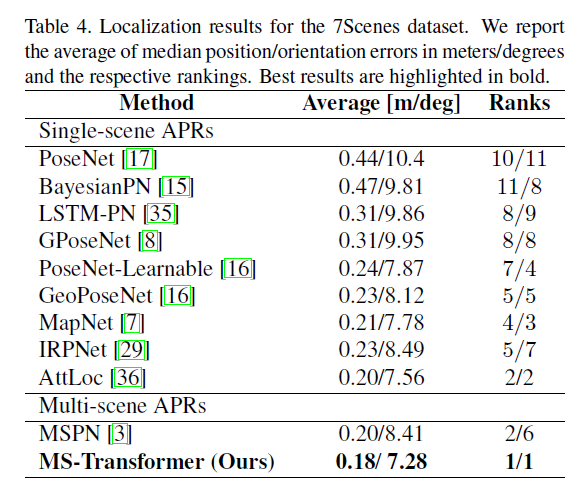

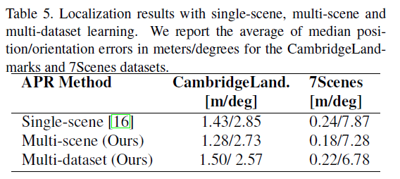
