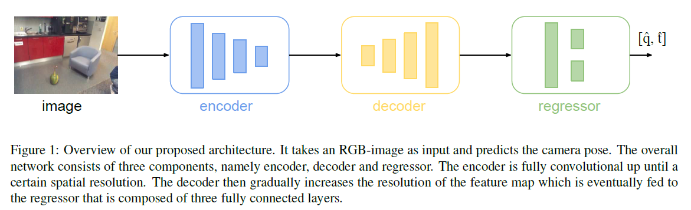
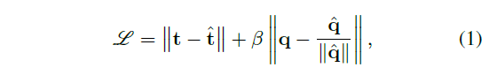
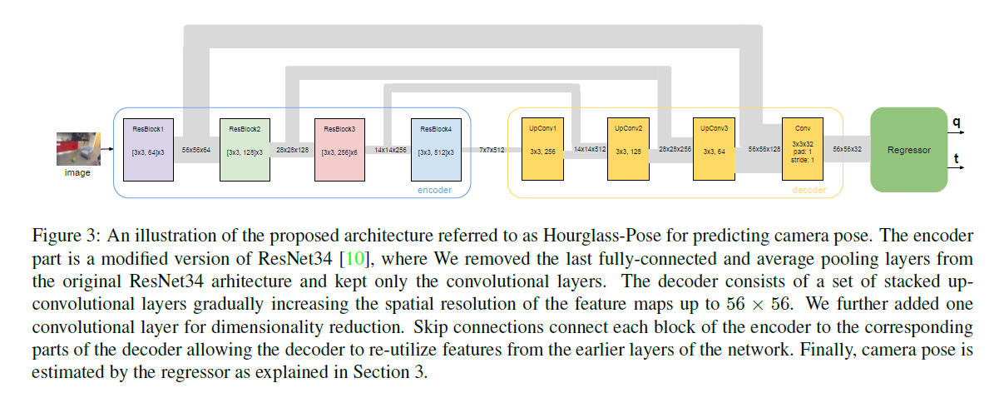
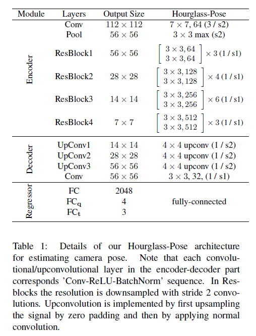
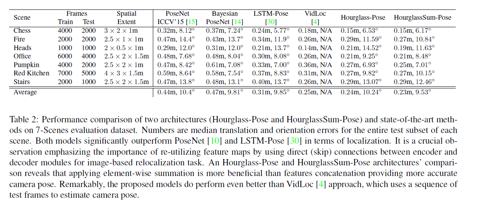
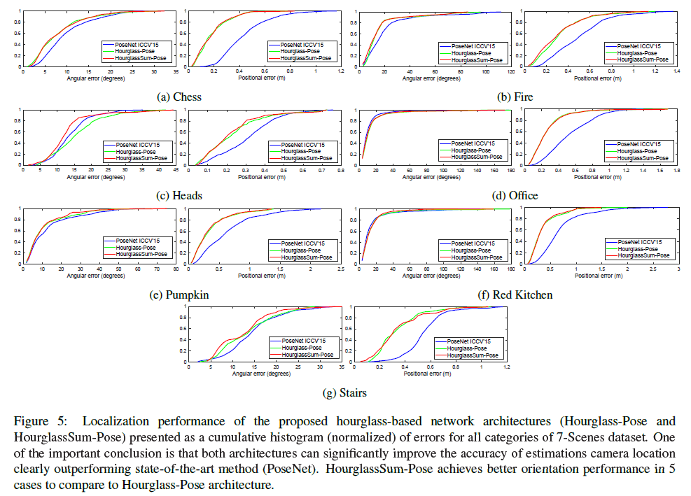
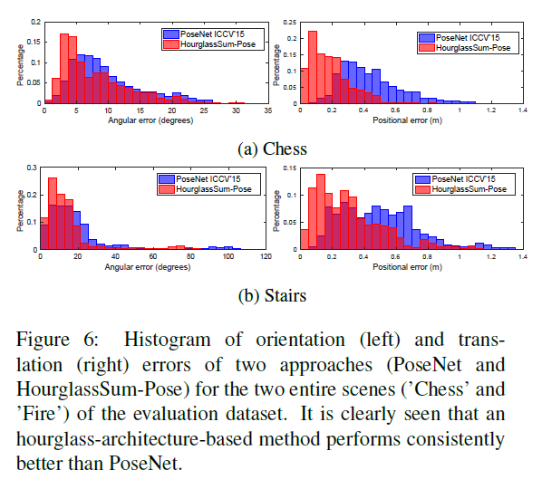

# \[ICCVW 2017] HourglassNet



### Abstract

这篇论文提出一个根据单张RGB图像预测相机位姿的网络，网络为沙漏型，由一系列卷积和上卷积层和一个回归层组成。上卷积层用于保留图像的细节信息。

### Introduction

受到视觉领域其他任务的启发，作者在通过RGB图像预测相机位姿的回归任务中，加入了更多上下文信息（细节信息），来采集图像中更全面的信息。该网络结构包含一个编码层，将所有信息编码压缩，和一个解码层，通过上卷积处理将编码层的特征图逐渐恢复到原图分辨率上。这样一个对称的编码层-解码层结构，称为沙漏型网络结构。本文的贡献在于：在CNN中加入了一系列上卷积层和shortcut连接，并将其用于相机定位任务中。

### Method

网络的输入是RGB图像，网络的输出是七维的向量p=\[q,t]，包含旋转四元数$$q=[q_1,q_2,q_3,q_4]$$和平移向量$$t=[t_1,t_2,t_3]$$。&#x20;

网络结构的简图如图1所示，网络包括编码层、解码层和回归层。编码层是一个全卷积结构，用于提取特征。解码层包含多层上卷积层，来恢复细节信息。之后，用回归层来预测相机位姿。

&#x20;损失函数为：&#x20;

#### CNN Architecture

作者使用了ResNet34作为basenet，去掉最后的全连接层，去掉最后的softmax和average pooling层，作为网络的编码层。编码层的输出是分辨率为7x7的特征图。在编码层后，作者加入了三个上卷积层和一个卷积层，来保留必要的细节信息。最后接一个有三层全连接层的回归层。为了更好的保留细节信息，作者在编码层的四个残差模块和解码层对应的上卷积层与最后的卷积层之间加入了跳步连接。解码层的最后一个卷积层，不改变特征图的大小，只是用于减少通道数。网络详细结构如表1所示。

#### Evaluation Dataset

7-Scenes数据集。

### Experiments

