# \[ICCVW 2019] How to improve



### Abstract

作者研究了PoseNet，根据数据集的特性来改进模型，提升位姿估计效果。特别地，作者发现了图像视野比图像分辨率更重要；提出了一种减轻过拟合现象的数据增强方法；并研究了LSTM对位姿估计任务的效果。

### Background

结构：&#x20;

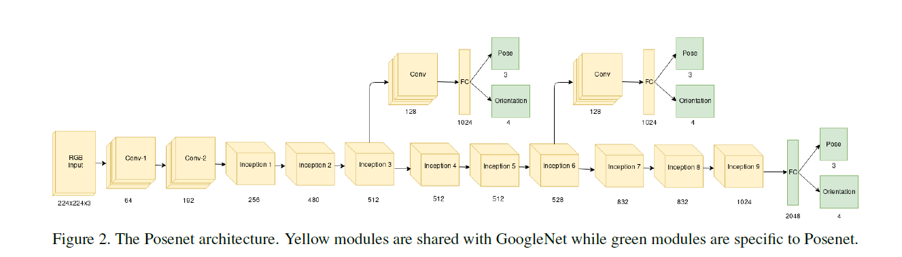

posenet损失函数&#x20;

加入不确定性的posenet损失函数：&#x20;

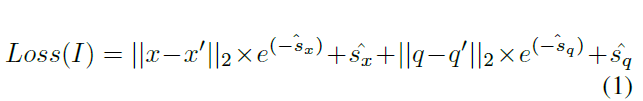

用Adam优化器训练，参数设置：lr=0.0001, $${\beta}_1=0.9,{\beta}_2=0.999,{\varepsilon}=1e-8$$ 用Cambridge Landmarks和7 Scenes数据集训练和测试。Cambridge是离散的图像，丢失了temporal信息，所以定位更类似于place recognition；而7 Scenes数据集是连续的图像，可以实现序列化图像的定位。

### Method and Experiments

#### Increased Field-of-View

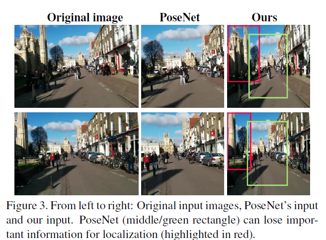

PoseNet是将输入的图像最小边缩放到256，然后中心裁剪或随机裁剪224x224大小的图像输入网络，这样可以会丢失一些重要的信息。所以作者为了利用完整的视野，将图像直接缩放到224x224，虽然这样做会破坏图像的纵横比，但是作者认为在整个图像序列中这种变化是一致的，所以不会影响网络的表现。作者认为由于网络中的pooling层会平滑掉高分辨率图像中的高频信息，所以视野比图像分辨率更重要。从结果上看，用完整的视野提升了网络的表现，尤其是在室外大场景中。&#x20;

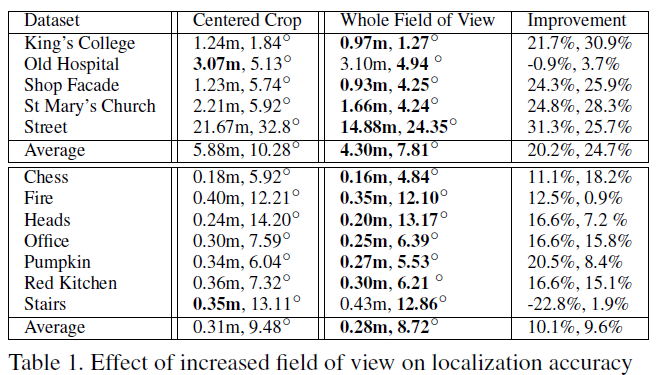

#### Data Augmentation

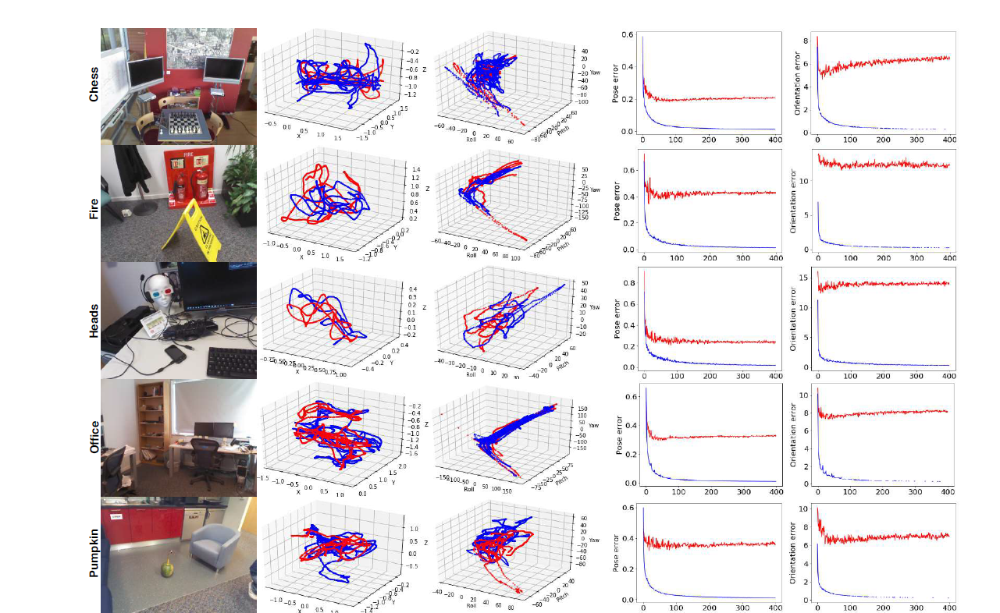

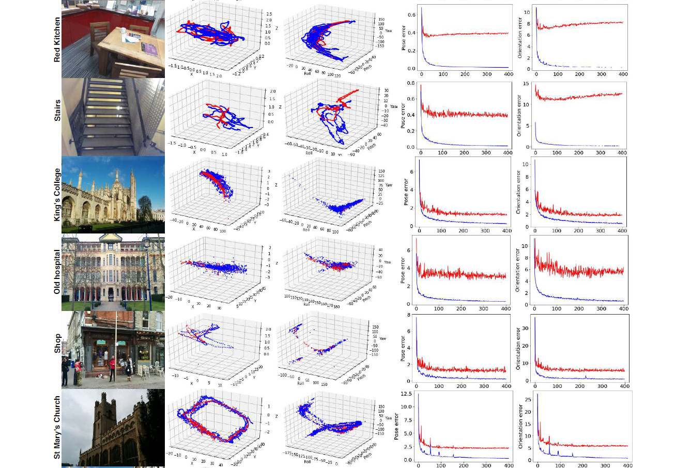

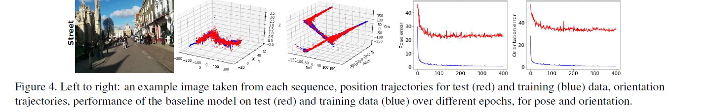

可以看到，模型的过拟合严重。作者将每幅图像随机旋转\[-20,20]度，进行数据增强，并相应的改变真值中的四元数，扩充数据集。可以看到，这样的数据增强方法在室内场景很有效，但是在室外可能会起到负面效果。&#x20;

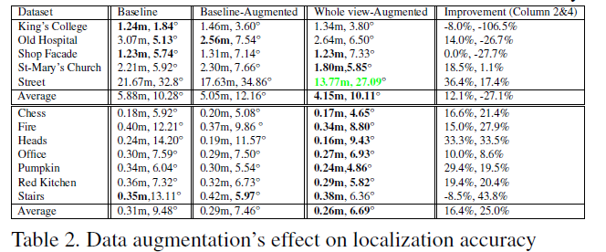

#### LSTM Experiments

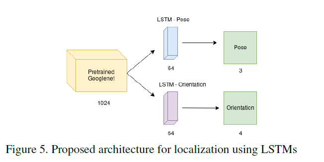

作者用两个并行的LSTM单元代替了全连接层，来回归位姿和旋转。并输入不同长度的图像序列来测试LSTM的效果增益。可以看到，LSTM单元相比原本的baseline有所提升，并且提升效果并不是随着图像序列长度而递增的，这可能与室内场景中连续图像间特征非常相似、室外场景中图像连续性被破坏有关。&#x20;

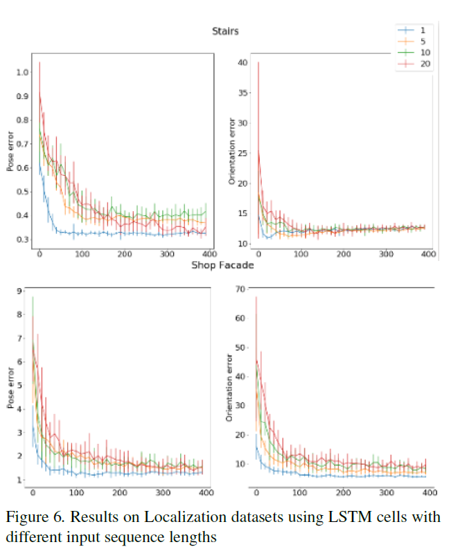

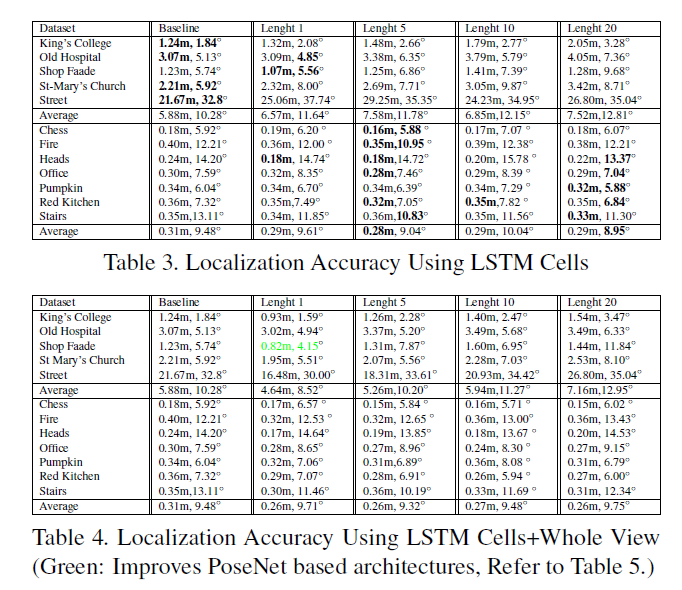

#### Putting it All Together

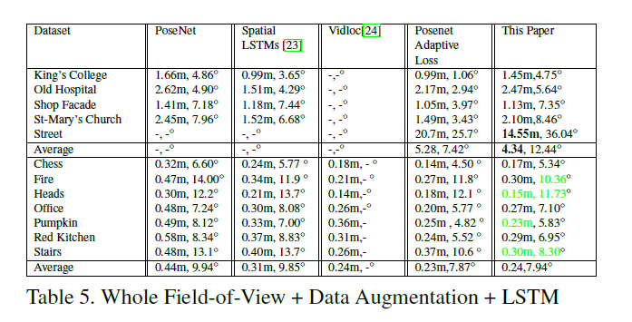
