# \[ICRA 2016] Bayesian PoseNet





### Abstract

作者使用一个贝叶斯卷积神经网络，以单张RGB图像作为输入，拟合6DOF位姿。基于贝叶斯卷积神经网络，作者可以估计模型的定位不确定性，并提升定位的效果。作者使用这一不确定性度量来估计重定位误差，并检测输入图像中场景的存在或缺失。作者证明了模型的不确定性主要是由测试图像与训练集图像的位姿和外观不相似造成的。

### Introduction

> In PoseNet, we introduced a new framework for localization, PoseNet, which overcomes many limitations of these current systems. It removes the need for separate mechanisms for appearance based relocalization and metric pose estimation. Furthermore it does not need to store key frames, or establish frame to frame correspondence. It does this by mapping monocular images to a high dimensional space which is linear in pose and robust to annoyance variables. We can then regress the full 6-DOF camera pose from this representation. This allows us to regress camera pose from the image directly, without the need of tracking or landmark matching.&#x20;

作为PoseNet的延伸，本文的主要贡献在于提出一个贝叶斯模型，来估计定位的不确定性。贝叶斯卷积神经网络不需要额外的内存，并能够提升PoseNet的表现。除此之外，作者还提出一个模型不确定性的度量方法，来定量提升系统表现。作者利用这种不确定性去估计：1.位置和朝向的定位误差；2.数据建模的可信度（检测场景是否存在于图像中）。一个非贝叶斯系统只能预测结果，但是无法判断这个结果是模型可靠推理得到的还是随机猜测的。通过度量不确定性，我们可以知道预测结果的可信度。

### Modelling Localization Uncertainty

有学者指出了dropout和高斯过程中的近似推理之间的理论联系。作者用dropout进行采样，来从模型的后验分布中获得样本。他们将这种近似模型与伯努利分布的贝叶斯卷积神经网络的变分推理联系起来。作者用这种方法来获得位姿回归模型的概率推理，定义为Bayesian PoseNet。&#x20;

首先，作者得到给定训练数据X和训练标签Y时的卷积权重的后验分布W，$$p(W|X,Y)$$。一般而言，这种后验分布是不易处理的，需要有一些基于学习的方法来估计这些权重的分布。本文中，作者利用变分推理（variantional inference）来近似它。这种技术通过最小化近似分布和全后验之间的Kullback-Leibler（KL）散度$$KL(q(W)||p(W|X,Y))$$，来学习模型权重的分布，$$q(W)$$.其中，每一层i的近似变分分布$$q(W_i)$$被定义为：&#x20;

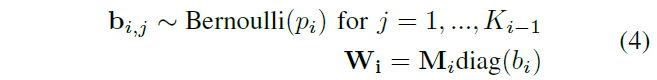

其中$$b_i$$为伯努利分布随机变量的向量，$$M_i$$是高斯过程近似模型的变分参数。dropout概率$$p_i$$可以被优化，但是作者直接将其定义为$$p_i=0.5$$。&#x20;

作者指出，最小化位姿回归网络的欧式回归损失具有最小化KL散度的效果。作者用SGD优化网络，来避免过拟合。者用dropout来描述贝叶斯卷积神经网络，在每层卷积层后加入dropout层，但是在实际应用中不可行。因此，作者使用caffe标准库，实现了伯努利贝叶斯卷积神经网络。在测试时，作者对dropout网络中的随机样本平均化实现推理。&#x20;

最后，整体的概率posenet的算法伪代码如下：&#x20;

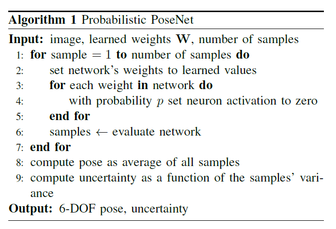

作者还探讨了在输入图像上使用卷积位姿回归器的密集滑动窗口进行位姿估计，评估结果来获得位姿分布的可能性，这可以通过对455x256大小的输入图像按等间隔裁剪224x224大小的区域来完成的。这样获得的姿态样本的方差也与定位误差相关，但不如从伯努利分布中对权值的采样那么强烈。&#x20;

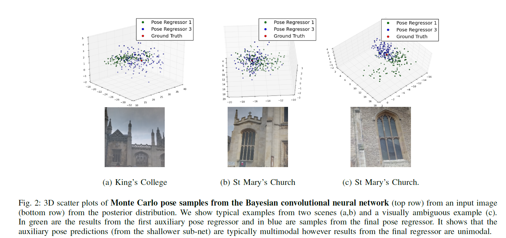

#### Estimating Uncertainty

作者用蒙塔卡罗采样算法估计贝叶斯卷积神经网络的后验位姿分布。图2用蓝色展示了一些后验网络的输出的蒙塔卡罗样本。此外，作者用绿色展示了GoogLeNet的辅助位姿回归器的输出，这个结果是从更浅层网络输出的，并且可以展示网络在更深层学到了什么。对于位姿旋转分量的四元数样本也可以观察到类似的结果。 可以看到：

1. 总输出（蓝色）的分布趋向于各向同性和单模态高斯分布。模型对特定位姿比较确定。通过对模型的分布用dropout进行采样，可以观察到一个位姿估计周围的各项同性散射；
2. 更浅层的输出偏向于多模态。这种现象在视觉上模糊不清的图像之间会出现。使用dropout对较浅模型的分布进行采样，产生的分布具有来自多个姿态假设的分量。这说明较深的模型可以学到区分视觉模糊图像的能力。 因此，作者用从模型的最终位姿回归器输出的样本拟合一个单峰高斯。将这些样本的均值作为位姿的估计值。用单峰高斯的协方差矩阵的迹作为不确定性估计。迹是不确定度的有效测度。迹是特征值的和，对旋转有不变形，可以有效地表示高斯中包含的不确定性。 作者还试了用行列式，即特征值的乘积，来表示不确定性，但是发现效果不理想。 作者也试了其他模型，比如：
3. 用几何中值代替平均值作为位姿估计；
4. 用Dirichlet process来拟合混合的高斯模型；
5. 用k-means对所有样本聚类，取最大簇的均值。 但是，这些方法的表现都不太好，不如拟合单个单峰高斯模型。

#### Creating a Comparable Uncertainty Statistic

为了比较从模型中获得的不确定性，作者用如下方法来构建归一化的度量，或Z分数。这样可以直接在不同算法之间进行不确定性比较。&#x20;

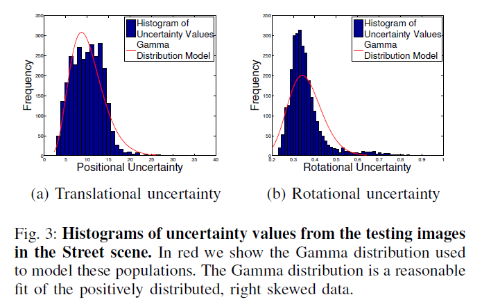

为此，作者首先评估了测试数据集，记录所有预测的相机位姿和不确定性。如图3所示，因此作者使用严格正分布的、右偏态的gamma分布进行拟合，该分布只需要两个参数进行表示。 从场景的测试集图像中获得模型不确定性的分布可以帮助我们评估一张新图像的不确定性位于整体分布的哪个位置。可以通过使用Gamma分布的累积分布函数为平移和旋转不确定性值分配一个百分比权重。将这个权重视为Z分数，并据此对每个场景中平移和旋转的不确定性分布计算Z分数。&#x20;

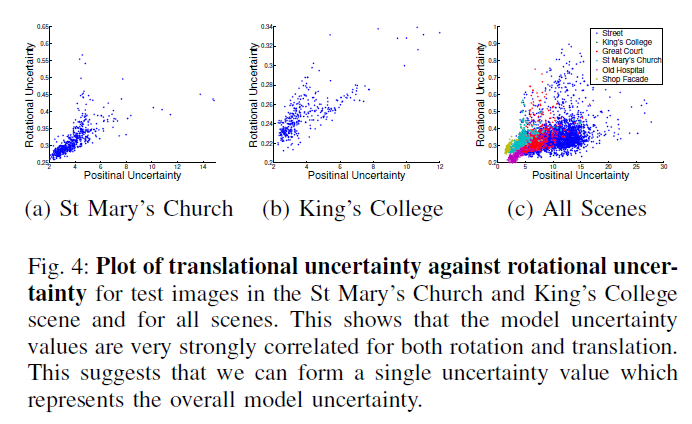

图4说明了平移和旋转的不确定性是高度相关的，因此可以直接对旋转和平移的不确定度求平均，得到整体的定位不确定性，这可以作为最后模型位姿估计的可信度分数。

#### Architecture

为了获得一个贝叶斯模型，应当在每层卷积层后加入dropout采样。但是，在实践中，作者发现这样做不是最优的。在PoseNet中，作者发现用Places预训练过的模型会增强定位效果，但是这些模型是在不加dropout的情况下训练的。而在Places上预训练加入dropout的模型，作者发现过多的dropout是一个过强的正则项，模型效果下降严重。作者发现只有在具有随机初始化的权重前加入dropout，才能获得最有表现。因此，作者在网络的inception layer 9和全连接层后加入了dropout。&#x20;

根据此结构，作者在测试时可以对概率模型进行采样获得位姿估计。然后对蒙塔卡罗dropout样本求平均来改善定位表现。图5说明40个样本就足够了。&#x20;

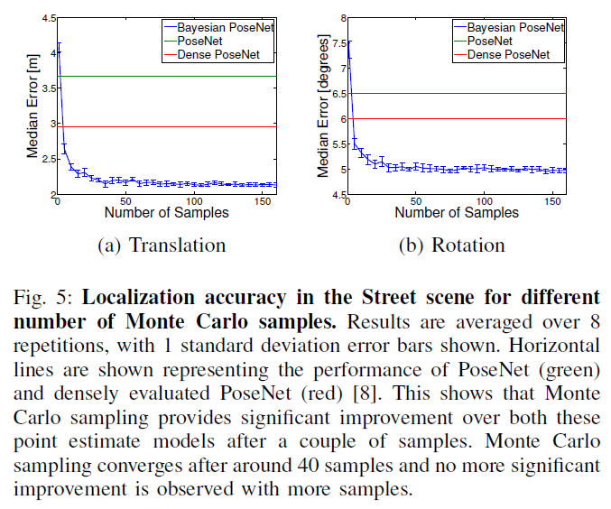

### Results

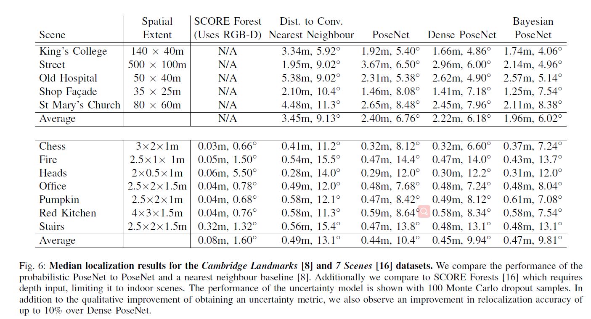

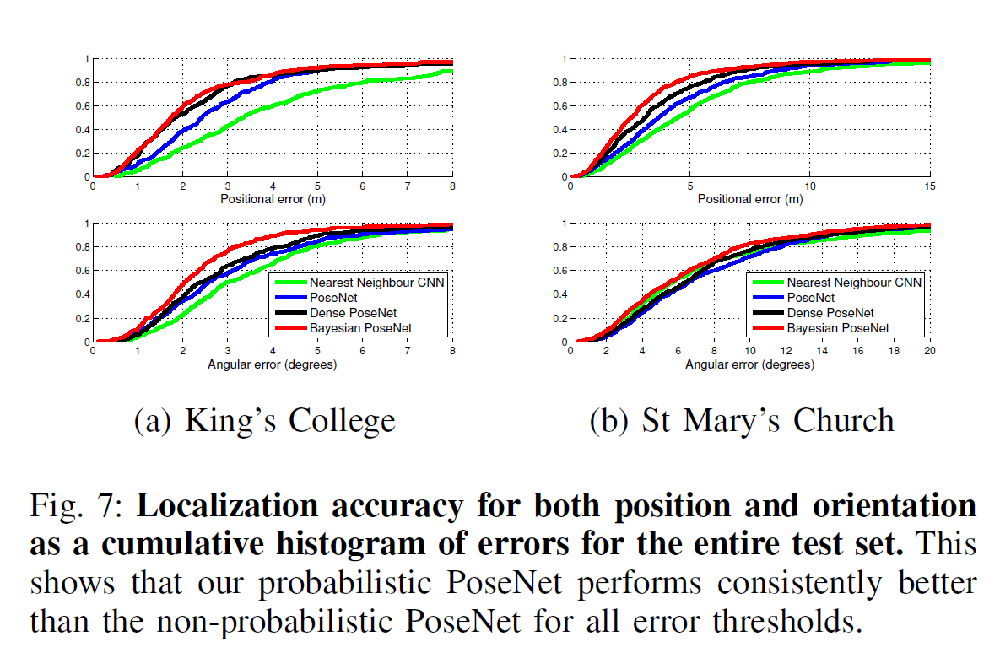

相比PoseNet有了很大提升，这里用了100个蒙塔卡罗样本。

#### Uncertainty as Estimate of Error

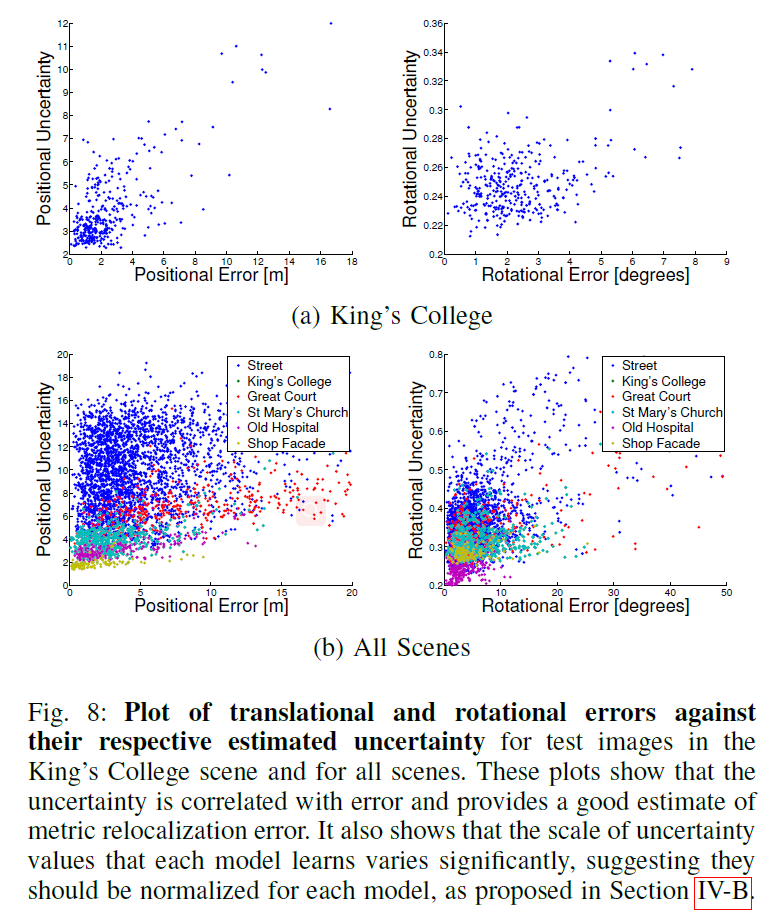

可以看到，不确定性和定位误差相关性很大。说明可以用不确定性来估计定位误差。

#### Uncertainty as a Landmark Detector

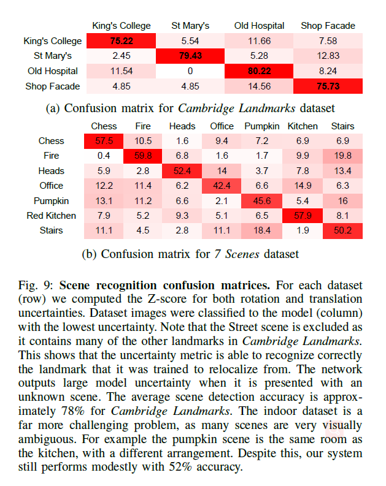

可以看到，不确定性还可以用于判断图像是否来自于模型的训练集，说明不确定性还显示了是否训练过的landmark存在于当前图像中。

#### What Makes the Model Uncertain about a Pose?

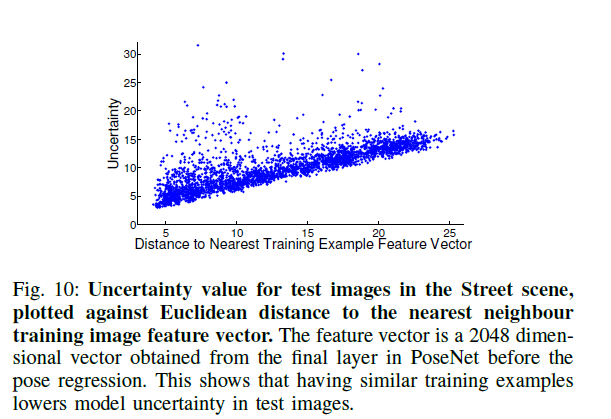

用PoseNet输出的2048维特征向量求测试图像与特征空间中最相似的训练图像之间的相似度，可以看到不确定性较大的图像，更难以被定位。&#x20;

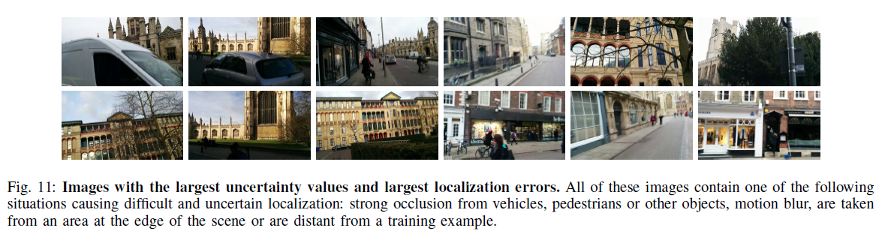

#### System Efficiency

> For example, on an NVIDIA Titan X, computing pose by averaging 40 Monte Carlo dropout samples takes 5:4ms while 128 samples takes 6ms. For comparison, a single PoseNet evaluation takes 5ms per image.
