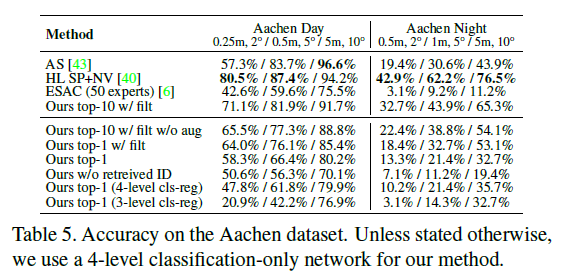

# \[CVPR 2020] HSCNet





### Abstract

作者提出了一种层次化场景坐标回归网络，通过单张RGB图像预测像素的场景坐标。网络包含一系列输出层，每一层都受前一层的约束。最后的输出层预测3D坐标，其他渐进的优化离散的位置标签。所提出的方法比只回归的网络效果要好。

### Introduction

作者对每个像素周围的离散位置标签施加约束，来克服小感受野带来的歧义。在训练时，标签通过对真值3D坐标进行粗略的量化来获得。在测试时，每个像素的位置标签用稠密的分类网络来获得，这可以更容易处理位置歧义，因为他们是用交叉熵分类损失训练的，可以实现3D空间中的多模态预测。模型使用多个分类层，来渐进的优化位置标签，通过对真值3D点云数据层次化聚类获得。作者提出的层次化由粗到精结构是用与FiLM相关的conditioning层实现的，构成了一个紧凑的结构。&#x20;

论文的贡献有：

1. 引入一种层次化由粗到精conditioning结构，来预测场景坐标，在regression-only网络的基础上提升了表现和可拓展性；
2. 算法获得了最好的表现，并且可以训练一个能够鲁棒地扩展到大场景中的模型；
3. 对于大规模室外定位，作者基于所提出的网络提出了一种混合方法，显著缩减与基于特征的方法之间的差距。

### Hierarchical Scene Coordinate Prediction

#### Hierarchical joint learning framework

为了定义层次化离散的位置标签，我们层次化地将真值3D点云数据划分。这一步可以通过k-means来实现。除了真值3D场景坐标，训练图像中的每个像素在聚类的不同层次上由粗到精地与一些标签相关联。然后，对于每一层，网络由一个对应的分类层，来预测所有像素在这一层中的位置标签。除了分类层，还加入了一个回归层，来预测像素的连续3D场景坐标，生成假定的2D-3D匹配。为了将粗糙的位置信息传递给更精细层的预测，作者在每个分类/回归层前引入一种conditioning层。注意，在训练阶段，用真值标签map作为条件；在测试阶段，用预测的标签map作为条件。&#x20;

由于每个分类层中的预测取决于所有之前的标签map，因此在每个特定的分类层中，预测该层上的标签分支就足够了（意思是不是直接预测在全局的绝对场景坐标，而是根据上一层的预测，预测在当前层相对上一层预测聚类中心的相对位置，类似于树型结构）。这样可以加快网络训练的收敛，这种网络结构还可以只进行分类，即如果在回归层之前，模型获得了足够精细的位置标签，那么可以直接用聚类中心来作为场景坐标预测，而不需要使用最后的回归层。&#x20;

这种网络是全局到局部的，代表着最后的输出层在图像上的感受野较小。这使得网络在较为粗糙的层上使用更多全局信息，同时根据位置标签，在更精细层上消除局部外观的歧义。注意，在测试时，最后输出层的感受野有很大，因为它们依赖于从输入图像预测的离散位置标签，而不是训练时的固定真值。&#x20;

#### Conditioning layers

为了利用在粗糙层预测的离散位置标签信息，这些预测被输入到更精细的层中。受到Feature-wise Linear Modulation（FiLM）conditioning method的启发，作者在每个输出层前引入了conditioning layer。conditioning parameter generator以预测的标签图l为输入，输出一组缩放和平移参数$$\gamma(l), \beta(l)$$，并且将这些参数输入conditioning layer来对输入特征图进行线性变换。与FiLM对整个特征图进行相同的channel-wise调制不同，作者使用的conditioning layer对于每个空间位置进行线性调制，即element-wise乘法和加法，如图2右所示。因此，输出的参数$$\gamma(l), \beta(l)$$不再是向量，而是与输入特征图相同大小的特征图。给定输入特征图x，缩放和平移参数$$\gamma(l), \beta(l)$$，线性调制可以写作：&#x20;

其中$$\bigodot$$为Hadamard乘积。&#x20;

另外，generator只包括一个1x1卷积层，来让每个像素以它自己的位置标签为条件。在特征调制后使用ELU非线性函数。

#### Network architecture

作者使用3级层次结构，即网络有两个分类输出层，和一个回归层。整体网络结构如图2左所示。第一个分类分支预测粗糙的位置标签，第二个预测精细的标签。在两个分类分支中利用strided convolution，upconvolution和dilated convolution来增大感受野的大小，并且保留输出的分辨率。conditioning layer后的所有层核大小都为1x1，来局部使用的label conditioning。

#### Loss function

该网络同时预测位置标签和回归场景坐标。对于回归任务，最小化预测的场景坐标和真值场景坐标之间的欧拉距离：&#x20;

对于分类任务，在每一层中使用交叉熵：&#x20;

其中，$$l^j_i$$为第j层像素i的独热真值编码，$$\hat{l^j_i}$$表示预测的标签概率向量。对每个元素取对数。最后的损失函数为：&#x20;

作者发现，最终回归预测的准确性对定位性能至关重要，因此回归损失应设置一个较大的权重。

### Experimental Evaluation

真值场景坐标可以从已知的姿态和深度地图中获得，也可以使用3D模型渲染。为了生成真值位置标签，作者在密集的点云模型上使用层次化的k-means聚类。对于实验中使用的每个单独场景，除非另有说明，作者使用两级分层k-means，并将两个级别的分支数设置为25。在三个组合场景，i7-场景，i12-scene和i19-Scenes，在第一层简单地组合了标签树。也就是说，对于i7场景，第一层有175个分支。 回归层、第二个分类层和第一个分类层的感受野大小分别为73x73, 185x185, 409x409. 在位姿估计任务中，用PnP-RANSAC算法。因为这个网络相当于给出了2D-3D的匹配，可以直接与PnP-RANSAC结合，估计位姿。

Ours w/o aug:不加数据增强；Ours capacity-：缩小backbone回归网络的大小，加入更多的conditioning层；Ours w/o cond：不加conditioning层；Ours rf+：每层的感受野增大（409x409）；Ours rf-：每层的感受野减小（73x73）；Reg-only capacity+：增加regression-only网络的通道数，即参数量。&#x20;

将场景回归任务定义为一个由粗到细的联合分类任务，可以在一定程度上打破原始回归问题的复杂性，即使没有本文提出的conditioning机制。为了证明这一点，作者去掉了所有conditioning generator和conditioning层，因此，在更精细的层中没有粗糙位置信息的输入。作者还保留了由粗到精的连续学习策略，用估计的位置标签来决定k-means聚类，即预测的局部回归坐标。与传统的regression-only网络不同，该方法通过预测相对聚类中心的偏移来局部回归位姿。&#x20;

在aachen数据集上，作者提出了一种混合方法。作者对稀疏的局部特征进行排序，在训练和测试阶段，网络以稀疏的特征作为输入，而非一个稠密的RGB图像。除了位置标签，每个输出层还取决于一个图像ID。在训练阶段，这个ID是训练图像的ID，在测试阶段，是检索图像的ID.作者用SuperPoint作为局部特征，用NetVLAD作为全局图像检索。&#x20;

网络详细结构&#x20;

