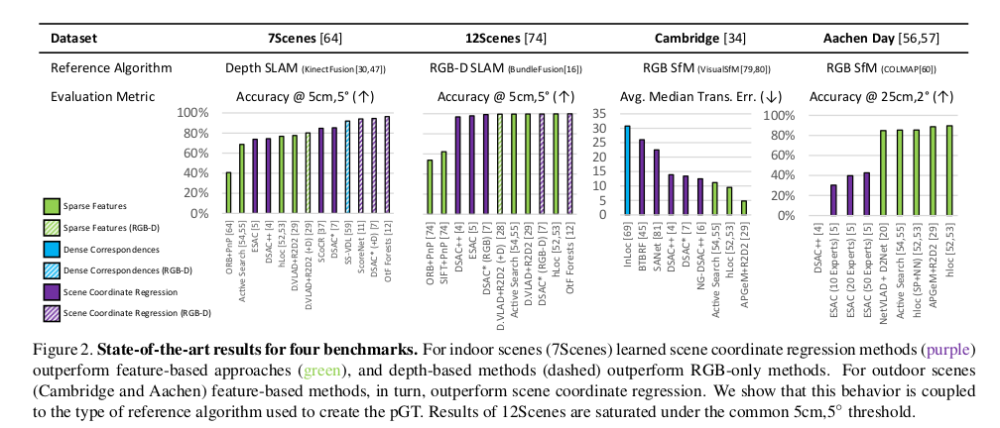
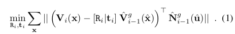
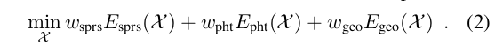
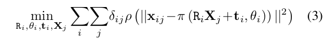

# \[ICCV 2021] pGT in VisLoc





## Abstract

Benchmark datasets that measure camera pose accuracy have driven progress in visual re-localisation research. To obtain poses for thousands of images, it is common to use a reference algorithm to generate pseudo ground truth. Popular choices include Structure-from-Motion (SfM) and Simultaneous-Localisation-and-Mapping (SLAM) using additional sensors like depth cameras if available. Re-localisation benchmarks thus measure how well each method replicates the results of the reference algorithm. This begs the question whether the choice of the reference algorithm favours a certain family of re-localisation methods. This paper analyzes two widely used re-localisation datasets and shows that evaluation outcomes indeed vary with the choice of the reference algorithm. We thus question common beliefs in the re-localisation literature, namely that learning-based scene coordinate regression outperforms classical feature-based methods, and that RGB-D based methods outperform RGB-based methods. We argue that any claims on ranking re-localisation methods should take the type of the reference algorithm, and the similarity of the methods to the reference algorithm, into account.

## Introduction

benchmark数据集提供了训练集和测试机图像及其位姿。训练集图像用于构建场景的表达，测试集图像需要根据场景表达来估计图像的6DoF位姿。​benchmark数据集一般通过SfM或RGB-D SLAM（称为reference算法）来估计图像的位姿。因此，benchmark其实是在测试重定位算法是否能够复现reference算法的结果。作者希望研究是否reference算法的选择会影响benchmark上各算法的排名。为此，作者比较了两类reference算法：基于深度的SLAM算法和SfM算法。实验结果说明reference算法的选择会对评测算法的排名产生巨大影响。所以算法的评估需要考虑特定算法是否与reference算法相似，更相似的算法更容易复现reference算法的伪真值。

.png>)

本文的贡献如下：

1. we show that the choice of a reference algorithm for obtaining pGT poses can have a significant impact on the relative ranking of methods, to the extend that the rankings of methods can be (nearly) completely reversed. This implies that published results for visual re-localisation should always be considered under the aspect of which algorithm was used to create the pGT.
2. we provide a comparison of pGT generated by RGB- only SfM and (RGB-)D SLAM on the 7Scenes and 12Scenes datasets. We show that none is clearly superior than the other. We show that commonly accepted re- sults from the literature (RGB-D variants of re-localisation methods outperform their RGB-only counterparts; scene coordinate regression is more accurate than feature-based methods) are not absolute but depending on the pGT.
3. we are not aware of prior work aimed at evaluating the extent to which conclusions about localisation performance can be drawn from existing benchmarks. As such, this paper is the first to raise awareness that the limitations of the pGT for re-localisation need to be discussed in order to make valid comparisons across methods

## ​Related Work

## Datasets and Reference Algorithms

为了度量不同reference算法对定位算法表现的影响，作者分别用RGB-D数据和稀疏RGB数据制作伪真值。作者在7Scenes和12Scenes上进行实验。​

### Incremental Depth SLAM​

相机位姿可以通过将稠密深度信息注册到3D场景地图上获得。​KinectFusion使用TSDF来表征场景，TSDF通过将第i帧的深度地图$$D_i$$合并到加权均值来更新：

​其中$$F$$和$$F_D$$表示场景和深度地图​$$D_i$$的TSDF表征。​权重$$W_{D_i}$$表示了深度的不确定性。为了估计某一帧的位姿，KinectFusion最小化测量的深度与渲染的场景TSDF体素之间的点-面距离：

在2D像素点x上最小化该目标函数。测量的深度和渲染的深度​被反投影到3D地图$$V_i$$和​$$\hat{V}^g_{i-1}$$上，$$\hat{N}^g$$为渲染的​法向量。

#### KinectFusion pGT for 7Scenes

​7Scenes由Kinect v1和KinectFusion构建。Every scene was scanned multiple times by different users, and the resulting 3D scene models were reg- istered using ICP. No global optimization within a single scan or across multiple scans was performed, and any camera drift remains unaccounted for in the pGT of 7Scenes. In terms of RGB-D images, the 7Scenes dataset only provides uncalibrated output of the Kinect, i.e., RGB images and depth maps are not registered, and the camera poses align with the depth sensor, not the RGB camera.

### Globally Optimised RGB-D SLAM

​为了减少增量扫描过程中的相机漂移，BundleFusion联合优化所有的相机位姿。参数向量$$\mathcal{X}=(R_0,t_0,...,R_N,t_N)$$包含所有记录帧的旋转和平移，BundleFusion优化：

其中​$$E_{sprs}$$最小化所有图像间SIFT匹配特征的欧氏距离，注意由于深度已知，这里优化的是3D距离，而非重投影误差。$$E_{pht}$$是光度损失，保证已注册图像之间图像光度的梯度一致性，最后​$$E_{geo}$$像KinectFusion一样使用投影数据关联优化​深度map的点-面距离。

#### BundleFusion pGT for 12Scenes

​Valentin et al. scanned twelve small-scale indoor environments for their 12Scenes dataset. They utilized a structure.io depth sensor mounted on an iPad that provided associated color images. Different from 7Scenes, 12Scenes comes with fully cali- brated and synchronized color and depth images and depth is registered to the color images. Each room was scanned two times, once for training and once for testing, and both scans of each scene were registered manually.

### Pseudo Ground Truth via SfM

SfM一般用稀疏的局部特征来构建图像间的特征匹配，然后来恢复位姿和构建3D场景结构。​一般在训练集和测试集图像上联合应用SfM，并恢复图像位姿。SfM算法最小化3D点和对应图像特征之间的重投影误差，在BA阶段优化以下问题：

其中$$\theta_i$$为相机内参，​$$X_j$$为​3D点，$$\delta_{ij} \in \{0,1\}$$表明第j个3D点在第i张图像中是否可见，$$x_{ij}$$为​第j个3D点在第i张图像中的投影点，$$\pi$$是投影函数​，$$\rho$$是鲁棒损失函数。SfM只能构建出​尺度不明确的场景地图，通过已知的3D距离来恢复地图的绝对尺度。

#### SfM pGT for 7Scenes and 12 Scenes

作者用SfM为7Scenes和12Scenes数据集重新制作了一版真值。首先，作者利用SfM对训练集图像构建地图，然后固定训练集图像的位姿，继续用测试集图像构建地图。这种策略可以避免训练集图像的位姿被测试集图像影响。最后，作者通过对齐所有相机与其pGT的位置来恢复绝对尺度。作者使用COLMAP算法，对同一个场景采用相同的相机参数。

这种方法在12Scenes的office2/5a和5b场景中失败了，这两个场景包含很多重复性结构。SfM会将这种视觉上相似但实际上不同的场景部分合并，导致地图崩溃。因此，对于这两个场景，作者首先用原本的pGT来三角化3D点，然后，we apply 10 iterations consisting of BA followed by merging and completing 3D points: nearby 3D points with matching features are merged and new features are added to 3D points if possible.

12Scenes中一些没有被BundleFusion注册的图像能够被COLMAP重建。在office2/5a和5b场景中，作者剔除了61张明显是外点的图像。

## Comparison of Pseudo Ground Truths

对于每个场景，现在有两个版本的pGT，一个由RGB-D SLAM构建，一个由SfM构建。In this section, we quantitatively and qualitatively show that no version of the pGT is clearly preferably over the other: we first show that the SfM pGT outperforms the (RGB- )D SLAM version according to metrics that are optimised during the SfM process. We then show that the (RGB-)D SLAM pGT in turn outperforms the SfM version in terms of dense 3D point alignment, i.e., the metrics optimised by depth-based methods. Thus, both versions can be considered as valid pGT for re-localisation experiments.

### Evaluation based on SfM metrics

作者评估了3D点数量（#3D），用于三角化3D点的特征观测的数量（#feat.），平均跟踪长度（track）即用于三角化一个3D点的平均特征数，和平均重投影误差（err.）。如果地图中图像数量相同，更多的观测和更长的跟踪，尤其是具有更低的重投影误差，说明相机位姿更准。更多的跟踪，即更多的3D点，说明一个实际的3D点被重建为了不同的SfM点：due to pose inaccuracies, no single SfM point projects within the error threshold used for robust triangulation for all its measurements.

作者将SfM pGT与用原本pGT三角化得到的点云进行比较。对于7Scenes，作者根据标定结果调整了原本的pGT，来消除RGB相机和深度传感器之间的偏移。作者在两个pGT中用了相同的匹配和相同的COLMAP参数，用训练集和测试集图像来统计指标。

.png>)

SfM pGT在观测数量、跟踪长度和重投影误差上明显比原本RGB-D SLAM pGT要好，尤其是在7Scenes上。这应该是因为KinectFusion没有进行全局优化，所以易受漂移干扰。

.png>)

图3定性比较了两种pGT的点云，SfM点云噪声更少一点。

As way to measure the similarity of the local optima found by the different pGT algorithms, we generate an “intermediate” pGT, denoted as +BA in Tab. 1: starting from the original pGT, we alternate between BA of the triangulated 3D model and merging and completing 3D points. As for office2/5a and office2/5b, we repeat this process for 10 iterations. In case that the local minima found by the (RGB- )D SLAM and SfM algorithms are close-by, we expect this process to result in a similar local optimum for the SfM metrics. As can be seen in Tab. 1, the “intermediate” pGT results in similar or slightly worse statistics compared to the SfM pGT for both datasets. This indicates that the difference between poses is not large enough for bundle adjustment to result in significantly different local minima.

### Evaluation based on 3D alignment metrics

然后作者评估了两版pGT对齐深度图的准确率。对于场景中的一对图像（A,B），用pGT的位姿来将其深度图投影到全局坐标系下的3D点云。对于A的深度图中的每个3D点，找到B的深度图中最近的点。作者计算了误差在5cm以下的对应点的RMSE。这一指标度量了3D点云间的对齐情况，是KinectFusion和BundleFusion中优化的指标。

作者根据SfM pGT的重叠视野来选择图像对：令$$|P_{AB}|$$为图A和图B都能观测到的3D点，$$|P_{A}|$$为图A中可见的3D点，当$$|P_{AB}|/max(|P_A|,|P_B|) \ge 0.3$$时，图A和图B构成一组图像对。

.png>)

图4展示了累计直方图。作者分别测试了两张训练集图像和一张训练集图像与一张测试集图像。由于图像是连续采集的，训练集图像间的视角变化相比训练集-测试集图像间的视角变化要小，因此test/train图像对的误差要更大些。

.png>)

可以看到，原本pGT的对齐误差要小一些。SfM pGT具有全局更一致的几何形状，漂移较小；原本pGT能够更好的保留前景目标的细节。

## Relocalisation Evaluation

从上面的实验可以看到两版pGT无法明确地比较出哪个更好，它们都可以作为定位效果评估的基准。这章实验旨在说明两版pGT对定位效果排名的影响，RGB-D类方法在RGB-D SLAM pGT上表现更好，而优化重投影误差的方法在SfM pGT上表现更好。

### Evaluation measures

We report the percentage of images localised within X cm and X$$\degree$$ of the respective pGT. We also report the Dense Correspondence Reprojection Error (DCRE): for each test image, we back-project the depth map into a 3D point cloud using its pGT pose. We project each 3D point into the image using the estimated and the pGT pose and measure the 2D distance between both projections. We report the maximum DCRE per test image.

### Baselines

DSAC\* is a learning-based scene coordinate regression approach, where a neural network predicts for each pixel the corresponding 3D point in scene space. DSAC\* uses a PnP solver and RANSAC on top of the 2D-3D matches. Its RGB-D variant, DSAC\* (+D), uses image depth to establish 3D-3D matches and a Kabsch solver. hLoc combines image retrieval with SuperPoint features and SuperGlue for matching, followed by P3P+RANSAC-based pose estimation. DenseVLAD+ R2D2 uses DenseVLAD for retrieving image pairs and R2D2 features for matching. The training images and poses are used to construct a 3D SfM map, and test images are localised using 2D-3D matches and P3P+RANSAC. Instead of triangulating point matches, DenseVLAD+R2D2 (+D) constructs the 3D map by projecting R2D2 keypoints to 3D space using depth maps. Active Search (AS) is a classical feature-based approach that establishes 2D-3D correspondences based on prioritized SIFT matching. AS estimates the camera pose with a P3P solver inside a RANSAC loop.

### Results

.png>)

对于原本的pGT，基于深度的DSAC\*(+D)明显比其他算法更好。基于深度的DenseVLAD+R2D2(+D)在所有基于局部特征的方法中表现最好。使用SIFT特征的AS表现最差。

当时用SfM pGT时，排名变化很大。AS成为表现最好的算法，尤其在Pumpkin和Red Kitchen数据集上，AS的提升很明显，而在这两个场景中，两版pGT的SfM统计指标相差很大。之前表现很好的DSAC\*（+D）和DenseVLAD+R2D2(+D)表现最差。但是这两种方法在使用SfM pGT时，加入深度信息要比只使用RGB信息的算法更好。

作者还给出了各算法与reference算法的相似度：优化重投影误差的算法与SfM相似，优化3D-3D误差的方法与RGB-D SLAM相似。The RGB variant of DSAC\* optimises a dense reprojection error. DVLAD+R2D2(+D) optimises a sparse reprojection error but incorporates depth when building the 3D map. 因此作者将这两种方法分类为intermediary。Among methods similar to SfM, AS shows the largest improvement under the SfM pGT as it re-uses the SIFT features from SfM.

.png>)

根据图7（a），This is particularly interesting for 12Scenes, where the accuracy of all methods saturates under the 5cm, 5$$\degree$$ threshold. Poses predicted by DSAC\* (+D) better align with the original (RGB-)D SLAM pGT than with the SfM pGT. At the same time, poses predicted by RGB-based methods better align with the SfM pGT. There are larger differences between the methods for finer thresholds. For 12Scenes, hLoc and DenseVLAD+R2D2 achieve the highest accuracy under a 1cm, 1$$\degree$$ threshold.

根据图7（b），Since the DCRE depends on the pose accuracy, we observe the same behavior as before, i.e., methods more similar to SfM outperform depth-based methods on the SfM pGT while performing worse on the original (RGBD) pGT. Yet, this does not necessarily imply that such methods are superior. They closely resemble the SfM ref. algorithm, and they use the 3D points triangulated by the SfM pipeline from the training images for pose estimation. Thus, it seems likely that feature-based methods “overfit” to the SfM pGT by being able to closely replicate SfM behavior.

To further illustrate the issue, we created an “intermediate” pGT: starting with the original pGT poses, we triangulate the scene and use bundle adjustment followed by point merging to optimise the test poses while keeping the training poses fixed. Intuitively, the resulting poses, denoted as “+BA”, approximate the “optimal” test poses for the original training image pGT under the reprojection error metric. Fig. 7(c) and Tab. 2 show results obtained using the +BA test poses. The +BA poses significantly improve the evaluation scores of RGB-based methods such as AS, but less so for depth-based methods such as DSAC\* (+D) or DenseVLAD+R2D2 (+D). The closer the pGT is to the cost function optimised by both methods, the better they perform. In contrast, depth-based methods typically either perform similar or worse under these pGT poses. Our results indicate that learning-based methods might have some capacity to adjust to the pGT since DSAC\* ranks well across all pGT versions. Still, DSAC\* is always outperformed by methods more similar to the ref. algorithm.

## Conclusion

Our paper points out an important implication: different cost functions optimised by reference algorithms lead to different local minima. This affects re-localisation evaluation as methods that optimise a similar cost function as the reference algorithm better replicate the local minima and imperfections of the pGT, to a degree that relative rankings can be (nearly) completely inverted.

Although DSAC\* does not perform best under any pGT, it performs well under all pGT versions.

Another approach is to choose evaluation thresholds that are large enough that the difference in pGT will not affect the measured performance, e.g., 5cm, 5$$\degree$$ for 12Scenes. Such an approach will likely have to explicitly account for the uncertainties in the estimated poses, which itself is a complex problem.
