# \[ICCV 2021] iMAP



### Abstract

作者在这篇论文中展示了多层感知机MLP可以用于RGB-D相机的实时场景表征，网络无需先验数据，是持续在线学习的，对于场景的occupancy和颜色进行隐式的、稠密的、场景相关的建模。iMAP使用了关键帧结构和多进程计算流，通过动态信息引导的像素采样来进行加速，可以实现10Hz的跟踪和2Hz的全局建图。

> The advantages of an implicit MLP over standard dense SLAM techniques include efficient geometry representation with automatic detail control and smooth, plausible filling-in of unobserved regions such as the back surfaces of objects.

### Introduction

> The ideal representation should precisely encode geometry, but also be efficient, with the memory capacity available used adaptively in response to scene size and complexity; predictive, able to plausibly estimate the shape of regions not directly observed; and flexible, not needing a large amount of training data or manual adjustment to run in a new scenario.

MLP是一个常用的隐式表征网络，将3D点映射到occupancy和颜色空间中，并从零开始优化，使其适应特定场景。它可以用很少参数来表征不同的细节信息，并且没有quantisation artifacts。即使不用事先训练，网络结构中的隐式先验表征可以根据部分数据预测稠密的几何结构，对于不可观察的区域由合理的补全。 这篇论文中，作者展现了MLP可以用于RGB-D相机的实时SLAM算法，作为场景表征。网络是随机初始化的，在线进行学习，无需先验数据。iMAP系统包含一个关键帧结构和多进程的计算流（类似于PTAM）。在跟踪线程中，算法可以达到10Hz，作者将实时的RGB-D观测数据与从MLP场景地图中预测得到的渲染深度和颜色进行对齐。并行地，建图线程挑选并保留一些关键帧，这些关键帧的视角遍布整个场景，用这些关键帧来持续训练和优化MLP，同时联合优化关键帧的位姿。 在跟踪和建图线程中，算法来动态地采样了最具信息的RGB-D像素来减少几何不确定性，并获得实时性。 本文的贡献总结为：

1. The first dense real-time SLAM system that uses an implicit neural scene representation and is capable of jointly optimising a full 3D map and camera poses
2. The ability to incrementally train an implicit scene network in real-time, enabled by automated keyframe selection and loss guided sparse active sampling.
3. A parallel implementation (fully in PyTorch with multi-processing) of our presented SLAM formulation which works online with a hand-held RGB-D camera.

### iMAP: A Real-Time Implicit SLAM System

#### System Overview

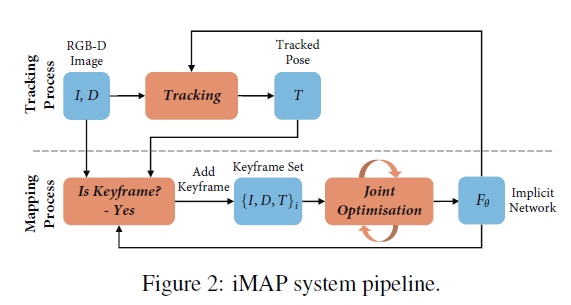

用全连接网络$$F_\theta$$表征3D几何地图，将3D坐标映射到颜色和volume density上。给定相机位姿，可以根据样本的反投影射线，对网络的检索信息进行累加来渲染像素的颜色和深度。该算法根据RGB-D视频，从场景中主动采样稀疏的观测信息，并据此增量式优化网络参数和相机位姿。运行两个并行的线程：跟踪（根据固定的网络优化当前相机位姿）和建图（联合优化网络和关键帧的相机位姿，关键帧是根据信息增益增量式地选取的）。

#### Implicit Scene Neural Network

参考NeRF，作者用了一个有4层隐层的MLP，隐层的特征维度为256，网络由两个输出head，将一个3D坐标$$p=(x,y,z)$$映射到颜色和volume density：$$F_\theta (p)=(c,\rho)$$。作者没有考虑视角方向，因为不需要对specularity建模。 作者用高斯位置编码来将输入的3D坐标升维到n维空间中：$$sin(Bp)$$，其中B是一个$$n \times 3$$的矩阵，从标准差为$$\sigma$$的正太分布中采样得到。这一编码作为MLP的输入，并且与网络第二个激活层连结。作者同时优化了编码矩阵B，用一个带有sine激活函数的单层全连接层实现。

#### Depth and Colour Rendering

文中的渲染机制与NeRF和NodeSLAM相似，是通过对场景网络进行查询，来获得特定视角的深度和颜色图像的。给定一个相机位姿$$T_{WC}$$和一个像素坐标\[u,v]，首先将其反投影到归一化平面并将其变换到世界坐标系下：$$r=T_{WC}K^{-1}[u,v]$$，K为相机内参矩阵。沿着射线$$p_i=d_i r$$，用对应的深度$${d_1,d_2,...,d_N}$$选取一组N个样本点，查询网络，获得颜色和volume density信息$$(c_i,\rho_i)=F_\theta (p_i)$$。 volume density可以通过乘以样本间距离$$\delta_i=d_{i+1}-d_i$$转换为occupancy概率，然后传入激活函数$$o_i=1-exp(-\rho_i\delta_i)$$。每个样本点是射线终点的概率为$$w_i=o_i\prod^{i-1}_{j=1}(1-o_j)$$.最后，深度和颜色的期望渲染值为：&#x20;

&#x20;

沿着射线的深度方差为：

&#x20;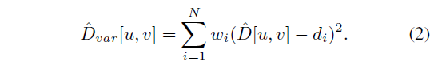

#### Joint optimisation

算法联合训练隐式场景网络的参数和不断增多的W个关键帧的相机位姿，每个关键帧都有一个与之关联的颜色、深度和一个初始的位姿估计$$\{I_i,D_i,T_i\}$$. 本文所提出的渲染函数关于这些变量可微，所以算法采用迭代的方法对每张keyframe中的部分选取的rendered pixels $$s_i$$最小化集合误差和光度误差。 光度误差为M个采样点的渲染出的颜色值和真实颜色值的L1距离$$e^p_i[u,v]=|I_i[u,v]-\hat{I}_i[u,v]|$$: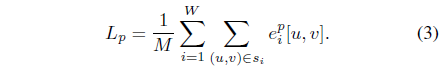

几何误差度量了深度的误差$$e^g_i[u,v]=|D_i[u,v]-\hat{D}_i[u,v]|$$，并用深度方差作为正则项来降低不确定区域的权重（如目标边缘）：

&#x20;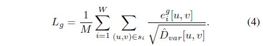&#x20;

使用Adam优化器来优化两部分误差的加权和：

&#x20;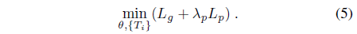&#x20;

**Camera Tracking** 在线SLAM过程中，接近相机帧率的跟踪很重要，因为优化较小的偏差是更鲁棒的。算法并行运行了一个跟踪线程，固定场景网络的参数，用完全相同的损失和优化器来持续优化最新一帧的位姿，并且速率比联合优化快很多。所选取的关键帧的初始位姿在建图线程中被进一步优化。

#### Keyframe Selection

使用全部图像训练网络参数和相机位姿是不可行的。但是，视频流中的图像是有很大部分冗余的，可以用一部分关键帧来表征当前场景。关键帧基于信息增益来增量式选取的。第一帧被用于初始化网络并定义世界坐标系。每次选择一个关键帧时，作者复制一份当前的网络来表示当前的3D地图。后续帧将基于这个网络副本进行检查，当该帧看到一个显著的新区域，则将其选为关键帧。 为此，作者渲染了一组像素样本s，并计算正则化深度误差小于阈值$$t_D=0.1$$的比例P，以测量当前地图副本可以解释该帧的比例:&#x20;

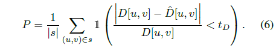&#x20;

当前这个比例小于阈值$$P<t_P, t_P=0.65$$，该帧被加入关键帧组合。正则化深度误差可以自适应地生成关键帧，需要更高的精度，因此当相机靠近目标时，需要更近距离的关键帧。 建图过程中获得的每一帧用于联合优化（10-20代），所以关键帧总是由最新获得的帧与基于它选择的关键帧构成的。

#### Activate Sampling

**Image Activate Sampling** 渲染和优化所有图像像素将消耗大量计算和内存。作者利用图像的规律性在每次迭代中只渲染和优化一个非常稀疏的随机像素集(每幅图像200个)。此外，作者使用渲染损失来指导主动采样信息量高的区域，即细节更多或重建尚不精确的区域。&#x20;

联合优化的每一代包括两个阶段。第一步，在每个关键帧的深度和颜色图像上采样一组均匀分布的像素$$s_i$$，这些像素用于更新网络和相机位姿，并计算loss。为此，作者将每张图像划分为$$8\times 8$$的网格，在每个正方形区域$$R_j$$中计算平均loss：

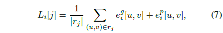

其中$$r_j=s_i\cap R_j$$为从$$R_j$$中均匀采样的像素。作者将这个指标正则化，转换为概率分布：

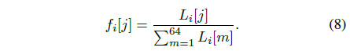

基于这一分布，对每个区域重新采样一组$$n_i\cdot f_i[j]$$个均匀的样本，让更多的样本分配个高损失的区域。场景网络用activate samples上的loss进行训练（在跟踪线程，只采用均匀采样）。

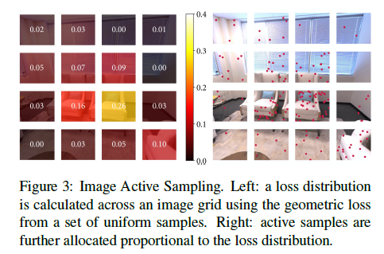

**Keyframe Activate Sampling** 在iMAP中，利用关键帧持续优化场景网络，类似于用一个memory bank来防止网络遗忘。希望将具有高损失的样本分配为关键帧，因为这些样本是新探索的、细节较多的、或者网络将要遗忘的区域。作者采用与image activate sampling相似的过程，对每个关键帧分配$$n_i$$个样本，与关键帧的loss分布成正比。

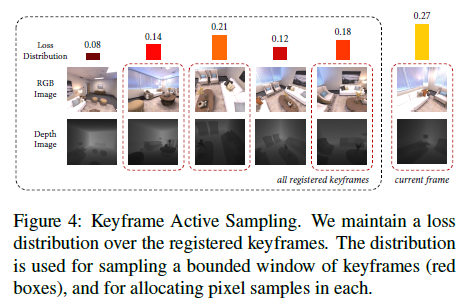

**Bounded Keyframe Selection** 当相机移动到新的区域，关键帧将越来越多。为了限制联合优化的计算，在每次迭代中，根据loss分布随机选择了固定数量的关键帧（在系统中设置为3）。并且将最新的关键帧和当前帧纳入联合优化，来构成一个大小为5的限制窗口。

### Experimental Results

#### Implementation Details

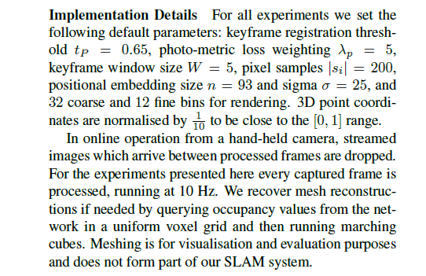

#### Scene Reconstruction Evaluation

**Quantitative metric** Accuracy(cm)：重建网格中的样本点和与之最近的真值点之间的平均距离；Completion(cm)：真值的采样点和与之最近的重建点之间的平均距离；Completion Ratio($$<5cm$$, %)：重建网格中Completion小于5cm的百分比。&#x20;

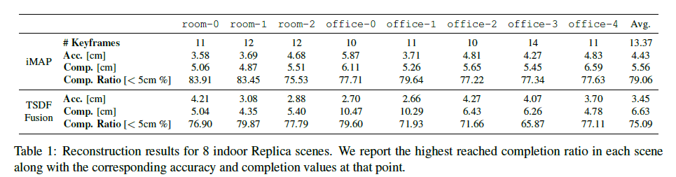

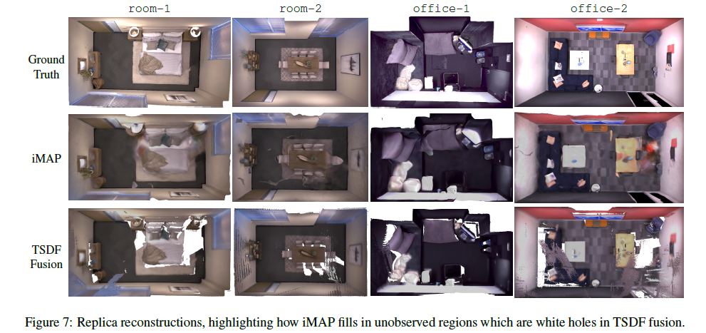

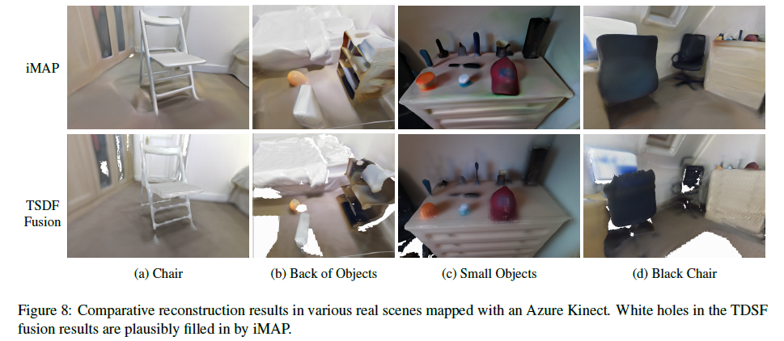

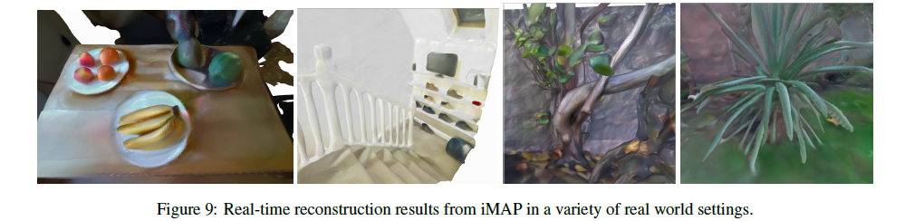

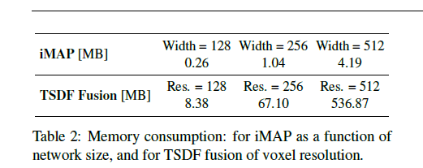

#### TUM Evaluation

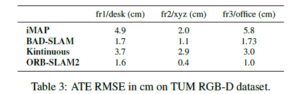

#### Ablative Analysis

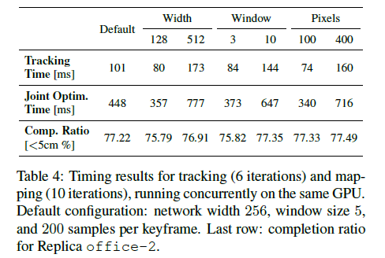

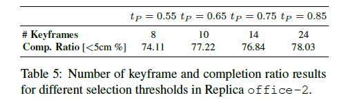

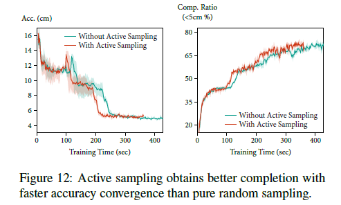

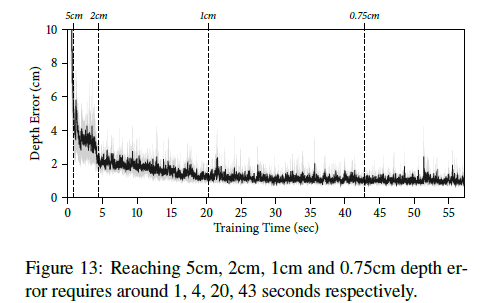
