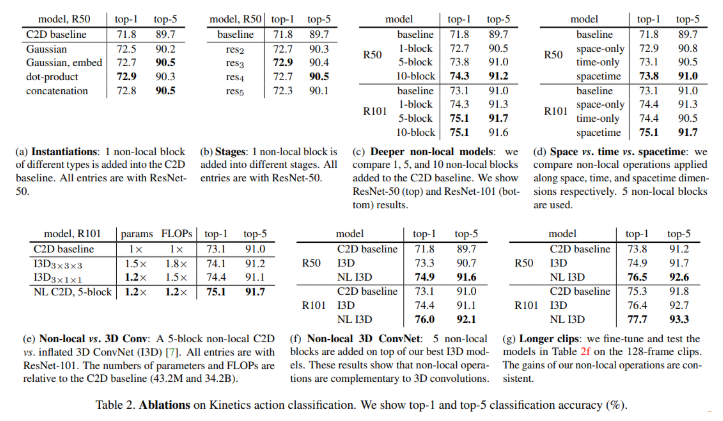

# \[CVPR 2018] Non-local Module







### Abstract

卷积和循环神经网络都是一次处理一个邻近区域。这篇论文提出了non-local操作，可以获取大范围的依赖。所提出的non-local操作在某一位置上通过计算所有位置特征的加权和作为该位置的响应。该模块可以嵌入很多计算机视觉结构中。

### Introduction

卷积和循环神经网络只能处理时间或空间维度上的邻域信息，为了获取长期的交互信息，只能重复堆叠这些层，逐步处理数据。但是这种是低效的，且难以优化的。&#x20;

这篇论文中，作者提出non-local操作，作为一种可以用深度神经网络捕获长期依赖的组件。这种结构是传统的non-local mean操作的泛化，直观地讲，non-local操作通过输入特征图的所有位置的特征的加权和来作为某一位置的响应，位置的集合可以在空间、时间或时空维度上，因此，non-local操作可以用于图像、序列和视频任务中。&#x20;

.png>)

non-local操作的优势有：1）与渐进地使用卷积或循环网络不同，non-local操作通过直接计算两个位置的交互来捕获长期依赖，无视位置距离；2）non-layer更高效且效果更好；3）non-local不限制输入的大小，易与其他结构结合。

### Non-local Neural Networks

#### Formulation

定义一个通用的non-local操作为：&#x20;

.png>)

这里，i为输出位置的索引值（时间、空间或时空）。x是输入信号，y是输出信号。f计算i和所有j之间的关联，g计算了j位置输入信号的表征。然后响应用C(x)标准化。

#### Instantiations

这篇论文，作者还提供了几种f和g的实例，但是在实验中，作者发现模型的表现不受f和g的影响说明non-local是一种比较泛化的模型，对f和g不敏感。&#x20;

为了简化，作者选择了线性的g：$$g(x_j)=W_gx_j$$，其中$$W_g$$是需要学习的权重矩阵。 而对于f，作者给出了一下几种实例化情况：&#x20;

**Gaussian** 参考non-local mean和双边滤波，f可以用高斯函数来定义：&#x20;

.png>)

正则项为$$C(x)=\sum_jf(x_i,f_j)$$&#x20;

**Embedded Gaussian** 将高斯函数拓展到embedding空间中，得到：&#x20;

.png>)

其中$$\theta(x_i)=W_\theta x_i, \phi(x_j)=W_\phi x_j$$。同样，$$C(x)=\sum_jf(x_i,f_j)$$。&#x20;

作者注意到，self-attention可以看做在embedded Gaussian空间中的non-local算子。对于i，$$\frac{1}{C(x)}f(x_i,x_j)$$是在j维度上的softmax，因此有$$y=softmax(x^TW^T_\theta W_\phi x)g(x)$$，这与self-attention一样。&#x20;

**Dot product** f可以定义为点乘相似性：&#x20;

.png>)

这种情况下，正则项为C=N，其中N为x中位置数量，来简化梯度计算。&#x20;

**Concatenation** 如Relation Networks中一样，作者还用concatenation定义了f：&#x20;

.png>)

其中$$[\cdot,\cdot]$$为concatenation，$$w_f$$是一个权重向量，将拼接后的向量映射到标量，正则项为C=N。

### Non-local Block

作者提出了一种non-local block来融合公式1中的non-local操作：&#x20;

.png>)

其中$$y_i$$由公式1给出，$$+x_i$$表示一种残差连接。示例如图2所示。&#x20;

**Implementation of Non-local Blocks** 作者设置$$W_g,W_\theta,W_\phi$$的通道数为x的一半。公式6中的权重矩阵$$W_z$$计算$$y_i$$的一个position-wise embedding，与x的通道数一致。&#x20;

这里使用一个二次抽样的技巧来进一步减少计算，将公式1修改为$$y_i=\frac{1}{C(\hat{x})}\sum_j f(x_i,\hat{x}_j)g(\hat{x}_j)$$，其中$$\hat{x}$$是对x二次采样后的结果（比如pooling），作者在空间维度执行这一操作，减少1/4的pairwise计算。这一技巧不改变non-local，知识让计算更稀疏，这一步可以通过在g和$$\phi$$之后加入max pooling层来完成。

### Video Classification Models

**2D ConvNet baseline (C2D)** 为了将non-local的时序影响与3D卷积网络分离开，作者构建了一个简单的2D结构，简单地处理时间维度（比如，只通过pooling）&#x20;

.png>)

表1展示了用ResNet-50作为backbone的C2D baseline。输入的视频片段有32帧，每帧为224x224大小。表1中的所有卷积都是2D的。唯一涉及到时域信息的操作是池化层。换句话说，这个baseline只是聚合了时间信息。&#x20;

**Inflated 3D ConvNet (I3D)** 可以将表1中的C2D模型改为3D卷积层。例如，可以将2D的$$k \times k$$ kernel扩展到横跨t帧的3D $$t \times k \times k$$ kernel。这个kernel可以从2D预训练模型中初始化：$$t \times k \times k$$ kernel中t个位面的每一层可以用预训练的$$k \times k$$权重初始化，乘以1/t。&#x20;

作者考察了两种拓展：或者将residual block中的3x3 kernel扩展到3x3x3，记为$${I3D}_{3\times 3 \times 3}$$，或者将residual block中第一个1x1 kernel扩展为3x1x1,记为$${I3D}_{3\times  1\times 1}$$。由于3D卷积计算很密集，作者对每两个residual block只拓展一个kernel。作者将$${conv}_1$$拓展为5x7x7.&#x20;

**Non-local network** 作者将non-local blocks插入C2D或I3D来变为non-local网络。作者调查添加1,5,或10 non-local blocks。

#### Implementation Details

**Training** 模型在ImageNet上预训练。输入32帧的视频片段。这些片段是从原始全长视频中随机裁剪出连续的64帧然后每隔一帧丢弃得到的。视频画面较短边被缩放到\[256,320]之间，然后随机裁剪为224x224大小。作者在表示$$W_z$$的最后一个1x1x1层后加入BN层，在其他non-local block中不加入BN层。 **Inference** 作者将视频的较短边缩放到256，进行空间上的全卷积操作。对于时域，作者从一个完整的视频中均匀地抽取10个片段，并分别计算它们的softmax分数。最终的预测是所有剪辑的平均softmax分数。

### Experiments

.png>)

.png>)

.png>)

.png>)
