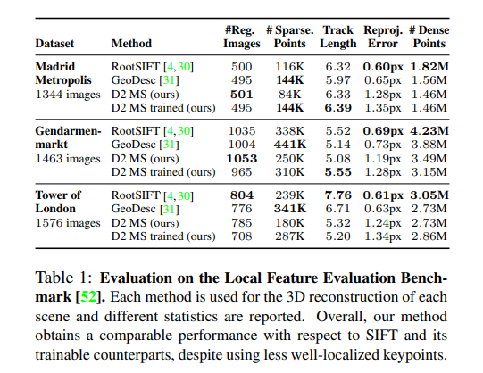
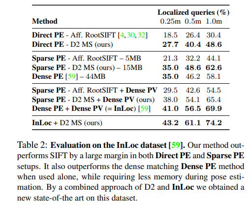
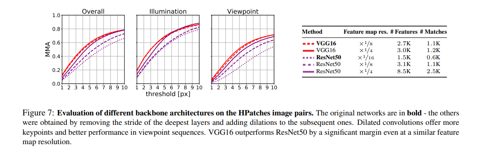
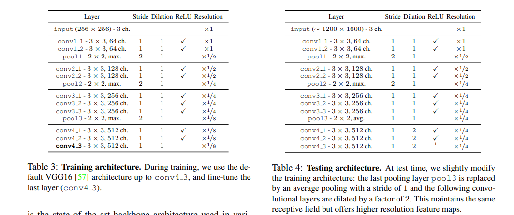

# \[CVPR 2019] D2-Net





### Abstract

D2-net的主要贡献在于提出了detect-and-describe的特征提取方法，不再是传统的detect-then-describe方法。作者认为从高层语义信息（CNN的高层conv输出的feature map）中提取的关键点位置要比从低层结构信息中提取的更稳定一些。detector和descriptor的参数实现了完全的共享。

### Method

D2的detector和descriptor是基于相同的feature map获取的。输入图像通过一个前向网络，得到C x H x W feature map，被视为得到了H x W 个C维的稠密局部特征。&#x20;

.png>)

### Hard feature detection(test)

由于D2得到feature map有很多层，每一层都可以作为一个detector去检测局部最大值进而提取local feature，所以在提取特征时，D2约定（i，j）为一个特征点当且仅当在该点具有最大值的那个detector中，该点是一个局部最大值：&#x20;

.png>)

直观地来讲，就是对于每个点，我们需要先找到该点对应C个detector中最显著的那个detector，然后验证在该detector中，当前点是否是局部最大的。

### Soft feature detection(training)

但是上述detection方法是不可微的，无法用反向传播方法进行训练，为了实现end-to-end训练，作者soften了上述detection的方法。 首先soften筛选最显著detector的部分，计算当前detector的ratio-to-max用以表示其显著性&#x20;

.png>)

其次soften计算局部最优值的部分，计算了9邻域内某点的soft local-max占比&#x20;

.png>)

最后，综合两部分的分数，取最大值，&#x20;

.png>)

并做image-level normalization得到一个用来表征像素是特征点的概率的score map。&#x20;

.png>)

### Multiscale detection

为了获取具有更强尺度不变性的特征，D2使用图像金字塔，在测试阶段，将图像分别缩放至0.5,1,2倍，输入D2，得到feature map，并将之前由低分辨率图像获得的feature map插值放大到当前分辨率，与当前feature map相加，获得更稳定的feature map，在此map上进行detection，之前提取的关键点也被上采样（最近邻）到当前尺度，纳入提取的特征中。

### Data

D2用MegaDepth数据集进行训练，MegaDepth提供了同一场景不同视角、光照、设备下的照片，以及深度信息，每个场景由COLMAP进行建图，由此获得2d-3d特征点的对应信息，利用sfm提供的信息，我们可以计算同一场景下两幅图像的overlap，在训练中，D2使用overlap>0.5的图像对，并用depth信息进行验证，去除被遮挡的像素。

### Loss

为了提升descriptor的区分度，需要让对应点的descriptor距离较小，非对应点的descriptor距离较大，所以D2使用了triplet margin loss。

对于图1,2中一对匹配点A和B，positive descriptor distance=

.png>)

在计算negative descriptor distance时，先挑选hardest negatives：&#x20;

.png>)

直观理解，$$N_1$$为图1中位于A的邻域之外，与B最相似的点。$$N_2$$同理。 然后就可以分别计算A与$$N_2$$，B与$$N_1$$的descriptor距离，得到negative descriptor distance=

.png>)

最后，triplet margin loss如下：&#x20;

.png>)

通过该loss可以让descriptor的distinctiveness提升，而为了挑选更具重复性的特征，D2在triple margin loss前加了一个权重&#x20;

.png>)

这样的话，为了让loss降低，网络需要学习去提取区分度更高（m更小）并且可重复性更好（权重更大）的点，并且优化提取的descriptor。

### Training & Test

D2采用了VGG-16网络模型（\~conv4\_3），加载ImageNet预训练模型即可提取特征，如果进行finetune只需训练最后一层。在测试时，最后一个max-pooling改为average-pooling，并且stride改为1（不降低分辨率），conv4\_1到conv4\_3使用空洞卷积，这样得到的feature map是1/4大小的，D2使用SIFT中的local refinement方法去修正关键点位置，descriptor被双线性插值到矫正后的位置。

### Evaluation

.png>)

在HPatches上，D2表现较差，threshold小于6px时的MMA很低。D2提取的特征较多，匹配数量也较多。在camera localization和3D reconstruction实验中效果较好。

 (1).png>)

Direct Pose Estimation (PE)是在query和最相似图像之间匹配特征，然后估计位姿；Sparse PE是在query和top-100个相似图像间匹配特征，然后用一个spatial verification步骤来剔除错误匹配，然后用与query具有最多匹配的database image来估计query的位姿。Dense PE是用稠密的CNN描述子来进行匹配（对VGG16网络的conv5层到conv3层进行有指导的匹配）。Dense Pose Verification(PV)是InLoc中提出的一种位姿验证方法，通过估计出的位姿渲染出一幅图像，用稠密提取的SIFT描述子与query进行匹配，计算一个相似度，用此相似度在Dense PE后rerank top-10个图像。具体算法可参考InLoc原文。

### 网络结构

