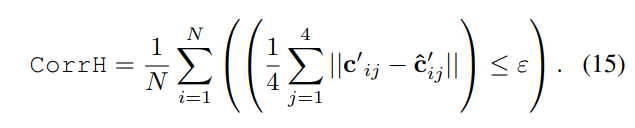

# \[CVPRW 2018] SuperPoint







### Abstract

作者在MagicPoint的基础上增加了提取descriptor的部分，提出了homographic adaptation的数据增强方法，用来训练detector的repeatability，并且使得训练数据可以从虚拟的仿真数据拓展到MS-COCO等真实数据。

### Introduction

作者认为deep feature训练的关键在于带有标签的数据，但是人工标注的数据中，关键点往往是ill-defined，所以作者提出自监督方法训练，用网络本身去标注一批伪真值关键点，在此基础上进行训练，这样做，关键点更丰富，标注成本也更低。&#x20;

.png>)

第一步，其实就是之前提到的训练MagicPoint，先构建了一个仿真数据集Synthetic Shapes，训练了MagicPoint(a)。虽然之前的论文提到MagicPoint在应对各种干扰时重复率和准确率都很高，但是它丢失了一些潜在的关键点，为了解决这个问题，作者用Homographic Adaption去增强了MagicPoint标注的真实图像，得到了一个更符合预期的真实数据(b)，并用此去训练一个新的网络SuperPoint(c).

### Architecture

.png>)

SuperPoint由一个共享参数的encoder和两个task-specific decoders构成，采用vgg结构，图像(H x W)通过encoder，得到一个1/8大小($$H_c \times W_c$$)的feature map。&#x20;

在**interest point decoder**中，网络依旧延续MagicPoint的做法，采用非参数的上采样过程，feature map通过head降维到65 x $$H_c \times W_c$$维，分别代表原图中与之对应的8x8区域内每个点是关键点的概率以及一个dustbin通道，dustbin用以表示该8x8区域内无关键点。&#x20;

在**descriptor decoder**中，网络先提取了$$H_c \times W_c$$的semi-dense descriptor，每个descriptor代表与之对应的8x8区域内关键点的256-d descriptor（根据interest point detector，每8x8区域内只可能存在1/0个关键点），然后采用bi-cubic插值恢复到原分辨率。

### Loss

训练interest point detector依旧采用对每个cell计算cross-entropy loss的方法：&#x20;

.png>)

为了使这部分$$L_p$$降低，需要让Y中为1的位置（即该点为关键点）在X中有较大的值，即增大该点为关键点的概率。&#x20;

训练descriptor extractor时，需要先找到匹配的点，然后用匹配点的descriptor来计算loss，所以先找判断图1(h,w)和图2(h',w')是否是一组匹配点：&#x20;

.png>)

p是cell的中心位置，H是真值homography，所以上式就是判断两个cell在原图中中心是否是符合真值homography的，如果是，则这两个位置是一对匹配点，计算它们descriptor的距离：&#x20;

.png>)

上式中当图1和图2中两个点是匹配点时，s=1，则两个点的descriptor之间的cosine距离应该越大越好；而当两个点不匹配时，s=0，两个点的descriptor间的cosine距离越小越好。此处作者采用了hinge loss。 综上，SuperPoint训练使用的loss：&#x20;

.png>)

分别计算图1和图2与真值图像的interest point loss，再计算图1与图2间的descriptor loss。

### Training

作者先训练了SuperPoint中提取关键点的detector pathway，其实就是MagicPoint，发现在虚拟数据集上MagicPoint表现很好，在真实数据中，当场景中有大量角点时，效果很好，但是在自然场景中，MagicPoint效果不如传统特征，所以作者提出**用自监督方法在真实场景中训练网络**，即Homographic Adaptation。

### Homographic Adaptation

.png>)

可通过iterative homographic adaptation来提升效果。100次random homography效果较好。

### Experiments

#### System Runtime

整个系统在Titan X GPU上处理一张480\*640的图像需要用时13ms，FPS大概为70.

#### HPatches Repeatability

在Hpatches数据集上测试了repeatability，在240\*320的图像中提取最多300个点，$$\varepsilon=3$$：&#x20;

.png>)

#### HPatches Homography Estimation

**Nearest Neighbor mean Average Precision (NN mAP)** 这个指标度量描述子在不同描述子距离阈值下的可区分程度。利用最近邻算法获得特征匹配，得到precision-recall曲线，计算area under curve（average precision）。这个指标在图像对之间对称地计算并取平均。&#x20;

**Matching Score** 这个指标综合评估detector和descriptor。它度量了由方法预测出的真值匹配占两幅图像中共视区域内方法检测出的特征的比例。这个指标在图像对之间对称地计算并取平均。&#x20;

**Homography Estimation** 因为无法直接比较真值H和预测H之间的差异，所以作者转而比较H将图1的四个角点变换到图2中的效果，先在图1中定义四个角点$$c_1,c_2,c_3,c_4$$，然后用真值H将四个点变换到图2中，得到$$c'_1,c'_2,c'_3,c'_4$$，并用预测的H将四个点变换到图2中，得到$$\hat{c}'_1,\hat{c}'_2,\hat{c}'_3,\hat{c}'_4$$，用阈值$$\varepsilon$$来定义一个正确的H：

在实验中，设置$$\varepsilon=3$$，在480x640大小的图像中提取最多1000个特征。为了估计H，先对两幅图像中的特征进行最近邻匹配，然后用OpenCV中的findHomography()+RANSAC来估计H矩阵。

.png>)

