# \[ICCV 2021] MDA





### Abstract

现有基于attention的方法对每张图像只预测一个attention map，限制了模型对不同视觉模式的探索能力。这篇论文中，作者提出一种局部特征，同时关注单张图像中多个有区分度的局部模式。在该模型中，作者首先自适应地调整了attention map的通道，来实现多个head。对每个head，设计了新的动态注意力模块来学习可能的注意力。整个网络只需要图像级别的标签，用度量学习的方法来训练。训练好模型后，对每张图像，根据多个head的动态注意力信息，提取局部特征，用于图像检索。&#x20;

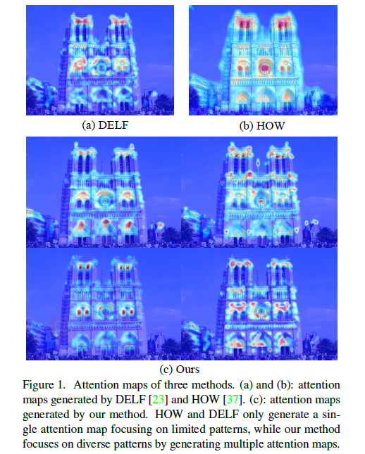

### Introduction

作者认为一张图像中会存在多种语义模式，所以现有方法中只使用一个attention map，可能无法很全面地捕获所有潜在的语义模式。为了解决这一问题，作者提出一种具有多个动态注意力的模型，来检测不同语义模式下的不同局部特征。在该方法中，从CNN的中层特征图中提取注意力map。为了解耦不同的语义模式，引入一种channel mapping layer来自适应地将输入特征图的通道重新组织为多个group，每个group被输入一个attention head。在attention head中，引入一种动态注意力模块。特别地，我们引入了一个多样性正则化，以确保不同的head关注图像中的不同模式。为了在大规模图像数据库中高效检索，作者用一个codebook量化这些局部特征，然后用binarized aggregated match kernel来匹配图像。

### Method

#### Framework

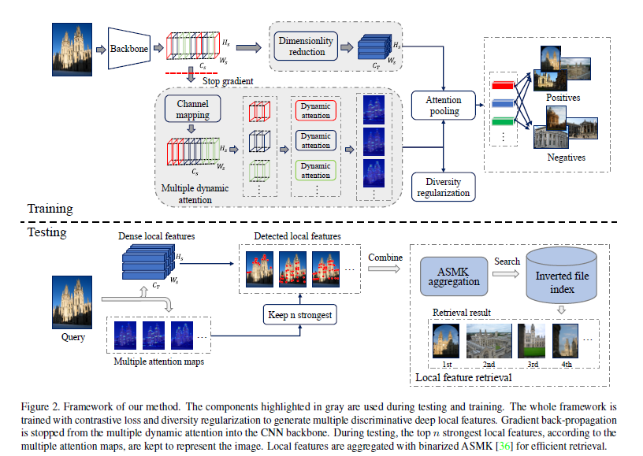

给定一张图像，通过CNN backbone得到特征图$$S\in R^{H_s \times W_s \times C_s}$$.为了选择用于图像检索的相关模式，作者提出了新的多动态注意力模块multiple dynamic attention（MDA） ，它包含N个head来预测哪些特征对感兴趣的目标具有可分辨性。MDA中的每个head检测出一种特定的模式，不同的head检测不同的模式。M首先自适应地用channel mapping layer来重新组织S，然后将它均匀地划分为不同组。每个组被输入attention generation module来独立地学习attention maps。由于一张图像可以提取出成千上万个特征，所以特征必须足够紧凑，来节省内存开销。为此，作者用一个卷积层来降维。局部描述子L=T(S)，其中$$L\in R^{H_s \times W_s \times C_T}$$，T是一个有$$C_T$$个核的1x1卷积层。&#x20;

在训练时，用attention map将局部描述子pooling为全局描述子，得到一组全局描述子。这些全局描述子被用于训练整个网络。特别地，作者还用diversity regularization term来让不同的head关注于图像中的不同模式。&#x20;

在测试时，基于multiple attention maps的重要性，选取出L中n个最显著的描述子。这些局部描述子与binarized ASMK相结合，用于大规模图像检索。

#### Multiple Dynamic Attention Module

CNN输出的特征图可以视为一组模式detector的2D响应图。但是，同一视觉模式对应的特征通道往往不是按顺序组合的。给定backbone生成的特征图S，用1x1卷积来重新组织通道：&#x20;

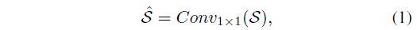

其中$$\hat{S}\in R^{H_s \times W_s \times C_s}$$。然后将特征图$$\hat{S}$$划分为不同的组，来表征多个不同的模式。这些组表示为$$\mathcal{F}=\{F^1,F^2,...,F^N\}$$，其中$$F^i$$表示$$\hat{S}$$的第$$[(i-1)\times\lfloor\frac{C_s}{N}\rfloor+1,i\times\lfloor\frac{C_s}{N}\rfloor]$$个通道。最后，通过将每个$$F^i\in \mathcal{F}$$输入attention generation module，产生了N块attention map，定义为$$\mathcal{A}\in\{A^{(1)},...,A^{(N)}\}, A^{(i)}\in R^{H_s \times W_s}$$。&#x20;

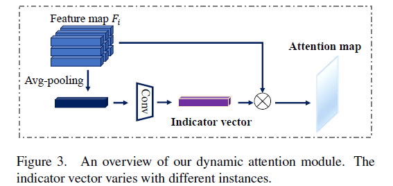

图3显式了attention generation module，记为dynamic attention head（DA）。给定一个中间层特征图$$F^i \in R^{H_s \times W_s \times \lfloor \frac{C_s}{N} \rfloor}$$作为输入，DA首先用平均池化将特征图的空间信息聚合起来，产生一个空间上下文描述子$$F^i_{avg}$$。这个描述子然后被输入一个1x1卷积层来产生指示向量$$F^i_g \in R^{1 \times 1 \times \lfloor\frac{C_s}{N}\rfloor}$$.简而言之，指示向量计算步骤如下：&#x20;

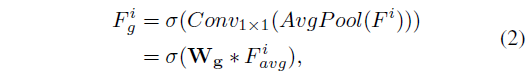

其中$$\sigma$$为ReLU函数，然后attention map计算如下：&#x20;

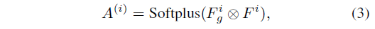

总之，我们的MDA模块产生了多个注意力图，每个都集中在一个特定的模式上。多重注意图捕捉不同的模式。

#### Training Stage

作者用constrastive loss和diversity regularization两部分目标来优化整个网络。&#x20;

给定一堆图像(i,j)，和匹配标签$$Y(i,j)\in\{0,1\}$$。对每张图像，用$$\mathcal{A}$$中的各个attention map池化L中的局部描述子，获得一组全局描述子$$\mathcal{G}=\{G^{(1)},...,G^{(N)}\}$$：&#x20;

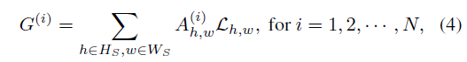

每个对应着一个head。对每个head求constrastive loss，求和：&#x20;

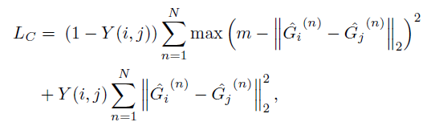

$$\hat{G}$$是L2正则化后的全局描述子。 为了让不同的head关注于不同的模式，来最大化最后描述子中包含的内容，即需要最大化任意两个attention maps之间的距离。 对于每个attention map $$A_i \in \mathcal{A}$$，首先将其展平为一个向量$$a_i \in R^{H_s W_s}$$，然后用softmax去处理：&#x20;

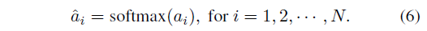

然后计算$$\hat{a}_i$$与$$\hat{a}_j$$之间的Hellinger距离：&#x20;

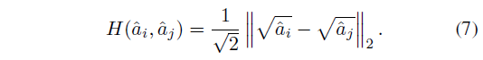

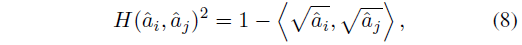

其中$$<\sqrt{\hat{a}_i}, \sqrt{\hat{a}_j}>$$为点乘。为了增加attention map之间的diversity，定义regularization term：&#x20;

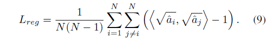

最后的目标函数为：&#x20;

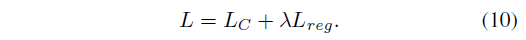

#### Testing Stage

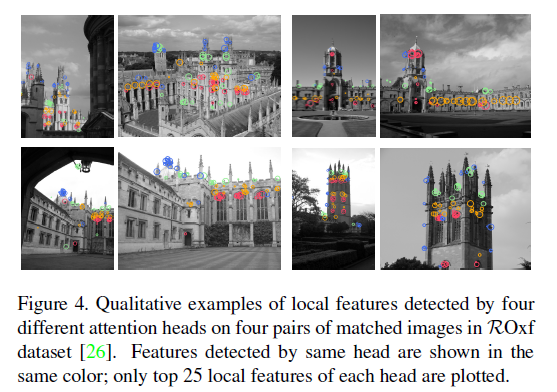

在测试时，根据$$\mathcal{A}$$提供的重要性选择局部特征，所有head的attention values一起排序，选择top n个局部特征。在测试时还应用了多尺度提取。用binarized aggregated match kernel framework（ASMK\*）用于聚合局部特征并计算图像间的相似度。 在ASMK\*框架中，图像X用一组n个$$C_T$$维局部描述子$$\mathcal{X}$$来描述。这些描述子用一个用C个视觉单词的codebook $$\mathcal{C}$$来量化，codebook用k-means来学习。定义$$\mathcal{X}c=\{x\in \mathcal{X}:q(x)=c\}$$为X中关联到视觉单词c的局部描述子。图像X和图像Y之间的相似度为：&#x20;

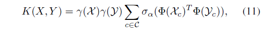

其中$$\mathcal{X},\mathcal{Y}$$是图像X和图像Y的描述子，$$\Phi(\mathcal{X})$$为一个聚合向量，$$\sigma_\alpha(\cdot)$$为一个scalar selectivity函数，$$\gamma(\mathcal{X})$$为正则项。

### Experiments

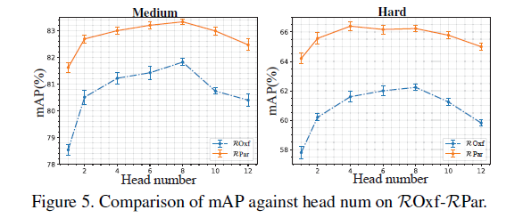

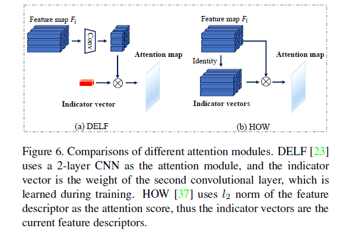

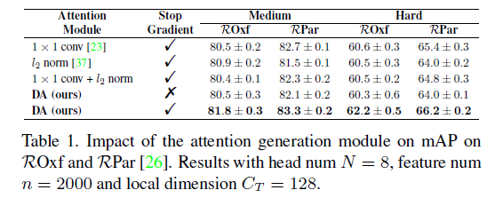

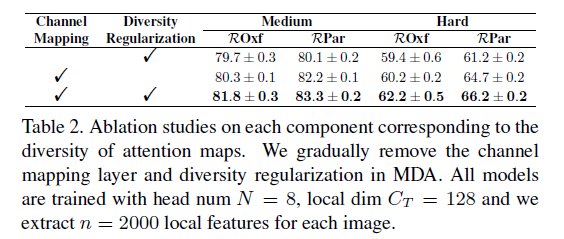

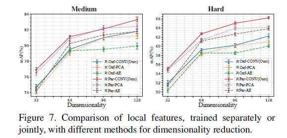

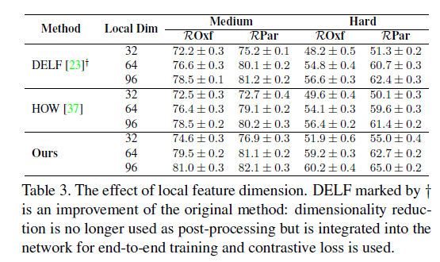

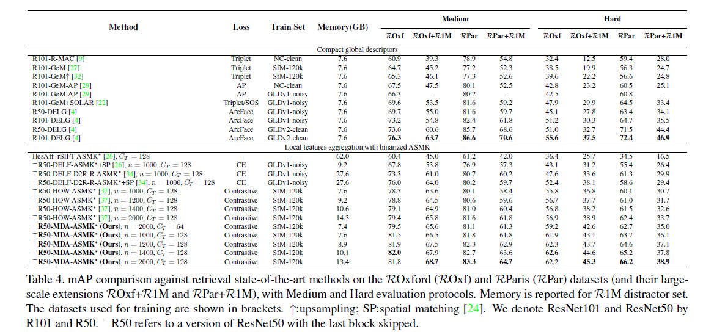
