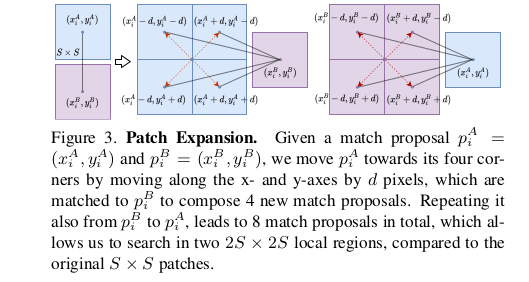

# \[CVPR 2021] Patch2Pix





### Abstract

这篇论文中，作者提出一个新的范式，用detect-to-refine的方法来估计correspondence，首先预测patch-level匹配，然后优化调整。作者提出Patch2Pix精调网络，在patch-level match proposal定义的区域中拟合pixel-level matches，同时根据可信度分数来剔除外点。Patch2Pix采用弱监督方法训练，去学习图像间符合极线约束的correspondence。

### Introduction

获得图像对之间correspondence的传统方法主要包含三步：1.检测并描述局部特征；2.用描述子进行最近邻匹配；3. 剔除外点。&#x20;

在本文中，作者提出Patch2Pix，一种新的匹配网络的范式。该网络首先获得patch-level match proposal，然后将它们refine到pixel-level matches。所提出refinement网络是基于用相对位姿计算得到的极线约束来弱监督的，来学习在patch proposa中回归具有几何一致性的pixel-wise matches。 本文的贡献点在于：

1. 提出了一种新的寻找匹配的范式，首先获得patch-level match proposal，然后精调获得pixel-level matches；
2. 提出一种match refinement网络，同时通过回归精调匹配，并且剔除外点，并且训练不需要真值的correspondence；
3. 模型可以稳定地提升匹配网络的匹配准确率；
4. 模型可以泛化到全监督方法，而不需要重新训练，在室内、室外定位任务中获得了sota表现。

### Patch2Pix: Match Refinement Network

匹配网络的优势在于可以直接优化匹配目标，不需要显式地检测关键点。网络隐式地包含了特征检测和描述，并在匹配中反映出来。但是目前匹配网络中还存在两个问题，导致匹配的不准确：1. 由于内存的限制，需要使用下采样后的特征图；2. 使用弱监督方法训练的NCNet和SparseNCNet简单地给非匹配对低分数、给匹配对高分数，这无法让网络识别出好和坏的匹配，让方法无法获得pixel-accurate correspondence。 为了解决这两个问题，作者提出一种detect-to-refine两阶段匹配过程。在第一阶段检测过程中，用匹配网络，如NCNet，获得一组patch-level match proposal。第二阶段中，网络用两种途径refine match proposals：1. 用分类去判断一个proposal是好是坏；2. 用回归去在proposed match的中心周围局部区域内检测出一个pixel精度的匹配。作者基于这样的直觉，即correspondence网络用高层次的语义特征来区域patch-level的语义匹配，然后refinement网络用局部结构的细节信息来获得匹配的更准确位置。最后，网络用弱监督的极线损失来训练，让获得的匹配满足相对位姿定义的几何约束。&#x20;

#### Refinement: Pixel-level Matching

**Feature Extraction** 给定一对图像$$(I_A,I_B)$$，一个L层的CNN backbone从每张图像中提取特征，令$$\{f_l^A\}_{l=0}^L, \{f_l^B\}_{l=0}^L$$分别为从第l层CNN提取出的图A和图B的特征图。在l=0层，特征图就是原图本身。对于一个大小为$$H\times W$$的图像，特征图$$f_l$$的大小为$$H/2^l \times W/2^l, l \in [0, L-1]$$。最后一层，令卷积的步长为1，来避免丢失过多分辨率。特征图只提取一次，用于检测匹配和refinement。检测匹配阶段只用了最后一层特征图，其包含更多高层次信息，而refinement阶段用了之前层的特征，其包含更多低层次信息。&#x20;

**From match proposals to patches** 给定一个match proposal $$m_i=(p^A_i,p^B_i)=(x^A_i,y^A_i,x^B_i,y^B_i)$$，refinement阶段的目标就是通过在局部区域内寻找pixel-wise match来获得准确的匹配。因为match proposal是在下采样后的特征图上获得的，1像素的误差将会导致在原图上$$2^{L_1}$$像素的误差。因此，算法定义搜索区域为以$$(p^A_i,p^B_i)$$为中心的大小为$$S \times S$$的局部patch，其中$$S > 2^{L_1}$$。当根据match proposal获得局部patch对后，通过网络拟合pixel-level matches。&#x20;

**Local Patch Expansion** 首先将$$p^A_i$$沿x轴和y轴分别移动d个像素，得到四个角点。这让我们获得了相对$$p^B_i$$的四个角点，组成了四个新的match proposals。相似的，拓展$$p^B_i$$获得与$$p^A_i$$相匹配的四个角点，获得四个新的match proposals。最后，拓展后的8个proposals组成8对$$S\times S$$局部区域。令d=S/2则拓展后的搜索区域大小为$$2S\times 2S$$，并包含了原本的$$S \times S$$搜索区域。对patch proposals的patch expansion在训练时非常有效，因为网络可以在空间上相近和特征上相似的proposals中搜索正确的proposals，可以加快收敛速度并提升效果。&#x20;

**Progressive Match Regression** __ 为了获得pixel-level匹配，定义refinement任务为在局部patches对中寻找好的匹配。作者用两个相同结构的regressor实现了这一过程，即mid-level regressor和fine-level regressor，来渐进式地检测出匹配。给定一对$$S\times S$$的patch，首先从之前提取的特征图中获得对应的特征信息，$$\{f^A_l\},\{f^B_l\}$$。patch中的每个点(x,y)，它在第l层特征图中的位置为$$(x/2^l,y/2^l)$$。作者从{0,...,L-1}层中提取所有特征，并将它们拼接为一个特征向量。两个聚合特征patch $${PF}^A_i,{PF}^B_i$$在特征维度拼接起来，输入mid-level regressor。mid-level regressor先用两个卷积层将输入特征聚合为一个紧凑的特征向量，然后输入两个全连接层，最后用两个全连接层作为head输出预测结果。第一个head为拟合head，输出是在$$S \times S$$的局部patches中相对它们中心店的local matches $$\widehat{M_\triangle}:=\{\widehat{\delta_i}\}_{i=1}^N \subset R^4$$，其中$$\widehat{\delta_i}=(\widehat{\delta x^A_i}, \widehat{\delta y^A_i}, \widehat{\delta x^B_i}, \widehat{\delta y^B_i}, )$$。第二个head为分类head，用sigmoid函数获得可信度分数$$\widehat{C_{pixel}}=(\widehat{c_1}, ..., \widehat{c_N}) \in R^N$$，表示检测到匹配的可靠度。这使得我们可以检测好的匹配并剔除不好的匹配。算法通过将local matches加到patch matches上，获得mid-level matches $$\widehat{M_{pixel}} := \{\widehat{m_i}\}^N_{i=1}$$，即$$\widehat{m_i}=m_i + \widehat{\delta_i}$$。再次重复之前的步骤，提取以mid-level matches为中心的$$S \times S$$的局部patch，输入fine-level regressor，输出fine pixel-level matches $$\widetilde{M_{pixel}}:=\{\widetilde{m_i}\}^N_{i=1}$$和可信度分数$$\widetilde{C_{pixel}}=(\widetilde{c_1},...,\widetilde{c_N}) \in R^N$$.

#### Losses

本文所使用的pixel-level matching loss $$L_{pixel}$$包含两个部分：1. 一个分类损失$$L_{cls}$$用于训练可信度分数，预测一个match proposal是好的还是坏的；2. 一个几何损失$$L_{geo}$$来判断拟合后的匹配的准确度。最后的损失为$$L_{pixel}=\alpha L_{cls} + L_{geo}$$，其中$$\alpha=10$$.&#x20;

**Sampson distance** 为了获得pixel-level matches，作者监督网络取检测符合极线几何一致性的匹配，即两个正确匹配到的点应该位于其匹配点根据位姿变换投影过来的极线上。Sampson距离可以准确地度量一个匹配符合极线约束的程度。给定一个匹配$$m_i$$和用图像间相对位姿计算得到的基本矩阵$$F \in R^{3 \times 3}$$，它的Sampson距离度量了该匹配基于基本矩阵的几何误差：&#x20;

.png>)

其中$$P^A_i={(x^A_i,y^A_i,1)}^T,P^A_i={(x^A_i,y^A_i,1)}^T$$，$${(FP^A_i)}^2_k,{(FP^B_i)}^2_k$$表示向量$$FP^A_i,FP^B_i$$的第k个元素。&#x20;

**Classification loss** 给定match proposal $$m_i=(x^A_i,y^A_i,x^B_i,y^B_i)$$中的一对patches，当$$\phi_i < \theta_{cls}$$时，定义这一对是positive，即分类标签为$$c^*_i=1$$。这里$$\theta_{cls}$$是用于分类的几何距离阈值。其他对被定义为negative。给定预测的可信度分数C和二进制标签$$C^*$$，加权二进制交叉熵被用于度量分类损失： h

 (1).png>)

其中权重$$w=|{c^_i|c^i=0}| / |{c^_i|c^i=1}|$$是平衡因子。在mid-level和fine-level分类损失中，作者使用了不同的阈值$$\widehat{\theta_{cls}},\widetilde{\theta_{cls}}$$，两部分损失相加得到总的分类损失$$L_{cls}$$.&#x20;

**Geometric loss** 为了避免regressor将每个refined matches都分类为不可信的，作者只在其属于的match proposal的Sampson距离小于阈值$$\theta_{geo}$$时优化几何损失。本文所用的几何损失为refined matches的平均Sampson距离。同样，作者在mid-level和fine-level regressor中使用不同的阈值$$\widehat{\theta_{geo}},\widetilde{\theta_{geo}}$$，两部分相加获得总的几何损失$$L_{geo}$$.

### Implementation Details

match proposal由NCNet提供，在MegaDepth上训练refinement网络，$$\widehat{\theta_{cls}}=\widehat{\theta_{geo}}=50, \widetilde{\theta_{cls}}=\widetilde{\theta_{geo}}=5, S=16$$

### Evaluation
