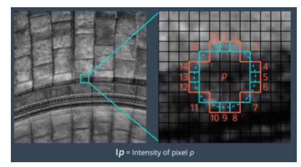
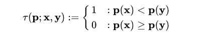
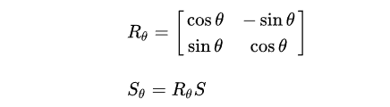

# \[ICCV 2011] ORB特征



ORB=Oriented FAST+Rotated BRIEF

### Oriented FAST

#### 确定候选角点

1.确定某个像素p，其像素值为$$I_p$$，以p为圆心，半径为3，确定一个圆，圆上有16个像素，分别为$$p_1,p_2,...,p_{16}$$;&#x20;

2.确定一个阈值：t，比如$$I_p$$的20%;

3.让圆上的点像素值分别与p的像素值作差，如果存在连续n个点满足$$I_x-I_p>t$$或$$I_x-I_p< -t$$，那么就把该点作为一个候选点，根据经验，一般令n=12，即FAST-12. 由于大部分像素点都不是候选点，所以FAST先对第1、5、9、13号像素点进行检测，如果4个点中至少有三个满足上述要求，则对该点进行16个邻域像素点的检测，否则判定该点为非特征点，直接剔除。

#### 非极大值抑制

对上述候选点进行非极大值抑制，去除一部分彼此相邻的候选点。

#### 尺度不变性

1.对图像做不同尺度的高斯模糊；&#x20;

2.对图像做降采样（隔点采样）；&#x20;

3.对每层金字塔做FAST特征点检测；&#x20;

4.不同比例的图像中提取的特征点的总和作为这幅图像的oFAST特征点。

#### 旋转不变性

1.在一个小图像块中，定义图像块的矩：&#x20;

2.通过矩可以找到图像块的质心：&#x20;

3.连接图像块的几何中心和质心，得到一个方向向量$$\overrightarrow{OC}$$，这就是特征点的方向：&#x20;

### Rotated BRIEF

#### BRIEF描述子

1.为减少噪声干扰，先对图像进行高斯滤波（方差为2，高斯窗口为9x9;&#x20;

2.以特征点为中心，取S x S的邻域窗口，在窗口内随机选取一对点（x,y），比较两者像素大小，进行二进制赋值：&#x20;

3.在窗口中随机选取N对随机点（一般N为256），重复步骤2的二进制赋值，形成一个二进制编码，这个编码就是对特征点的描述：&#x20;

随机特征点对的选取，有5种方法，其中第二种比较好：&#x20;

1.$$x_i,y_i$$都呈均匀分布$$[-\frac{S}{2},\frac{S}{2}]$$;&#x20;

2.$$x_i,y_i$$都呈高斯分布$$[0,\frac{1}{25}S^2]$$，采样服从各项同性的同一高斯分布；&#x20;

3.$$x_i$$服从高斯分布$$[0,\frac{1}{25}S^2]$$，$$y_i$$服从高斯分布$$[0,\frac{1}{100}S^2]$$，采样分两步进行：首先在原点处为$$x_i$$进行高斯分布，然后在中心为$$x_i$$处为$$y_i$$进行高斯分布；&#x20;

4.$$x_i,y_i$$在空间量化极坐标下的离散位置处进行随机采样；&#x20;

5.$$x_i={(0,0)}^T$$，$$y_i$$在空间量化极坐标下的离散位置处进行随机采样 b

.png>)

#### steered BRIEF描述子

1.对于任意特征点，在31x31邻域内位置为$$(x_i,y_i)$$的n对点集，用2 x n的矩阵来表示：&#x20;

2.利用FAST算法求出的特征点的主方向$$\theta$$和旋转矩阵$$R_\theta$$，求出旋转的$$S_\theta$$:&#x20;

3.计算描述子：&#x20;

steered BRIEF具有旋转不变性，但是可区分性不如原本的BRIEF描述子。

#### rotated BRIEF描述子

为了解决描述子的可区分性和相关性问题，ORB论文用统计学习的方法来重新选择点对集合。首先建立300k个特征点测试集，对于测试集中的每个点，考虑其31x31邻域。对图像进行高斯平滑之后，使用邻域中的某个点的5x5邻域灰度平均值来代替某个点对的值，进而比较点对的大小。这样特征值更加具备抗噪性。另外可以使用积分图像加快求取5x5邻域灰度平均值的速度。&#x20;

在31x31的邻域内共有(31-5+1)x(31-5+1)=729个子窗口，那么取点对的方法共有M=205590种，需要在这M种取法中挑选256种取法，令这256种取法之间的相关性最小。在300k特征点的每个31x31邻域内按照M种方法取点对，比较点对大小，形成一个300k x M的二进制矩阵Q，矩阵的每一列表示300k个点按照某种取法得到的二进制描述子；对Q矩阵的每一列求平均值，按照平均值到0.5的距离大小重新对Q矩阵的列向量排序，形成矩阵T；将T的第一列向量放到R中；取T的下一列向量和R中所有列向量计算相关性，如果相关系数小于设定的阈值，则将T中的该列向量移至R中；按照上一步不断处理，直到R中的向量数量为256.这样就获得了256种取法。
